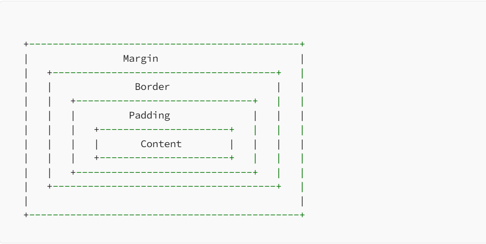

# CSS

#### 1. Explain CSS position properties ?

In CSS, there are several **position** properties that control the positioning of elements on a web page. Let’s explore each of these position properties with examples:

**1. position:** This property specifies the positioning method for an element. It can take several values:

- **static**: This is the default value, and elements are positioned according to the normal document flow.

- **relative**: Elements are positioned relative to their normal position. You can use the `top`, `bottom`, `left`, and `right` properties to offset the element from its original position.

- **absolute**: Elements are positioned relative to the nearest positioned ancestor or the containing block. If there is no positioned ancestor, it will be positioned relative to the initial containing block (usually the `` element).

- **fixed**: Elements are positioned relative to the viewport and do not move even if the page is scrolled.

- **sticky**: Elements are positioned based on the user’s scroll position. It toggles between ‘relative’ and ‘fixed’. It behaves like `relative` within its container until a specific offset threshold is reached, after which it behaves like `fixed`.

Here are some examples illustrating the usage of CSS position properties:

```css
/* Example 1: Relative positioning */
.relative-box {
  position: relative;
  top: 20px;
  left: 50px;
}

/* Example 2: Absolute positioning */
.absolute-box {
  position: absolute;
  top: 50px;
  left: 100px;
}
/* Example 3: Fixed positioning */
.fixed-box {
  position: fixed;
  top: 20px;
  right: 20px;
}
/* Example 4: Sticky positioning */
.sticky-box {
  position: sticky;
  top: 50px;
}
.container {
  height: 2000px; /* To create a scrollable container for sticky positioning */
}
```

In Example 1, the `.relative-box` element is positioned relative to its normal position. It is shifted 20 pixels down from its original position and 50 pixels to the right.

In Example 2, the `.absolute-box` element is positioned relative to its closest positioned ancestor or the containing block. It is shifted 50 pixels down from the top edge and 100 pixels to the right from the left edge of its container.

In Example 3, the `.fixed-box` element is positioned relative to the viewport. It remains fixed in its position, regardless of scrolling. It is placed 20 pixels down from the top and 20 pixels from the right edge of the viewport.

In Example 4, the `.sticky-box` element is initially positioned according to the normal flow of the document. Once the user scrolls past the offset of 50 pixels from the top edge of its containing block (in this case, the `.container`), it becomes “sticky” and behaves like `fixed`, remaining fixed at that position while scrolling.

These examples demonstrate how CSS position properties can be used to control the positioning of elements on a web page.

#### 2. What are pseudo elements and pseudo classes ?

#### Pseudo elements:

A CSS pseudo-element is used to style specified parts of an element. For example, it can be used to:

->Style the first letter, or line of an element

->Insert content before, or after, the content of an element

```css
p::first-line {
  color: #ff0000;
  font-variant: small-caps;
}
```

#### Pseudo classes

A pseudo-class is used to define a special state of an element. For example, it can be used to:

->Style an element when a user mouses over it ->Style visited and unvisited links differently

->Style an element when it gets focus

```css
* unvisited link */ a:link {
  color: red;
}

/* visited link */
a:visited {
  color: green;
}
/* mouse over link */
a:hover {
  color: hotpink;
}
/* selected link */
a:active {
  color: blue;
}
```

#### 3. What is the difference between display inline, display inline block and display block ?

In CSS, the **display** property controls how an element is rendered in the document flow. There are three commonly used values for the `display` property: `inline`, `inline-block`, and `block`. Here’s a breakdown of the differences between them:

1. `display: inline`: Elements with `display: inline` are rendered as inline elements, meaning they flow within the text content of a line. Inline elements do not start on a new line and only take up as much width as necessary to contain their content. They cannot have a specified width or height, and margins and padding only affect their left and right sides, not top and bottom.

Example:

```css
span {
  display: inline;
}
```

```html
<span>This is an inline element.</span>
```

2. `display: inline-block`: Elements with `display: inline-block` are rendered as inline-level elements but with the ability to have a specific width, height, margins, and padding. They flow within the text content like inline elements, but they can have block-level properties applied to them. Inline-block elements start on the same line as the previous content, but they can have line breaks if necessary.

Example:

```css
div {
  display: inline-block;
  width: 200px;
  height: 100px;
  margin: 10px;
  padding: 5px;
}
```

```css
<div>This is an inline-block element.</div>
```

3. `display: block`: Elements with `display: block` are rendered as block-level elements. They start on a new line and take up the full available width by default. Block-level elements can have a specific width, height, margins, and padding. They create a “block” that other elements cannot appear within on the same line.

Example:

```css
div {
  display: block;
  width: 300px;
  height: 200px;
  margin: 10px;
  padding: 5px;
}
```

```html
<div>This is a block element.</div>
```

In summary, the key differences between `display: inline`, `display: inline-block`, and `display: block` are:

- **display: inline**: Elements flow within the text content, cannot have a specified width or height, and have limited control over margins and padding.

- **display: inline-block**: Elements flow within the text content but can have a specified width, height, margins, and padding.

- **display: block**: Elements start on a new line, take up the full available width, and can have a specified width, height, margins, and padding.

It’s worth noting that there are additional values for the `display` property, such as `none` (hides the element), `table` (renders as a table), and `flex` (enables flexible box layout), among others. Each value serves a specific purpose and has its own set of behaviors and characteristics.

#### 4. Difference between Display none and Visibility hidden ?

Two commonly used properties to manipulate the visibility of elements are `display` and `visibility`. While both serve similar purposes, they have distinct differences that can significantly impact the layout and functionality of a webpage.

#### 1. display: none:

The `display: none;` property is a straightforward and powerful way to hide an element completely from the layout. When applied to an element, it not only makes the element invisible but also removes it from the document flow. This means that the space the element would have occupied is reclaimed, causing the surrounding elements to adjust accordingly.

Example:

#### CSS:

```css
.hidden-element {
  display: none;
}
```

#### HTML:

```html
<div class="hidden-element">This content is hidden.</div>
```

In this example, the `.hidden-element` will not be visible on the webpage, and it won’t affect the layout or spacing of other elements.

#### 2. visibility: hidden:

On the other hand, the `visibility: hidden;` property also hides an element, but with a subtle difference. While the element becomes invisible, it still occupies space in the document flow. The surrounding elements will act as if the hidden element is still present, maintaining the layout integrity.

Example:

#### CSS:

```css
.hidden-element {
  visibility: hidden;
}
```

#### HTML:

```html
<div class="hidden-element">
  This content is hidden but still occupies space.
</div>
```

In this case, the `.hidden-element` is hidden, but the space it would normally occupy is retained, influencing the layout of surrounding elements.

#### Comparison:

- **Reflow**: The major distinction lies in how the two properties impact the document flow. `display: none;` triggers a reflow, adjusting the layout, while `visibility: hidden;` does not affect the layout.

- **Accessibility**: When using `display: none;`, assistive technologies will generally ignore the hidden element. In contrast, `visibility: hidden;` will still make the element accessible to screen readers, allowing for a more inclusive user experience.

#### Conclusion:

Understanding the difference between `display: none;` and `visibility: hidden;` is crucial for web developers. Depending on the desired outcome, one should choose the property that aligns with the specific requirements of the webpage. Whether aiming to completely remove an element from the layout or simply hide it while maintaining space, these CSS properties offer versatile solutions for crafting visually appealing and functional websites.

#### 5. In how many ways can we add CSS to our HTML file ?

In this article, we’ll explore the different ways to add CSS to your HTML document, making your website captivating and user-friendly.

#### The Three Flavors of CSS Integration:

- **Inline CSS:** This method involves adding CSS directly to an HTML element using the style attribute. While convenient for quick tweaks, it can quickly clutter your code and become difficult to maintain for larger projects.

Example:

```html
<p style="color: red; font-size: 20px;">This text is styled inline.</p>
```

- **Internal CSS:** This approach involves creating a dedicated `<style>` tag within the `<head>` section of your HTML document. Here, you can define styles for various elements using class selectors, IDs, or element tags. This method offers better organization and maintainability compared to inline CSS.

Example:

```html
<head>
  <style>
    p {
      color: blue;
      font-family: Arial, sans-serif;
    }
    h1 {
      text-align: center;
      font-size: 30px;
    }
  </style>
</head>
<body>
  <p>This text is styled internally.</p>
  <h1>Internal CSS rocks!</h1>
</body>
```

- **External CSS:** The preferred method for larger projects, external CSS involves storing your styles in a separate `.css` file. This file is then linked to your HTML document using the `<link>` tag in the `<head>` section. This approach promotes code reusability, simplifies maintenance, and improves website performance.

Example:

```html
<head>
  <link rel="stylesheet" href="mystyles.css" />
</head>
<body></body>
```

#### Choosing the Right Method:

The choice between these methods depends on your project’s size and complexity. Inline CSS is suitable for minor adjustments, while internal CSS caters to small-scale projects. For larger websites, external CSS is the golden standard for organization and maintainability.

#### 6. What are the new features in CSS3 ?

**CSS3** introduced many new features and enhancements to the CSS specification. Below are some of the notable **CSS3 features** with examples:

#### 1. Border Radius:

```css
/* CSS3 */
.box {
  border-radius: 10px;
}
```

Allows you to create rounded corners for elements.

#### 2. Box Shadow:

Creates a shadow effect around elements.

```css
/* CSS3 */
.box {
  box-shadow: 2px 2px 4px rgba(0, 0, 0, 0.2);
}
```

#### 3. Text Shadow:

Adds a shadow effect to the text.

```css
/* CSS3 */
.text {
  text-shadow: 1px 1px 2px rgba(0, 0, 0, 0.5);
}
```

#### 4. Gradients:

Allows you to create gradient backgrounds.

```css
/* CSS3 - Linear Gradient */
.box {
  background: linear-gradient(to right, #ff0000, #00ff00);
}

/* CSS3 - Radial Gradient */
.circle {
  background: radial-gradient(circle, #ff0000, #00ff00);
}
```

#### 5. Transitions:

Enables smooth transitions between property values.

```css
/* CSS3 */
.box {
  transition: background-color 0.3s ease;
}

.box:hover {
  background-color: #ffcc00;
}
```

#### 6. Animations:

Allows you to define complex animations.

```css
/* CSS3 */
@keyframes bounce {
  0%,
  20%,
  50%,
  80%,
  100% {
    transform: translateY(0);
  }
  40% {
    transform: translateY(-30px);
  }
  60% {
    transform: translateY(-15px);
  }
}

.box {
  animation: bounce 2s infinite;
}
```

#### 7. Flexbox:

A powerful layout system for arranging items within a container.

```css
/* CSS3 */
.container {
  display: flex;
  justify-content: center;
  align-items: center;
}
```

#### 8. Grid Layout:

A two-dimensional layout system for designing complex web page layouts.

```css
/* CSS3 */
.container {
  display: grid;
  grid-template-columns: 1fr 1fr;
  grid-gap: 10px;
}
```

#### 9. Media Queries:

Allows you to apply different styles based on the user’s device or screen size.

```css
/* CSS3 */
@media screen and (max-width: 768px) {
  .box {
    font-size: 14px;
  }
}
```

#### 10. Transforms:

Allows you to perform transformations on elements, such as scaling, rotating, and translating.

```css
/* CSS3 */
.box {
  transform: rotate(45deg);
}
```

#### Conclusion:

These are just a few examples of the new features introduced in **CSS3**. CSS3 brought a wide range of capabilities that enable web developers to create more dynamic and visually appealing web pages without relying on complex JavaScript or images for certain effects.

#### 7. What are the different types of Selectors in CSS ?

A CSS selector is the part of a CSS ruleset that actually selects the content you want to style. Different types of selectors are listed below.

**1. Universal Selector:** The universal selector works like a wildcard character, selecting all elements on a page. In the given example, the provided styles will get applied to all the elements on the page.

**2. Element Type Selector:** This selector matches one or more HTML elements of the same name. In the given example, the provided styles will get applied to all the ul elements on the page.

**3. ID Selector:** This selector matches any HTML element that has an ID attribute with the same value as that of the selector. the provided styles will get applied to all the elements having ID as a container on the page.

**4. Class Selector:** The class selector also matches all elements on the page that have their class attribute set to the same value as the class. the provided styles will get applied to all the elements having ID as the box on the page.

**5. Descendant Combinator:** The descendant selector or, more accurately, the descendant combinator lets you combine two or more selectors so you can be more specific in your selection method.

**6. Child Combinator:** A selector that uses the child combinator is similar to a selector that uses a descendant combinator, except it only targets immediate child elements.

**7. General Sibling Combinator:** A selector that uses a general sibling combinator to match elements based on sibling relationships. The selected elements are beside each other in the HTML.

**8. Adjacent Sibling Combinator:** A selector that uses the adjacent sibling combinator uses the plus symbol (+), and is almost the same as the general sibling selector. The difference is that the targeted element must be an immediate sibling, not just a general sibling.

**9. Attribute Selector:** The attribute selector targets elements based on the presence and/or value of HTML attributes, and is declared using square brackets.

#### 8. What is the difference between active and focus pseudo classes ?

The main difference between the two pseudoclasses is that the `:focus` pseudoclass is applied when the user starts interacting with the element, while the `:active` pseudoclass is applied when the user finishes interacting with the element.

For example, if you have a button that changes color when it is focused, the `:focus` pseudoclass will be applied when the user tabs to the button or clicks on it with the mouse. The `:active` pseudoclass will not be applied until the user actually clicks on the button and starts to press down.

The `:focus` and `:active` pseudoclasses are both used to style elements in different states, but they have different meanings.

1. The `:focus` pseudoclass is used to style an element when it is in focus. This means that the element is currently receiving input from the user, either through a keyboard or a mouse.

2. The `:active` pseudoclass is used to style an element when it is being activated by the user. This means that the user is currently clicking or pressing on the element.

#### Here is an example of how to use the `:focus` and `:active` pseudoclasses in CSS:

```css
button:focus {
  background-color: yellow;
  color: black;
}

button:active {
  background-color: red;
  color: white;
}
```

This code will make a button change color from yellow to red when it is clicked. The `:focus` pseudoclass will be applied when the user tabs to the button or clicks on it with the mouse, and the `:active` pseudoclass will be applied when the user actually clicks on the button and starts to press down.

It is important to note that not all elements can be focused. Only elements that are able to receive input from the user, such as buttons, input boxes, and text areas, can be focused.

Also, the `:active` pseudoclass is not supported by all browsers. For example, it is not supported by the mobile Safari browser.

**Conclusion:**

In general, the `:focus` pseudoclass is a more reliable way to style elements that are being interacted with by the user. The `:active` pseudoclass should only be used if you need to style an element in a specific way when it is being activated by the user.

#### 9. What is CSS box sizing property ?

The **box-sizing** property allows us to include the padding and border in an element’s total width and height.

If you set **box-sizing: border-box;** on an element, padding and border are included in the width and height:

#### HTML:-

```html
<div class="div1">Both divs are the same size now!</div>
<br />
<div class="div2">Hooray!</div>
```

#### CSS:-

```css
.div1 {
  width: 300px;
  height: 100px;
  border: 1px solid blue;
  box-sizing: border-box;
}

.div2 {
  width: 300px;
  height: 100px;
  padding: 50px;
  border: 1px solid red;
  box-sizing: border-box;
}
```

#### 10. What is the box model in CSS ?

The **box model** is a fundamental concept in CSS that describes how elements are structured and how they are displayed on a web page.

In CSS, every element on a web page is essentially a rectangular box, consisting of four parts: **margin, border, padding, and content**. The content area contains the actual content of the element, while the padding is the space between the content and the border, and the border is the visible line that surrounds the content and padding. The margin is the space between the border and the adjacent elements.

#### Here’s a graphical representation of the box model:



The **box model** is important because it helps developers understand how elements are laid out on a web page and how they interact with each other. By setting values for margin, border, and padding, developers can control the size and spacing of elements on the page, and create more visually appealing layouts.

#### Box model and border-box sizing:

The **box-sizing** property in CSS allows you to control how the total width and height of an element are calculated, taking into account its content, padding, and border. It affects the box model behavior, particularly how the specified width and height of an element are interpreted.

By default, the **box-sizing property** is set to **content-box**, which means that the specified width and height of an element only apply to its content area, excluding padding and border. This is the traditional box model behavior.

However, you can change the **box-sizing property** to **border-box**, which alters the box model behavior. When **box-sizing: border-box** is applied to an element, the specified width and height now include the content, padding, and border. In other words, the element’s overall width and height will be calculated by adding the padding and border to the specified width and height.

#### 11. What is the difference between top and margin top ?

The top attribute basically defines the y-position from the top of the browser, but also depends on what is defined in the position attribute as well.

The margin-top specifies the element’s top gap from another element.

#### 12. What is the difference between bottom and margin bottom ?

The bottom attribute basically defines the y-position from the bottom of the browser, it starts counting the pixels or whatever units defined from the bottom.

margin-bottom defines the bottom gap from the another element.

#### 13. What is the difference between vh, px and percent ?

1vh is equal to 1% of the viewport’s height, with the viewport being the browser window. 1px is one physical pixel on the device’s screen. Percent is the relative size compared to its parent element. For example, a div with 50% width inside another div will take up half of the outer div’s width.

Vh and percent are both relative units, so they scale based on some factor of the device it is viewed on. Pixels are absolute, so a 100x100 pixel image will be larger on a low resolution screen, but very small on a screen with high pixel density.

#### 14. What is the difference between rem and em ?

**rem**

rem units are relational to the font-size value of the HTML tag. For example, if the font size of the HTML tag is 16px (that is the default size for an html document), then 1rem unit is equal to 16px. That makes .5rem=8px, 2rem=32px, etc.

**em**

em units are similar to rem units, but whereas a rem unit always references the HTML tag, an em unit is relational only to it’s nearest defined parent element. For example, if the div wrapper for a callout is set to font-size:20px, then any child element set to 1em would be the equivalent of 20px, .5em=10px, 2em=40px, etc.

#### 15. What is :root in css ?

The :root CSS pseudo-class matches the root element of the document. In HTML, :root represents the HTML element and is identical to the selector HTML, except that its specificity is higher.

So, for example if want to change the background of our complete page to black. We can do it by the CSS :

```css
:root {
  background: black;
}
```

:root is also used for declaring global CSS variables, for example :

```css
:root {
  --main-color: hotpink;
  --pane-padding: 5px 42px;
}
```

#### 16. What is the meaning of 1. div ~ p 2. div + p 3. Div > p in CSS ?

#### 17. What are media queries ?

**Media query** is a CSS technique introduced in CSS3.It is a technique to apply different styles or layouts to a web page based on the characteristics of the user’s device or screen size. Media queries allow web developers to create designs that adapt and look well-organized on various devices, such as desktop computers, laptops, tablets, and smartphones.

With **media queries**, you can set specific CSS rules to trigger only when certain conditions are met, such as the width of the viewport. This enables you to create flexible and responsive designs that provide an optimal viewing experience regardless of the device being used to access the website.

#### Here’s an example of a media query in CSS:

```css
/* This CSS rule will apply to screens with a maximum width of 600 pixels */
@media (max-width: 600px) {
  body {
    background-color: lightblue;
  }
}
```

In this example, the `@media` rule specifies a condition for when the screen width is at most 600 pixels. If the screen width matches this condition (i.e., the screen is 600 pixels wide or narrower), the styles inside the curly braces will be applied. In this case, the background color of the `body` element will be changed to light blue.

You can also have multiple conditions within a single media query, allowing you to target different screen sizes with different styles:

```css
/* Styles for screens up to 600 pixels wide */
@media (max-width: 600px) {
  body {
    background-color: lightblue;
  }
}

/* Styles for screens between 601 and 1200 pixels wide */
@media (min-width: 601px) and (max-width: 1200px) {
  body {
    background-color: lightgreen;
  }
}
```

In this second example, the first media query targets screens up to **600 pixels** wide with a light blue background color, and the second media query targets screens between **601 and 1200 pixels** wide with a light green background color.

These examples showcase how media queries allow you to apply different styles based on the characteristics of the screen, creating a responsive design that adapts to various devices.

#### 1.How do you create a responsive design using CSS3 ?

Creating a responsive design using CSS3 involves using various techniques to ensure that a website or web application looks and functions well on different devices with varying screen sizes and resolutions. Here are some common techniques used in CSS3 to create a responsive design:

**1) Fluid Layouts:** One approach to creating a responsive design is to use fluid layouts that resize based on the width of the browser window or device screen. This can be achieved by using percentage widths for containers and elements, instead of fixed pixel values.

**2)Media Queries:** Media queries allow developers to apply different styles to elements based on the size of the device screen. This allows them to create a tailored user experience for different devices. Media queries are typically written using the @media rule in CSS3.

**3)Flexible Images:** To ensure that images resize correctly on different devices, developers can use the max-width property on images, which prevents them from exceeding their parent container’s width.

**4)Grid Systems:** Grid systems are a popular technique used to create responsive designs. They involve dividing the page into a grid of columns and rows, which can be adjusted based on the screen size using media queries. Developers can use CSS3 frameworks like Bootstrap and Foundation to implement grid systems quickly.

**5)Flexbox:** Flexbox is a powerful CSS3 layout system that allows developers to create flexible, responsive layouts easily. Flexbox provides a way to align and distribute space among elements in a container, even when the size of the elements is unknown.

By combining these techniques, developers can create a responsive design that looks great and functions well on different devices, without having to create separate websites or web applications for each device.

#### 2. How to align an element both vertically and horizontally at the center of it’s parent element ?

To align an element both vertically and horizontally at the center of its parent element, you can use CSS flexbox,CSS Grid or Custom css with position absolute. Here are examples of both approaches:

#### 1. Using CSS Flexbox:

```css
.parent {
  display: flex;
  justify-content: center; /* Horizontal centering */
  align-items: center; /* Vertical centering */
}
```

In this example, the `.parent` class represents the parent element containing the element you want to center. By setting `display: flex` on the parent, its child elements become flex items. The `justify-content: center` property centers the child element horizontally, while `align-items: center` centers it vertically.

#### 2. Using CSS Grid:

```css
.parent {
  display: grid;
  place-items: center; /* Centers both horizontally and vertically */
}
```

Here, the `.parent` class uses CSS Grid by setting `display: grid`. The `place-items: center` property centers the child element both horizontally and vertically within the grid cell. Remember to apply these styles to the parent element that contains the element you want to center. You can adjust the CSS selectors (`parent`) according to your HTML structure and class names.

#### 3. Custom css with position absolute

```css
.parent {
  position: relative;
}
.container {
  position: absolute;
  top: 50%;
  left: 50%;
  width: 100px;
  height: 100px;
  margin-left: -50px;
  margin-top: -50px;
  border: 1px solid #ccc;
  background-color: #f3f3f3;
}

or .parent {
  position: relative;
}
.container {
  position: absolute;
  top: 50%;
  left: 50%;
  width: 100px;
  height: 100px;
  transform: translate(-50%, -50%);
  border: 1px solid #ccc;
  background-color: #f3f3f3;
}
```

In this approach, the parent element should have a non-static position, such as position: relative, to serve as the reference for absolute positioning. The child element is positioned absolutely using position: absolute. By setting top: 50% and left: 50%, the element is moved to the center of its parent. Finally, transform: translate(-50%, -50%) shifts the element back by 50% of its own width and height, effectively centering it. You can also use margin-left and margin-top to shift the element by 50 percent, in this case it will be margin-left:-50px; and margin-top:-50px; as height and width of element is 100px

HTML:-

```html
<body class="parent">
  <div class="container">
    <div class="item item-1">
      1.Lorem Ipsum has been the industry's standard dummy text ev
    </div>
  </div>
</body>
```

#### 3. How to animate in css ?

In CSS, you can create **animations** using the `@keyframes` rule and apply them to elements using the `animation` property. Here’s a basic example of how to animate an element in CSS:

```css
/* Define the animation keyframes */
@keyframes myAnimation {
  0% {
    /* Initial state */
    transform: scale(1);
  }
  50% {
    /* Intermediate state */
    transform: scale(1.5);
  }
  100% {
    /* Final state */
    transform: scale(1);
  }
}

/* Apply the animation to an element */
.my-element {
  animation: myAnimation 2s infinite;
}
```

In this example, we define an animation called `myAnimation` using the `@keyframes` rule. The `@keyframes` rule allows you to specify different stages of the animation by setting CSS properties at different percentage points. In this case, we define three stages: 0%, 50%, and 100%.

Next, we apply the animation to an element with the class `.my-element` using the `animation` property. The `animation` property takes several values separated by spaces. The first value is the name of the animation (`myAnimation`), followed by the duration of the animation (`2s` in this case), and finally, any additional animation properties such as timing function or delay.

In the example above, the animation will scale the element from its initial size to 1.5 times its size and then back to the initial size, creating a simple pulsating effect. The animation will repeat indefinitely (`infinite`) until stopped or removed.

You can customize the animation by changing the CSS properties within the `@keyframes` rule and adjusting the animation properties applied to the element. You can animate various CSS properties such as `transform`, `opacity`, `color`, `width`, and more.

CSS **animations** provide a wide range of possibilities for creating engaging and dynamic effects on web pages. You can explore different animation properties, timing functions, and keyframe percentages to achieve the desired animation effects.

#### 4. How to create a half circle using css ?

To create a half circle using CSS, we can use the border-radius property to create a circular shape and then use the overflow property to hide the bottom half of the circle.

Here’s an example of how to do it:

HTML:

```html
<div class="half-circle"></div>
```

CSS:

```css
.half-circle {
  width: 200px;
  height: 100px;
  border-radius: 100px 100px 0 0;
  background-color: red;
}
```

In this example, we’ve created a div element with a class of half-circle. We’ve set the width and height of the element to 200px and 100px respectively, which gives us an elliptical shape. We’ve then used the border-radius property to create a circle by setting the top-left and top-right border radii to 100px, and the bottom-left and bottom-right border radii to 0, which gives us the appearance of a half circle.

Next, we’ve set the background color of the half circle to red to make it more visible.

You can adjust the dimensions, border radii, colors, and other properties to create half circles of different sizes and styles.

#### 5. How to create a triangle using css ?

To create a triangle using CSS, we can use the border property to set the width, height, and color of the triangle, and then use the border-style property to create a triangle shape.

Here’s an example of how to do it:

HTML:

```html
<div class="triangle"></div>
```

CSS:

```css
.triangle {
  width: 0;
  height: 0;
  border-left: 30px solid transparent;
  border-right: 30px solid transparent;
  border-bottom: 30px solid red;
}
```

In this example, we’ve created a div element with a class of triangle. We’ve set the width and height of the element to 0, which effectively hides the element. We’ve then used the border-left, border-right, and border-bottom properties to create the triangle shape.

#### 6. What are the limitations of CSS ?

CSS (Cascading Style Sheets) is a powerful styling language used for describing the presentation of a document written in HTML or XML. While CSS is widely used and versatile, it does have some limitations. Here are some of them:

**1. Browser Compatibility**

Different browsers may interpret CSS rules differently, leading to inconsistencies in the appearance of a webpage. This can require additional effort to ensure cross-browser compatibility.

**2. Lack of dynamic behavior**

CSS is a declarative language, which means that it describes the desired state of a document. It does not allow developers to write code that executes dynamically in response to user interactions. For this, developers need to use JavaScript or another scripting language.

**3. Limited layout control**

CSS is primarily designed for styling elements, not for laying them out. While CSS does provide some layout capabilities, such as positioning and floats, it can be challenging to achieve complex layouts with CSS alone. For this, developers need to use CSS frameworks like Flexbox or Grid.

**4. Security vulnerabilities**

CSS is not inherently secure, and it can be used to introduce security vulnerabilities into web pages. One example is cross-site scripting (XSS), which is a type of attack that allows an attacker to inject malicious code into a web page. Developers need to be careful when using CSS from untrusted sources and should always validate user-supplied input before rendering it on the page.

**5. Scalability issues**

As the size and complexity of web pages grow, maintaining CSS can become difficult. This is especially true when using a lot of CSS rules or when using CSS frameworks with a lot of nested selectors. To manage CSS complexity, developers can use CSS preprocessors like LESS or Sass, which allow them to write more modular and maintainable CSS code.

**6. Accessibility challenges**

CSS can be used to create visually appealing web pages, but it is important to consider accessibility when using CSS. Developers should ensure that their CSS code does not interfere with the ability of users with disabilities to access and use web pages. This may involve using CSS to provide alternative text for images, using high-contrast color schemes, and ensuring that the page is navigable without relying on a mouse.

**Conclusion:**

CSS is a powerful tool for styling web pages, but it is important to be aware of its limitations. By understanding these limitations, developers can avoid problems and create more consistent, maintainable, and accessible websites.

#### 7. How to create a carousel using css ?

Creating a carousel using CSS can be achieved using CSS animations and transforms. Here is an example of how to create a basic carousel using CSS:

HTML:

```html
 <div class="carousel-container">
  <div class="carousel">
    <div class="slide">
      
    </div>
    <div class="slide">
      
    </div>
    <div class="slide">
      
    </div>
  </div>
</div>
</div>

```

CSS:

```css
.carousel-container {
  width: 100%;
  overflow: hidden;
}

.carousel {
  display: flex;
  width: 300%;
  animation: slide 10s infinite;
}

.slide {
  width: 33.33%;
  padding: 10px;
  box-sizing: border-box;
}

.slide img {
  width: 100%;
}

@keyframes slide {
  0% {
    transform: translateX(0);
  }
  33.33% {
    transform: translateX(-100%);
  }
  66.66% {
    transform: translateX(-200%);
  }
  100% {
    transform: translateX(0);
  }
}
```

In this example, we have a container with the class “carousel-container” that has an overflow of hidden to hide the overflow of the carousel. The carousel itself has a width of 300% to accommodate the width of all the slides, and a flex display to align the slides horizontally. The slides have a width of 33.33% to ensure that all three slides fit within the carousel container. The slide images have a width of 100% to fill the width of their respective slides.

The @keyframes rule defines the animation for the carousel, where we translate the carousel horizontally by 100% for each slide, and then back to 0% to create the carousel effect. The animation is set to repeat infinitely with a duration of 10 seconds.

Note that this is a basic example, and you can modify the styles and animation to fit your specific needs and design.

#### 8. What is SCSS ?

**SCSS (Sassy Cascading Style Sheets)** is a preprocessor for CSS that extends the capabilities of traditional CSS. It is a superset of CSS, meaning that any valid CSS code is also valid SCSS code. SCSS introduces additional features and functionalities to CSS, making it more powerful and flexible for styling web pages.

Here are some key features of SCSS:

**1. Variables:** SCSS allows the use of variables, which can store values such as colors, font sizes, or any other CSS property. Variables make it easier to reuse and maintain consistent styles throughout a project.

```css
$primary-color: #ff0000;

.button {
  color: $primary-color;
}
```

**2. Nesting:** SCSS allows nesting CSS selectors, which provides a more intuitive and organized way of writing styles. Selectors that are nested within other selectors inherit the styles from their parent selectors.

```css
.container {
  background-color: #f0f0f0;

  h1 {
    font-size: 24px;
  }

  p {
    color: #333;
  }
}
```

**3. Mixins:** Mixins are reusable blocks of code that can be included in multiple selectors or rules. They allow you to define a set of styles and apply them wherever needed, reducing code duplication.

```css
@mixin flex-center {
  display: flex;
  justify-content: center;
  align-items: center;
}

.container {
  @include flex-center;
}
```

**4. Partials and Imports:** SCSS allows you to break your CSS code into multiple files called partials. Partials are prefixed with an underscore, indicating that they are not compiled into separate CSS files. You can then import these partials into a main SCSS file.

```css
// _buttons.scss
.button {
  // Button styles...
}

// main.scss
@import "buttons";
```

**5. Operators and Calculations:** SCSS supports various mathematical operations, allowing you to perform calculations within CSS properties. This can be useful for dynamically calculating values based on variables or other properties.

```css
$base-font-size: 16px;

body {
  font-size: $base-font-size * 1.2;
}
```

To use SCSS in a project, you need to compile it into regular CSS using a preprocessor or a build tool. There are several options available, such as Sass, node-sass, or webpack with sass-loader, that can compile SCSS files into CSS.

**SCSS** simplifies and enhances the process of writing and maintaining CSS stylesheets, making it a popular choice for frontend developers working on complex projects.

#### 9. What are mixins in SCSS ?

In SCSS (Sass), **mixins** are a feature that allows you to define reusable blocks of CSS code. A mixin is similar to a function in programming, as it can accept parameters and generate CSS styles based on those parameters. Mixins provide a way to encapsulate and reuse common styles, making your code more modular and maintainable.

To define a mixin in SCSS, you use the `@mixin` directive, followed by a name and a block of CSS code.

Here’s an example:

```css
@mixin center-element {
  display: flex;
  align-items: center;
  justify-content: center;
}
```

In this example, we define a mixin called `center-element` that applies common styles to center an element both vertically and horizontally using flexbox.

To use a mixin, you can include it in a selector using the `@include` directive, followed by the name of the mixin. Here’s an example:

```css
.container {
  @include center-element;
}
```

The `@include` directive includes the `center-element` mixin in the `.container` selector, which applies the styles defined in the mixin to that selector. After compilation, the generated CSS will include the styles from the mixin:

```css
.container {
  display: flex;
  align-items: center;
  justify-content: center;
}
```

Mixins can also accept parameters, allowing you to customize the generated styles. Here’s an example of a mixin with parameters:

```css
@mixin link-color($color) {
  color: $color;
  text-decoration: none;

  &:hover {
    text-decoration: underline;
  }
}
```

In this example, the `link-color` mixin accepts a `$color` parameter. When using the mixin, you can pass a specific color value to customize the link’s color. Here’s an example:

```css
a {
  @include link-color(blue);
}
```

After compilation, the generated CSS for the `a` selector will include the customized color:

```css
a {
  color: blue;
  text-decoration: none;
}

a:hover {
  text-decoration: underline;
}
```

**Mixins** in SCSS provide a powerful way to reuse and share CSS code, making your stylesheets more maintainable and reducing code duplication. They are particularly useful for common styles or styles that require customization in different parts of your project.

#### 10. What are the benefits of using CSS preprocessors ?

**CSS preprocessors** offer several benefits that make them popular among web developers. Here are some of the key advantages of using CSS preprocessors:

**1. Modularity and Reusability:** Preprocessors allow you to break down your CSS code into smaller, modular pieces using features like variables, mixins, and functions. This modularity promotes code reuse and makes it easier to maintain and update styles across a large project.

**2. Variables:** Preprocessors support the use of variables, which means you can define and reuse values (e.g., colors, font sizes) throughout your stylesheets. This makes it simpler to maintain consistency and quickly apply changes globally.

Example:

```css
// Scss
$primary-color: #007bff;
$secondary-color: #6c757d;

.button {
  background-color: $primary-color;
  color: white;
}

.alert {
  background-color: $secondary-color;
  color: white;
}
```

**3. Nested Rules:** CSS preprocessors enable you to nest CSS rules within one another, reflecting the HTML structure. This nesting makes the code more organized and easier to read, as well as helps avoid repetitive selector names.

Example :

```css
// Sass
.navbar {
  background-color: #333;

  ul {
    list-style: none;
    padding: 0;

    li {
      display: inline-block;
      margin: 0 10px;
    }
  }
}
```

**4. Mixins and Functions:** Mixins are reusable blocks of CSS code that can be included in multiple rules. Functions allow you to perform calculations and manipulate values within your styles. These features enhance code maintainability and encourage the use of DRY (Don’t Repeat Yourself) principles.

Example :

```css
// Sass
@mixin flex-center {
  display: flex;
  justify-content: center;
  align-items: center;
}

.container {
  width: 100%;
  height: 300px;
  @include flex-center;
}
```

**5. Conditionals:** Preprocessors offer conditional statements, such as if-else blocks, which allow you to write dynamic CSS rules based on certain conditions. This can be particularly useful for handling browser-specific styles or creating responsive designs.

Example:

```css
// Sass
$use-rounded-corners: true;

.button {
  border: 1px solid #ccc;
  @if $use-rounded-corners {
    border-radius: 5px;
  }
}
```

**6. Importing and Partials:** Preprocessors let you split your CSS into multiple files and import them into a single file. This feature simplifies code organization, promotes code reuse, and makes collaboration more manageable.

Example:

```css
// _variables.scss
$primary-color: #007bff;
$secondary-color: #6c757d;

// main.scss
@import "variables";

.button {
  background-color: $primary-color;
  color: white;
}

.alert {
  background-color: $secondary-color;
  color: white;
}
```

**7. Vendor Prefixing:** Preprocessors often have built-in or integrated tools for automatically handling vendor prefixes for CSS properties. This saves time and effort in writing and maintaining prefixes for different browser compatibility.

**8. Source Maps:** When compiling CSS preprocessors to standard CSS, you can generate source maps. Source maps allow the browser to link the CSS styles back to their original preprocessor files, making debugging and inspecting styles easier.

**9. Minification and Compression:** Using preprocessors, you can easily generate minified and compressed CSS files for production, which reduces the file size and enhances website performance.

**10. Community and Ecosystem:** CSS preprocessors, like Sass and Less, have active and large communities, providing extensive documentation, resources, and third-party libraries (e.g., frameworks, mixins) that can streamline development.

**Conclusion:**

Using **CSS preprocessors** like Sass can significantly enhance the maintainability and organization of your CSS code. They provide a more structured and powerful way of writing styles, leading to a more efficient development process. The examples above demonstrate how variables, mixins, nested rules, and other features make it easier to manage and create scalable styles for web projects.

#### 11. How can you implement responsive images ?

To **implement responsive images** using HTML and CSS, you can follow the steps below. Responsive images are essential for ensuring that your website looks good and performs well on various devices with different screen sizes.

#### 1. Use the `` tag with the `srcset` attribute:

The `` tag is the standard HTML element for displaying images.  
To make it responsive, you can use the `srcset` attribute, which allows you to provide multiple image sources at different resolutions or sizes.  
The browser will then choose the most appropriate image based on the user’s device and screen size.

```html

```

In the example above, we provide three image sources: `small-image.jpg`, `medium-image.jpg`, and `large-image.jpg`. The numbers after the image names (480w, 768w, and 1200w) represent the image widths in pixels. The browser will decide which image to load based on the device’s screen width.

#### 2. Set the `sizes` attribute:

The **sizes** attribute is used to provide additional information to the browser about the image sizes. It helps the browser determine the appropriate image to load based on the viewport’s size (screen size and resolution).

```html

```

In the example above, we set specific image sizes for different viewport widths using media queries. If the viewport is 600 pixels wide or less, the browser will load the 480 pixels wide image. If the viewport is between 601 pixels and 1024 pixels wide, the 768 pixels wide image will be used. For viewports wider than 1024 pixels, the 1200 pixels wide image will be loaded.

#### 3. Add CSS for responsive behavior:

Sometimes, you may want to style the images differently based on the device’s screen size. You can achieve this by using CSS media queries.

```css
/* CSS for small screens (up to 600 pixels) */
@media (max-width: 600px) {
  img {
    max-width: 100%;
  }
}

/* CSS for medium screens (601 to 1024 pixels) */
@media (min-width: 601px) and (max-width: 1024px) {
  img {
    max-width: 80%;
  }
}

/* CSS for large screens (greater than 1024 pixels) */
@media (min-width: 1025px) {
  img {
    max-width: 60%;
  }
}
```

In the example above, we set different maximum widths for the images based on the screen size using media queries. For small screens, the image will take the full width of its container. For medium screens, it will be limited to 80% of the container width, and for large screens, it will be limited to 60% of the container width.

With these steps, you can **implement responsive images** that adjust according to the user’s device and screen size, providing a better user experience on different platforms.

#### 12. Explain CSS flexbox with example ?

**CSS Flexbox** is a layout model that provides a flexible way to arrange and align elements within a container. It simplifies the process of creating responsive and dynamic layouts. Here’s an example to illustrate the usage of CSS Flexbox:

```html
<!DOCTYPE html>
<html>
  <head>
    <style>
      .container {
        display: flex;
      }

      .item {
        flex: 1;
        padding: 10px;
      }

      .item:nth-child(odd) {
        background-color: #f0f0f0;
      }
    </style>
  </head>
  <body>
    <div class="container">
      <div class="item">Item 1</div>
      <div class="item">Item 2</div>
      <div class="item">Item 3</div>
    </div>
  </body>
</html>
```

In the example above, we create a container with the class `.container` and three child elements with the class `.item`. The container has the `display: flex` property, which turns it into a flex container.

The child items have the `flex: 1` property, which distributes the available space equally among them. This allows them to dynamically resize based on the container’s width.

The `.item:nth-child(odd)` selector applies a background color to alternate items to provide visual distinction.

**Conclusion :**

**CSS Flexbox** provides a powerful set of properties to control the layout and alignment of elements within a flex container. Some commonly used properties include `flex-direction`, `justify-content`, `align-items`, `flex-wrap`, and more. These properties allow you to control the direction, alignment, and wrapping behavior of flex items.

By leveraging the flexbox model, you can easily create responsive layouts that adapt to different screen sizes and provide a consistent user experience across devices.

#### 13. In CSS flexbox how to to put a child div which is on 3rd position inside the parent to top inside the parent container ?

#### Using order property as shown in below code :-

HTML:-

```html
<div id="main">
  <div style="background-color:coral;" id="myRedDIV"></div>
  <div style="background-color:lightblue;" id="myBlueDIV"></div>
  <div style="background-color:lightgreen;" id="myGreenDIV"></div>
  <div style="background-color:pink;" id="myPinkDIV"></div>
</div>
```

CSS:-

```css
#main {
  width: 400px;
  height: 150px;
  border: 1px solid #c3c3c3;
  display: -webkit-flex; /* Safari */
  display: flex;
}

#main div {
  width: 70px;
  height: 70px;
}

/* Safari 6.1+ */
div#myRedDIV {
  -webkit-order: 2;
}
div#myBlueDIV {
  -webkit-order: 4;
}
div#myGreenDIV {
  -webkit-order: 1;
}
div#myPinkDIV {
  -webkit-order: 3;
}

/* Safari 6.1+ */
div#myRedDIV {
  -webkit-order: 2;
}
div#myBlueDIV {
  -webkit-order: 4;
}
div#myGreenDIV {
  -webkit-order: 1;
}
div#myPinkDIV {
  -webkit-order: 3;
}
```

#### 14. What is the difference between CSS grid and CSS flexbox ?

**CSS Grid** and **CSS Flexbox** are both powerful layout systems in CSS that provide different approaches to creating responsive and flexible layouts. Here’s a detailed comparison of CSS Grid and CSS Flexbox, along with examples:

CSS Grid:

**CSS Grid** is a two-dimensional layout system that allows you to create complex grid-based layouts with rows and columns. It provides precise control over the placement and alignment of elements within the grid.

Example:

```html
<div class="grid-container">
  <div class="item">Item 1</div>
  <div class="item">Item 2</div>
  <div class="item">Item 3</div>
</div>
```

```css
.grid-container {
  display: grid;
  grid-template-columns: 1fr 1fr 1fr;
  grid-gap: 10px;
}

.item {
  background-color: #ddd;
  padding: 20px;
}
```

In this example, we create a grid container with three columns using the `grid-template-columns` property. The `1fr` value represents a fraction of the available space, so each column will have an equal width. We also set a gap of 10 pixels between grid items using the `grid-gap` property. The grid items inside the container will be placed automatically in the grid.

**CSS Flexbox:**

**CSS Flexbox** is a one-dimensional layout system that allows you to create flexible and dynamic layouts along a single axis (either horizontally or vertically). It provides powerful alignment and distribution capabilities.

Example:

```html
<div class="flex-container">
  <div class="item">Item 1</div>
  <div class="item">Item 2</div>
  <div class="item">Item 3</div>
</div>
```

```css
.flex-container {
  display: flex;
  justify-content: space-between;
  align-items: center;
}

.item {
  background-color: #ddd;
  padding: 20px;
}
```

In this example, we create a flex container using the `display: flex` property. The `justify-content` property is set to `space-between`, which distributes the flex items evenly along the main axis with space between them. The `align-items` property is set to `center`, which vertically aligns the flex items at the center of the container.

**Comparison:**

**1. Axis Orientation:**

- Grid: Two-dimensional layout (rows and columns)
- Flexbox: One-dimensional layout (main axis and cross axis)

**2. Container vs. Item Control:**

- Grid: You define the layout of the entire grid container and its child items individually.

- Flexbox: You define the layout of the flex container, and the child items automatically adapt to the available space based on their flex properties.

**3. Alignment:**

- Grid: Provides more control over both horizontal and vertical alignment.
- Flexbox: Provides powerful alignment and distribution options along the main axis and cross axis.

**4. Complexity:**

- Grid: Suitable for complex, grid-based layouts with precise control over rows and columns.

- Flexbox: Suitable for simpler, one-dimensional layouts along a single axis.

**Conclusion:**

Both **CSS Grid** and **CSS Flexbox** are incredibly useful and have their strengths. In some cases, you might use them together, with Grid handling the overall page layout and Flexbox handling smaller sections within the grid. The choice between them depends on the specific layout requirements of your project.

#### 15. How to create a 9 square boxes with 3 rows and 3 columns using css ?

#### Below is the code to create 9 square boxes with 3 columns and 3 rows using css HTML:

```html
<div class="parent">
  <div class="box">1</div>
  <div class="box">1</div>
  <div class="box">1</div>
  <div class="box">1</div>
  <div class="box">1</div>
  <div class="box">1</div>
  <div class="box">1</div>
  <div class="box">1</div>
  <div class="box">1</div>
  <div class="box">1</div>
</div>
```

#### Using CSS Grid:-

```css
.parent {
  display: grid;
  grid-template-columns: 100px 100px 100px;
  grid-template-rows: 100px 100px 100px;

  .box {
    border: solid 1px gainsboro;
  }
}
```

#### Using CSS Flexbox:

```css
.parent {
  display: flex;
  flex-wrap: wrap;
  width: 300px;

  .box {
    flex-basis: 33.3%;
    height: 100px;
    border: solid 1px gainsboro;
    box-sizing: border-box;
  }
}
```
