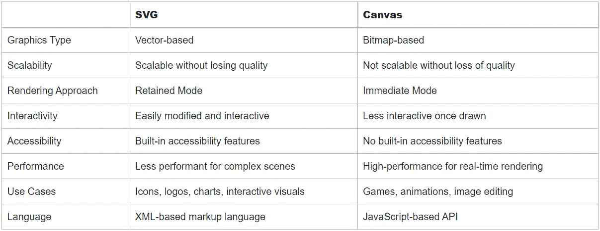

# HTML

#### 1. What are the new features of HTML5 ?

**HTML5** is the fifth revision of the Hypertext Markup Language (HTML), which is the standard markup language for creating webpages and applications on the World Wide Web. It was developed by the World Wide Web Consortium (W3C) and the Web Hypertext Application Technology Working Group (WHATWG) as an evolution of its predecessor, HTML4.

#### Following are the new features in HTML5 :

**1. Semantics** : HTML5 introduced several new elements that provide better semantic meaning to web content. These include `<header>`, `<footer>`, `<nav>`, `<article>`, `<section>`, `<aside>`, `<figure>`, and `<figcaption>`. These elements make it easier for search engines and assistive technologies to understand the structure and purpose of the content.

Semantic elements in HTML are tags that provide meaning and context to the content within a web page. They help describe the purpose or role of different sections of the document, making it more accessible to both humans and machines. Here are some commonly used semantic elements in HTML:

**1. `<header>`:** Represents the introductory content or a container for the site’s heading, logo, navigation, etc.
Example:

```html
<header>
  <h1>My Website</h1>
  <nav>
    <ul>
      <li><a href="#">Home</a></li>
      <li><a href="#">About</a></li>
      <li><a href="#">Contact</a></li>
    </ul>
  </nav>
</header>
```

**2. `<nav>`:** Defines a section containing navigation links.
Example:

```html
<nav>
  <ul>
    <li><a href="#">Home</a></li>
    <li><a href="#">About</a></li>
    <li><a href="#">Contact</a></li>
  </ul>
</nav>
```

**3. `<main>`:** Represents the main content of the document.
Example:

```html
<main>
  <h1>Article Title</h1>
  <p>Article content goes here.</p>
</main>
```

**4. `<article>`:** Defines a self-contained composition within a document, such as a blog post, news article, or comment.
Example:

```html
<article>
  <h2>Blog Post Title</h2>
  <p>Blog post content goes here.</p>
  <footer>Published on June 1, 2023</footer>
</article>
```

**5. `<section>`:** Represents a standalone section within a document, which could have its own heading.
Example:

```html
<section>
  <h2>About Us</h2>
  <p>Information about our company.</p>
</section>
```

**6. `<aside>`:** Defines a section that contains content related to the main content but can be considered separate from it.
Example:

```html
<aside>
  <h3>Related Links</h3>
  <ul>
    <li><a href="#">Link 1</a></li>
    <li><a href="#">Link 2</a></li>
  </ul>
</aside>
```

**7. `<footer>`:** Represents the footer of a document or a section.
Example:

```html
<footer>
  <p>© 2023 My Website. All rights reserved.</p>
</footer>
```

These are just a few examples of semantic elements in HTML. Using semantic tags helps improve the accessibility, maintainability, and search engine optimization of web pages by providing clearer structural meaning to the content.

**2. Multimedia Support:** HTML5 added native support for multimedia elements, eliminating the need for plugins like Adobe Flash. The `<audio>` and `<video>` elements allow developers to embed audio and video content directly into web pages. The new `<canvas>` element enables dynamic rendering of graphics, animations, and visual effects using JavaScript.

**1. `<audio>`:** Embeds an audio file on a web page.
Example:

```html
<audio src="audiofile.mp3" controls="">
  Your browser does not support the audio element.
</audio>
```

**2. `<video>`:** Embeds a video file on a web page.
Example:

```html
<video src="videofile.mp4" controls="">
  Your browser does not support the video element.
</video>
```

**3. `<source>`:** Specifies alternative media resources for `<audio>` and `<video>` elements.
Example:

```html
<video controls="">
  <source src="" type="video/mp4" />
  <source src="" type="video/webm" />
  Your browser does not support the video element.
</video>
```

**4. `<track>`:** Specifies timed text tracks, such as captions or subtitles, for `<video>` and `<audio>` elements.
Example:

```html
<video controls="">
  <source src="" type="video/mp4" />
  <track src="" kind="captions" label="English" srclang="en" />
  Your browser does not support the video element.
</video>
```

**5. `<embed>`:** Embeds external content, such as plugins or multimedia content, within an HTML document.
Example:

```html
<embed src="" width="400" height="300" />
```

These HTML5 multimedia elements allow you to include audio, video, graphics, and external content into your web pages, providing a richer and more interactive user experience.

**3. Form Enhancements :** HTML5 introduced new input types and attributes to enhance web forms. Some examples include `<input type=”email”>` for email addresses, `<input type=”url”>` for URLs, `<input type=”date”>` for date input, `<input type=”range”>` for sliders, and `<input type=”color”>` for color pickers. Additionally, the `<datalist>` element provides a list of predefined options for form fields.

**1. Input types:** HTML5 introduced new input types that provide better input validation and user experience.
For example:

```html
<input type="email" placeholder="Email" required />
<input type="date" placeholder="Date" />
<input type="number" placeholder="Number" />
<input type="range" min="0" max="100" step="5" />
```

**2. Placeholder attribute:** The placeholder attribute allows you to provide hints or example values within input fields. It disappears when the user starts typing.

```html
<input type="text" placeholder="Enter your name" />
```

**3. Required attribute:** The required attribute specifies that an input field must be filled out before submitting the form.

```html
<input type="text" required />
```

**4. Pattern attribute:** The pattern attribute allows you to specify a regular expression pattern that the input value must match.

```html
<input type="text" pattern="[A-Za-z]{3}" />
```

**5. Date input:** HTML5 introduced the `<input type=”date”>` element, which provides a date picker for selecting dates.

```html
<input type="date" />
```

**6. Color input:** The `<input type=”color”>` element allows users to select a color using a color picker.

```html
<input type="color" />
```

**7. Range input:** The `<input type=”range”>` element creates a slider control for selecting a value within a specified range.

```html
<input type="range" min="0" max="100" />
```

**8. Autocomplete attribute:** The autocomplete attribute specifies whether a form field should have autocomplete functionality enabled or disabled.

```html
<input type="text" autocomplete="off" />
```

**9. Validation:** HTML5 introduced built-in form validation, which allows you to validate form inputs without using JavaScript. You can use attributes like `required`, `min`, `max`, `pattern`, and more to validate user input.

These are just a few examples of the form enhancements introduced in HTML5. These features help improve user experience, provide better input validation, and reduce the need for custom JavaScript solutions when working with forms.

**4. Offline and Storage:** HTML5 introduced the Application Cache (`<appcache>`) mechanism, enabling web applications to work offline or with a slow internet connection. It also introduced the Web Storage API (`localStorage` and `sessionStorage`), allowing web applications to store data locally on the client’s browser.

**1. Application Cache (Offline):** HTML5 introduced the Application Cache feature, which allows web pages to be cached on the client-side and accessed offline. By defining a cache manifest file, you can specify which resources should be stored for offline use.
Example:

```html
<!DOCTYPE html>
<html manifest="offline.appcache">
  ...
</html>
```

The `offline.appcache` file would contain a list of resources to cache.

**2. Local Storage:** HTML5 provides the Local Storage API, allowing you to store key-value pairs of data on the client’s browser. This data persists even after the browser is closed.
Example:

```html
<script>
  // Store data in local storage
  localStorage.setItem("username", "John"); // Retrieve data from local storage
  var username = localStorage.getItem("username");
  console.log(username); // Output: John
  // Remove data from local storage
  localStorage.removeItem("username");
</script>
```

**3. Session Storage:** Similar to Local Storage, the Session Storage API allows you to store data on the client-side. However, the data is available only for the duration of the browser session and is cleared when the session ends.
Example:

```html
<script>
  // Store data in session storage
  sessionStorage.setItem("token", "abc123"); // Retrieve data from session storage
  var token = sessionStorage.getItem("token");
  console.log(token); // Output: abc123
  // Remove data from session storage
  sessionStorage.removeItem("token");
</script>
```

**4. IndexedDB:** IndexedDB is a more advanced client-side database feature introduced in HTML5. It provides a structured, indexed storage solution for larger sets of data.
Example:

```html
<script>
  // Open a database connection
  var request = indexedDB.open("myDatabase", 1);
  request.onerror = function (event) {
    console.log("Database error: " + event.target.errorCode);
  };
  request.onsuccess = function (event) {
    var db = event.target.result;
    // Perform database operations here
  };
</script>
```

These offline and storage features in HTML5 provide web developers with the ability to create more robust and capable web applications that can function offline and store data locally on the client-side.

**5. Geolocation:** HTML5 introduced the Geolocation API, which enables web applications to access the user’s geographic location with their consent. This feature has been widely used for location-based services and applications.

Here’s an example of using the Geolocation API in HTML5:

```html
<!DOCTYPE html>
<html>
  <head>
    <script>
      function getLocation() {
        if (navigator.geolocation) {
          navigator.geolocation.getCurrentPosition(showPosition, showError);
        } else {
          alert("Geolocation is not supported by this browser.");
        }
      }

      function showPosition(position) {
        var latitude = position.coords.latitude;
        var longitude = position.coords.longitude;
        alert("Latitude: " + latitude + "\nLongitude: " + longitude);
      }

      function showError(error) {
        switch (error.code) {
          case error.PERMISSION_DENIED:
            alert("User denied the request for Geolocation.");
            break;
          case error.POSITION_UNAVAILABLE:
            alert("Location information is unavailable.");
            break;
          case error.TIMEOUT:
            alert("The request to get user location timed out.");
            break;
          case error.UNKNOWN_ERROR:
            alert("An unknown error occurred.");
            break;
        }
      }
    </script>
  </head>
  <body>
    <button onclick="getLocation()">Get Location</button>
  </body>
</html>
```

In this example:

1. The `getLocation()` function is called when the user clicks the “Get Location” button.

2. The function checks if the browser supports the Geolocation API. If supported, it calls the `getCurrentPosition()` method, passing in the `showPosition` function as the success callback and the `showError` function as the error callback.

3. If the user grants permission to access their location, the `showPosition()` function is called with the `position` parameter containing the latitude and longitude coordinates.

4. If an error occurs, the `showError()` function is called, providing information about the specific error that occurred.

When the user clicks the “Get Location” button, the web page will prompt the user to grant permission to access their location. If permission is granted, the browser will retrieve the latitude and longitude coordinates, and an alert dialog will display the coordinates. If an error occurs or if geolocation is not supported, an appropriate alert message will be displayed.

Please note that accessing geolocation requires the user’s consent, and the accuracy of the retrieved location can vary depending on various factors, such as the user’s device and browser settings.

**6. Drag and Drop:** HTML5 introduced a standardized Drag and Drop API, making it easier to implement drag-and-drop functionality within web applications without relying on third-party libraries.

```html
<!DOCTYPE html>
<html>
  <head>
    <style>
      .dropzone {
        width: 200px;
        height: 200px;
        border: 2px dashed #ccc;
        padding: 10px;
      }

      .dragitem {
        width: 100px;
        height: 100px;
        background-color: #f1f1f1;
        border: 1px solid #ccc;
        padding: 10px;
        margin-bottom: 10px;
        cursor: move;
      }
    </style>
    <script>
      function allowDrop(event) {
        event.preventDefault();
      }
      function drag(event) {
        event.dataTransfer.setData("text", event.target.id);
      }
      function drop(event) {
        event.preventDefault();
        var data = event.dataTransfer.getData("text");
        event.target.appendChild(document.getElementById(data));
      }
    </script>
  </head>
  <body>
    <div
      id="dragitem1"
      class="dragitem"
      draggable="true"
      ondragstart="drag(event)"
    >
      Draggable Item 1
    </div>
    <div
      id="dragitem2"
      class="dragitem"
      draggable="true"
      ondragstart="drag(event)"
    >
      Draggable Item 2
    </div>
    <div
      id="dropzone"
      class="dropzone"
      ondragover="allowDrop(event)"
      ondrop="drop(event)"
    >
      Drop Zone
    </div>
  </body>
</html>
```

In this example:

1. Two draggable elements with IDs “dragitem1” and “dragitem2” are created. The `draggable=”true”` attribute allows them to be dragged.

2. The `drag()` function is called when the drag operation starts, and it sets the ID of the dragged element as the data to be transferred during the drag.

3. The `allowDrop()` function is called when an element is dragged over the drop zone. It prevents the default behavior to allow dropping.

4. The `drop()` function is called when an element is dropped onto the drop zone. It prevents the default behavior, retrieves the data of the dragged element, and appends the dragged element to the drop zone.

When you run this code, you can drag the “Draggable Item 1” and “Draggable Item 2” elements and drop them into the “Drop Zone” element. The `drop()` function is responsible for handling the drop event and moving the dragged element to the drop zone.

This example demonstrates a basic implementation of drag and drop functionality using HTML5. You can customize it further by adding additional event handlers or applying CSS styles to enhance the visual feedback during drag and drop interactions.

**7. Improved Accessibility:** HTML5 introduced various attributes and elements to improve web accessibility. These include the `role` attribute, `aria-*` attributes for defining accessible roles and properties, and `<figure>` and `<figcaption>` elements for providing alternative descriptions for images and multimedia content.

Here’s an example that demonstrates additional HTML5 accessibility features and best practices for improved accessibility:

```html
<!DOCTYPE html><br />
<html lang="en">
  <br />
  <head>
    <br />
    <title>Improved Accessible Web Page</title>
    <br /></head
  ><br />
  <body>
    <br />
    <header>
      <br />
      <h1>Welcome to My Improved Accessible Web Page</h1>
      <br />
    </header>
    <br />
    <br />
    <nav>
      <br />
      <ul>
        <br />
        <li><a href="#section1">Section 1</a></li>
        <br />
        <li><a href="#section2">Section 2</a></li>
        <br />
        <li><a href="#section3">Section 3</a></li>
        <br />
      </ul>
      <br />
    </nav>
    <br />
    <br />
    <main>
      <br />
      <section id="section1">
        <br />
        <h2>Section 1</h2>
        <br />
        <article>
          <br />
          <h3>Subsection 1.1</h3>
          <br />
          <p>This is the content of subsection 1.1.</p>
          <br />
        </article>
        <br />
        <br />
        <article>
          <br />
          <h3>Subsection 1.2</h3>
          <br />
          <figure>
            <br />
            <br />
            <figcaption>A beautiful image</figcaption>
            <br />
          </figure>
          <br />
          <p>This is the content of subsection 1.2.</p>
          <br />
        </article>
        <br />
      </section>
      <br />
      <br />
      <section id="section2">
        <br />
        <h2>Section 2</h2>
        <br />
        <article>
          <br />
          <h3>Subsection 2.1</h3>
          <br />
          <p>This is the content of subsection 2.1.</p>
          <br />
        </article>
        <br />
        <br />
        <article>
          <br />
          <h3>Subsection 2.2</h3>
          <br />
          <p>This is the content of subsection 2.2.</p>
          <br />
          <aside>
            <br />
            <h4>Related Information</h4>
            <br />
            <p>Additional information about this section.</p>
            <br />
          </aside>
          <br />
        </article>
        <br />
      </section>
      <br />
      <br />
      <section id="section3">
        <br />
        <h2>Section 3</h2>
        <br />
        <article>
          <br />
          <h3>Subsection 3.1</h3>
          <br />
          <p>This is the content of subsection 3.1.</p>
          <br />
        </article>
        <br />
        <br />
        <article>
          <br />
          <h3>Subsection 3.2</h3>
          <br />
          <p>This is the content of subsection 3.2.</p>
          <br />
        </article>
        <br />
      </section>
      <br />
    </main>
    <br />
    <br />
    <footer>
      <br />
      <p>&copy; 2023 My Improved Accessible Web Page</p>
      <br />
    </footer>
    <br />
  </body>
  <br />
</html>
<br />
```

In this improved example:

1. Heading elements (`<h1>`, `<h2>`, `<h3>`, `<h4>`) are used to provide hierarchical structure and clear headings for different sections.

2. Semantic elements like `<article>`, `<section>`, and `<nav>` are used to indicate the structure and purpose of different parts of the page.

3. Alternative text (`alt` attribute) is provided for images within `` elements, describing the content or purpose of the image.

4. The `<figure>` element is used to group an image and its caption (`<figcaption>`), providing a semantic association between them.

5. An `<aside>` element is used to provide additional related information that is separate from the main content.

6. The `lang` attribute is set to `”en”` to specify the language of the web page.

7. The `<header>` element marks the header section of the page, and the `<footer>` element marks the footer section.

By incorporating these **HTML5 accessibility** features and best practices, you make the web page more structured, navigable, and understandable for users with disabilities and assistive technologies. Additionally, remember to ensure proper color contrast, provide descriptive link text, and consider keyboard accessibility to further improve the overall accessibility of your web page.

#### 2. What is the purpose of the doctype declaration in HTML5 ?

The purpose of the **doctype declaration in HTML5** is to specify the version of HTML being used in the document and to ensure that the browser renders the webpage in standards mode. The doctype declaration is placed at the very beginning of an HTML document, before the `` tag.

In HTML5, the doctype declaration is simplified and standardized. The following is the basic syntax of the doctype declaration in HTML5:

```html
<!DOCTYPE html>
```

The above declaration informs the browser that the document is written in HTML5. It triggers the browser to render the webpage in standards mode, where it follows the specifications and rules of HTML5.

```html
<!DOCTYPE html>
<html>
  <head>
    <title>My Webpage</title>
  </head>
  <body>
    <h1>Welcome to My Webpage</h1>
    <p>This is a sample paragraph.</p>
  </body>
</html>
```

In this example, the `<!DOCTYPE html>` declaration is placed at the very beginning. It signifies that the document is an HTML5 document. The rest of the HTML markup follows after the doctype declaration.

**Conclusion :**

It’s important to include the `<doctype declaration>` to ensure proper rendering and interpretation of the HTML code by web browsers. Without it, the browser might fallback to quirks mode or older rendering modes, leading to inconsistent behavior and potential compatibility issues.

#### 3. What would happen if I would not declare doctype in html ?

The <!DOCTYPE> declaration must be the very first thing in your HTML document, before the tag.

The <!DOCTYPE> declaration is not an HTML tag; it is an instruction to the web browser about what version of HTML the page is written in.

A lot of IDEs allow users to leave this out and default to a certain HTML style, but leaving it out does pose a potential threat in browser compatibility and the use of older versions of HTML.

For example: new features & tags in HTML5 such as `<article>`, `<footer>`, `<header>`, `<nav>`, `<section>` may not be supported if the `<!DOCTYPE>` is not declared.

#### 4. What are data attributes in HTML5 and how are they used ?

**Data attributes** in HTML5 are custom attributes that can be added to HTML elements to store extra information or metadata about the element. They are prefixed with “data-” followed by a descriptive name, allowing developers to define their own attributes without conflicting with standard HTML attributes or affecting the element’s functionality.

**Data attributes** can be useful for various purposes, such as storing additional data for JavaScript manipulation, providing configuration options, or associating data with specific elements.

## Here’s an example of a data attribute in HTML:

```html
<button id="myButton" data-action="delete" data-item-id="123">Delete</button>
```

In the above example, the `<button>` element has two data attributes: `data-action` and `data-item-id`. The values assigned to these attributes, `”delete”` and `”123"`, respectively, can be any valid string or number.

### JavaScript Access:

To access the data attributes using JavaScript, you can use the `dataset` property, which provides access to all the data attributes of an element. Here’s how you can access the data attributes in the above example:

```js
var button = document.getElementById("myButton");
var action = button.dataset.action; // "delete"
var itemId = button.dataset.itemId; // "123"
```

The `dataset` property returns an object that represents all the data attributes of an element. The names of the data attributes are converted to camel case when accessing them as properties.

Data attributes can also be manipulated and updated dynamically using JavaScript. For example, you can change the value of a data attribute like this:

```js
button.dataset.action = "update";
```

### CSS Access:

Data attributes can be accessed using css using css attribute selector.

```css
button[data-action="delete"] {
  color: red;
}
```

**Conclusion:**

**Data attributes** provide a flexible way to store custom data associated with HTML elements, making it easier to access and manipulate that data using JavaScript. They are particularly useful when you need to attach additional information to elements for scripting or styling purposes.

#### 5. What is the difference between HTML and HTML5 ?

1. Multimedia Support: HTML5 provides native support for audio and video playback, eliminating the need for third-party plugins such as Adobe Flash.

2. New Semantic Elements: HTML5 introduces new semantic elements like “header”, “footer”, “nav”, “section”, and “article” that make it easier to structure web pages and create more accessible and search engine friendly content.

3.Canvas Element: HTML5 includes a new “canvas” element that allows developers to draw graphics, animations, and other visual effects using JavaScript.

4. Offline Capabilities: HTML5 introduces new APIs that allow web applications to work offline and store data on the client-side, reducing server requests and improving user experience.

5. Improved Forms: HTML5 offers several new form elements and attributes such as “date”, “time”, “search”, “tel”, “number”, “required”, and “placeholder” that make it easier to create forms and validate user input.

6. Overall, HTML5 offers a more modern and feature-rich approach to web development compared to its predecessor, HTML.

#### 6. Difference between SVG and Canvas ?

SVG (Scalable Vector Graphics) and Canvas are both graphics technologies in HTML5, but they have different approaches and use cases. Here’s the difference between SVG and Canvas:



In summary, SVG is suitable for scalable graphics, interactive visualizations, and accessibility, while Canvas excels in high-performance rendering, pixel-level control, and applications requiring real-time graphics, such as games and animations. The choice between SVG and Canvas depends on the specific requirements and characteristics of the project.

#### 7. What is the difference between localstorage , session storage and cookies ?

**LocalStorage**, **sessionStorage**, and **cookies** are all mechanisms for storing data on the client-side in a web browser, but they differ in their scope, expiration, and usage. Here’s a breakdown of their differences:

**LocalStorage:**

— **Scope:** Local to the specific domain/origin.

— **Expiration:** Data stored in LocalStorage persists even after the browser is closed and is available for future sessions unless explicitly removed.

— **Size Limit:** Typically, the storage limit is around 5MB.

— **Usage:** LocalStorage is commonly used for long-term storage of data that needs to be available across multiple browser sessions, such as user preferences or cached data. It provides a simple key-value storage mechanism and is accessible by any page on the same domain.

**SessionStorage:**

— **Scope:** Local to the specific domain/origin.

— **Expiration:** Data stored in sessionStorage is available only within the current browser session. It is cleared when the session ends or when the browser is closed.

— **Size Limit:** Similar to LocalStorage, sessionStorage typically has a storage limit of around 5MB.

— **Usage:** sessionStorage is often used for storing temporary or session-specific data. For example, it can be used to store state information during a user’s visit to a website, such as a shopping cart contents or form data that needs to be retained temporarily.

**Cookies:**

— **Scope:** Cookies are associated with a specific domain and can be set to be accessible across subdomains or restricted to specific paths.

— **Expiration:** Cookies can have an expiration date/time, allowing them to persist across browser sessions (persistent cookies) or be deleted when the browser is closed (session cookies).

— **Size Limit:** The maximum size for cookies is typically around 4KB.

— **Usage:** Cookies are commonly used for storing small amounts of data, such as user preferences, session identifiers, or authentication tokens. They are sent with each request to the server, providing a way to maintain state or track user behavior.

In summary, **LocalStorage** and **sessionStorage** are storage mechanisms provided by the browser for client-side data storage, with LocalStorage being more persistent and available across sessions, while sessionStorage is limited to the current session. Cookies, on the other hand, are small text files used for storing data that is sent to the server with each request, and they can have expiration dates for persistence. The choice of which storage mechanism to use depends on the specific requirements of the application and the desired lifespan of the data.

#### 8. What are the void elements in HTML ?

Most of the HTML elements are surrounded by start and end tags to specify the starting and end of the element.

There is a special group of elements that only have start tags and does not contain any content within it, these elements are called void elements. **Void elements** doesn’t have ending tags and can only have attributes but do not contain any kind of content. These elements can have backslash before ending of start tag but that is completely optional.

**Example of such elements are** `<br>`, `<hr>`, ``, `<input>`, `<link>`, `<base>`, `<meta>`, `<param>`, `<area>`, `<embed>`, `<col>`, `<hr>`, `<source>` etc.

#### 9. What is BOM (browser object model ) and what is the root object in it ?

The Browser Object Model (BOM) is used to interact with the browser.

The default object of browser is window means you can call all the functions of window by specifying window or directly.

**Browser Objects:**

The objects listed below are called browser objects.

Window — part of DOM API

Navigator Document — part of DOM API

Screen — property of Window object

History — property of Window object

Location — property of Window and Document object

#### 10. What are the various formatting tags in HTML?

HTML has various **formatting tags:**

`<b>` — makes text bold  
`<i>` — makes text italic  
`<em>` — makes text italic but with added semantic importance  
`<big>` — increases the font size of the text by one unit  
`<small>` — decreases the font size of the text by one unit  
`<sub>` — makes the text a subscript  
`<sup>` — makes the text a superscript  
`<del>` — displays as strike out text  
`<strong>` — marks the text as important  
`<mark>` — highlights the text  
`<ins>` — displays as added text

#### 11. In how many ways you can display HTML elements ?

Following are the ways to display HTML elements:

**1. inline:** Using this we can display any block-level element as an inline element. The height and width attribute values of the element will not affect.

**2. block:** using this, we can display any inline element as a block-level element.

**3. inline-block:** This property is similar to inline, except by using the display as inline-block, we can actually format the element using height and width values.

**4. flex:** It displays the container and element as a flexible structure. It follows flexbox property.

**5. inline-flex:** It displays the flex container as an inline element while its content follows the flexbox properties.

**6. grid:** It displays the HTML elements as a grid container.

**7. none:** Using this property we can hide the HTML element.

#### 12. What is the difference between a tag and an attribute ?

**Here’s the difference between the two:**

**1. Tag:**
Within the domain of markup languages like HTML, a **tag** serves as a foundational building block. Tags are instrumental in defining the layout and substance of elements present on a webpage. They are composed of angle brackets (“<” and “>”) and usually come in pairs: an opening tag and a closing tag. The opening tag signifies the commencement of an element, while the closing tag denotes its conclusion.

**For example, in HTML:**

```html
<p>This is a paragraph.</p>
```

In this case, `<p>` is the opening tag, and `</p>` is the closing tag. Together, they define a paragraph element on the webpage.

**2. Attribute:**

An **attribute** encompasses additional particulars that can be appended to an HTML tag. These attributes are inserted within the opening tag of the element and generally comprise a name and a value. The name and value are separated by an equals sign (“=”) and are enclosed in either double or single quotation marks.

**For example, in HTML:**

```html
<a href="https://www.example.com">Visit Example Website</a>
```

In this example, `href` is an attribute of the `<a>` (anchor) tag. It specifies the hyperlink reference, or the URL that the anchor tag links to.

**Conclusion:**

In summary, a tag defines the type and structure of an HTML element, while an attribute provides additional information or settings for that element. Tags and attributes work together to create well-structured and interactive web content.

#### 13. What are data attributes in HTML5 and how are they used ?

**Data attributes** in HTML5 are custom attributes that can be added to HTML elements to store extra information or metadata about the element. They are prefixed with “data-” followed by a descriptive name, allowing developers to define their own attributes without conflicting with standard HTML attributes or affecting the element’s functionality.

**Data attributes** can be useful for various purposes, such as storing additional data for JavaScript manipulation, providing configuration options, or associating data with specific elements.

## Here’s an example of a data attribute in HTML:

```html
<button id="myButton" data-action="delete" data-item-id="123">Delete</button>
```

In the above example, the `<button>` element has two data attributes: `data-action` and `data-item-id`. The values assigned to these attributes, `”delete”` and `”123"`, respectively, can be any valid string or number.

**JavaScript Access:**

To access the data attributes using JavaScript, you can use the `dataset` property, which provides access to all the data attributes of an element. Here’s how you can access the data attributes in the above example:

```js
var button = document.getElementById("myButton");
var action = button.dataset.action; // "delete"
var itemId = button.dataset.itemId; // "123"
```

The `dataset` property returns an object that represents all the data attributes of an element. The names of the data attributes are converted to camel case when accessing them as properties.

Data attributes can also be manipulated and updated dynamically using JavaScript. For example, you can change the value of a data attribute like this:

```js
button.dataset.action = "update";
```

**CSS Access:**

Data attributes can be accessed using css using css attribute selector.

```css
button[data-action="delete"] {
  color: red;
}
```

**Conclusion:**

**Data attributes** provide a flexible way to store custom data associated with HTML elements, making it easier to access and manipulate that data using JavaScript. They are particularly useful when you need to attach additional information to elements for scripting or styling purposes.

#### 14. What are different types of list in HTML ?

In **HTML**, there are three main types of lists that can be used to organize and structure content:

**1. Ordered List (`<ol>`)**: An ordered list is used when the order of the items is important. Each item is represented by an `<li>` (list item) element, and by default, the items are numbered sequentially. The numbering style can be customized using CSS. Here’s an example of an ordered list:

```html
<ol>
  <li>First item</li>
  <li>Second item</li>
  <li>Third item</li>
</ol>
```

**2. Unordered List (`<ul>`)**: An unordered list is used when the order of the items is not important. Like the ordered list, each item is represented by an `<li>` element, but instead of numbers, bullet points or other markers are used to denote the items. Here’s an example of an unordered list:

```html
<ul>
  <li>Red</li>
  <li>Green</li>
  <li>Blue</li>
</ul>
```

**3. Definition List (`<dl>`)**: A definition list is used to present a list of terms and their corresponding definitions. It consists of `<dt>` (definition term) elements for the terms and `` (definition description) elements for the definitions. Here’s an example of a definition list:

```html
<dl>
  <dt>HTML</dt>
  <dd>HyperText Markup Language</dd>
  <dt>CSS</dt>
  <dd>Cascading Style Sheets</dd>
</dl>
```

These list types can be nested within each other to create more complex structures. For example, you can have an ordered list within an unordered list or vice versa. Additionally, CSS can be used to modify the appearance of the lists, such as changing the bullet points or numbering style, adjusting the spacing, or applying custom styles.

#### 1. What is the use of aria hidden attribute ?

The **aria-hidden** attribute is an accessibility attribute in HTML that is used to indicate whether an element and its contents should be visible or hidden to assistive technologies, such as screen readers. This can improve the experience for assistive technology users by hiding:-

1. Purely decorative content, such as icons or images
2. Duplicated content, such as repeated text
3. Offscreen or collapsed content, such as menus

According to the fourth rule of ARIA, aria-hidden=”true” should not be used on a focusable element. Additionally, since this attribute is inherited by an element’s children, it should not be added onto the parent or ancestor of a focusable element.

Using aria-hidden=”false” will not re-expose the element to assistive technology if any of its parents specify aria-hidden=”true”.

Here’s an example of how to use the aria-hidden attribute:

```html
<div aria-hidden="true">
  This content is visually hidden but accessible to assistive technologies.
</div>
```

#### 2. What are some important points related to accessibility ?

**Accessibility** is an essential aspect of web development, ensuring that websites and applications are usable by people with disabilities. Here are some important points related to accessibility:

**1. Semantic HTML :** Use appropriate HTML tags to convey the structure and meaning of the content. Use headings (`<h1>` to `<h6>`) to organize content, `<p>` for paragraphs, `<nav>` for navigation sections, `<button>` for interactive buttons, etc. This helps screen readers and assistive technologies understand the content and provide a better experience for users.

**2. Keyboard Accessibility:** Ensure that all functionality can be accessed and operated using a keyboard alone. This is crucial for people with motor disabilities who rely on keyboard navigation. Make sure focus is properly managed and visible, and elements such as buttons, links, and form inputs are keyboard accessible and provide appropriate feedback.

**3. Alt Text for Images:** Provide descriptive alternative text (`alt` attribute) for images. This allows screen readers to describe the content of images to visually impaired users. Use concise and meaningful descriptions that convey the purpose or information conveyed by the image.

**4. Contrast and Color:** Use sufficient contrast between text and background colors to ensure readability. Low contrast can make it difficult for people with visual impairments or color blindness to read content. Consider using tools to check contrast ratios and ensure compliance with accessibility standards.

**5. Forms and Labels:** Use proper form elements and labels to provide clear instructions and associations. Associate labels with form inputs using the `for` attribute or by wrapping the input within the label element. This helps screen readers understand the purpose of form inputs and improves usability for users with visual impairments.

**6. Focus Indicators:** Ensure that focus indicators are clearly visible and distinguishable. When users navigate through a page using the keyboard, it’s important to provide a visual indication of the focused element. This helps users with disabilities understand their location within the page and improves overall navigation.

**7. ARIA Roles and Attributes:** Use ARIA (Accessible Rich Internet Applications) roles and attributes to enhance the accessibility of complex or custom UI components. ARIA attributes provide additional information to assistive technologies, helping them understand and navigate interactive elements like menus, tabs, and modals.

**8. Responsive and Mobile Accessibility:** Ensure that your website is responsive and works well on different devices and screen sizes. Consider the needs of users with disabilities who may access your site using mobile devices or assistive technologies. Test your site’s accessibility on mobile devices and use media queries to adapt the layout and design.

**9. Testing and Auditing:** Regularly test and audit your website for accessibility. Use automated accessibility testing tools to identify common issues, and perform manual testing to understand the experience from the perspective of users with disabilities. Incorporate accessibility into your development process to catch and address issues early on.

**10. Continuous Learning:** Stay updated with accessibility guidelines and best practices. Accessibility standards and techniques evolve, so it’s important to continuously learn and improve your understanding of accessibility to create inclusive and usable experiences for all users.

These points highlight some important considerations for creating accessible websites and applications. By following accessibility best practices, you can ensure that your content is available and usable by a wider range of users, regardless of their abilities or disabilities.

**The WCAG 2.0 is organized in three different levels:**

Level A: the most basic Web accessibility features;

Level AA: the most common barriers for disabled people;

Level AAA: the highest level of accessibility.

Even level A is just the beginning, and the level AA embraced on large companies’ websites, the level AAA is the one to which is hoping that someday all the Web products will go. For reaching those, it’s very important to have empathy for your users, they need to have excellent experiences on the Web, too.

#### 3.For accessibility which screen reader is used for which browser ?

**1. JAWS —** most compatible with Chrome , firefox and Internet explorer although it supports other browsers as well. It is expensive. Compatible only with windows OS. JAWS came in the market much before NVDA and is a slightly better as compared to NVDA for blind uers because of better braille support , more sounds and whistles and more configuration options. But still it’s a better deal to use a free NVDA than to pay a heavy price for JAWS. Hence the users have now been shifting to NVDA and popularity of JAWS is decreasing.

**2. NVDA-** most compatible with Chrome , firefox and Edge although it supports other browsers as well. It is free of cost. Compatible only with windows OS

**3. Voiceover-** Available and used by default with Macos(Mac laptops) and IOS(Iphones)

**4. Talkback —** Available and used by default with Android phones

#### 4. What are web workers ?

**Web Workers** are a browser feature that allows you to run JavaScript code in the background, separate from the main browser thread. They enable concurrent execution and help prevent blocking the user interface during computationally intensive or time-consuming tasks.

Here are some key points about web workers:

**1. Background Execution:** Web Workers allow you to run scripts in the background without blocking the main thread. This keeps the user interface responsive and improves overall performance.

**2. Separate Thread:** Web Workers run in a separate thread from the main JavaScript thread, often referred to as the “worker thread.” This thread is isolated and doesn’t share the same memory space as the main thread.

**3. Communication:** Web Workers communicate with the main thread using messaging. They can receive messages from the main thread and post messages back to it. This messaging system allows data exchange and coordination between the worker and the main thread.

**4. Limited Scope:** Web Workers have limited access to browser APIs and the DOM. They can’t directly manipulate the DOM or access certain objects and methods available in the main thread. This limitation helps maintain security and prevents worker threads from interfering with the user interface.

**5. Types of Web Workers:** There are two types of web workers: dedicated workers and shared workers. Dedicated workers are tied to a specific script and can communicate only with the script that created them. Shared workers can be accessed by multiple scripts or web pages running on the same origin, allowing them to share data and communicate with multiple sources.

Web Workers are useful for various tasks such as heavy computations, parsing large datasets, performing complex algorithms, and offloading non-UI tasks. They can help improve the overall responsiveness and performance of web applications by distributing the workload across multiple threads.

Here’s a simple example of using a web worker:

```js
// main.js (main thread)
const worker = new Worker("worker.js");

worker.onmessage = function (event) {
  console.log("Message from web worker:", event.data);
};
worker.postMessage("Hello from main thread!");

// worker.js (worker thread)
self.onmessage = function (event) {
  console.log("Message from main thread:", event.data);
  self.postMessage("Hello from web worker!");
};
```

In this example, the main thread creates a **web worker** using the `Worker` constructor, specifying the script file (`worker.js`). The main thread sends a message to the web worker using `worker.postMessage()`. The web worker receives the message in its `onmessage` event handler, logs it, and sends a response back to the main thread using `self.postMessage()`. The main thread receives the response in its `onmessage` event handler and logs it.

Web Workers are supported in modern browsers and provide a powerful tool for performing background tasks, improving performance, and enhancing the user experience of web applications.

#### 5. Which html elements were used before HTML5 for embedding video into the website ?

**Before HTML5**, in order to have a video play on a webpage, you would need to use a plugin like Adobe Flash Player. With the introduction of HTML5, you can now place videos directly into the page itself.

The **HTML5** `<video>` element is used to embed video in web documents. It may contain one or more video sources, represented using the src attribute or the source element.

To embed a video file, just add this code snippet and change the src to the path of your video file:

```html
<video controls>
  <source src="test.ogg" type="video /ogg" />
  <source src="test.mp4" type="video /mpeg" />
  Your browser does not support the video element. Kindly update it to latest
  version.
</video>
```

#### 6. What is an image map ?

The HTML <map> tag defines an image map. An image map is an image with clickable areas. The areas are defined with one or more `<area>` tags.

**HTML:-**

```html


<map name="workmap">
  <area
    shape="rect"
    coords="34,44,270,350"
    alt="Computer"
    href="computer.htm"
  />
  <area shape="rect" coords="290,172,333,250" alt="Phone" href="phone.htm" />
  <area
    shape="circle"
    coords="337,300,44"
    alt="Cup of coffee"
    href="coffee.htm"
  />
</map>
```

#### 7. What does semantic HTML mean ?

**Semantic HTML** or semantic markup is HTML that introduces meaning to the web page rather than just presentation. For example, a **‘p’** tag indicates that the enclosed text is a paragraph. This is both semantic and presentational because people know what paragraphs are, and browsers know how to display them.

#### 8. What are the new features of HTML5 ?

**HTML5** is the fifth revision of the Hypertext Markup Language (HTML), which is the standard markup language for creating webpages and applications on the World Wide Web. It was developed by the World Wide Web Consortium (W3C) and the Web Hypertext Application Technology Working Group (WHATWG) as an evolution of its predecessor, HTML4.

#### Following are the new features in HTML5 :

**1. Semantics** : HTML5 introduced several new elements that provide better semantic meaning to web content. These include `<header>`, `<footer>`, `<nav>`, `<article>`, `<section>`, `<aside>`, `<figure>`, and `<figcaption>`. These elements make it easier for search engines and assistive technologies to understand the structure and purpose of the content.

Semantic elements in HTML are tags that provide meaning and context to the content within a web page. They help describe the purpose or role of different sections of the document, making it more accessible to both humans and machines. Here are some commonly used semantic elements in HTML:

**1. `<header>`:** Represents the introductory content or a container for the site’s heading, logo, navigation, etc.
Example:

```html
<header>
  <h1>My Website</h1>
  <nav>
    <ul>
      <li><a href="#">Home</a></li>
      <li><a href="#">About</a></li>
      <li><a href="#">Contact</a></li>
    </ul>
  </nav>
</header>
```

**2. `<nav>`:** Defines a section containing navigation links.
Example:

```html
<nav>
  <ul>
    <li><a href="#">Home</a></li>
    <li><a href="#">About</a></li>
    <li><a href="#">Contact</a></li>
  </ul>
</nav>
```

**3. `<main>`:** Represents the main content of the document.
Example:

```html
<main>
  <h1>Article Title</h1>
  <p>Article content goes here.</p>
</main>
```

**4. `<article>`:** Defines a self-contained composition within a document, such as a blog post, news article, or comment.
Example:

```html
<article>
  <h2>Blog Post Title</h2>
  <p>Blog post content goes here.</p>
  <footer>Published on June 1, 2023</footer>
</article>
```

**5. `<section>`:** Represents a standalone section within a document, which could have its own heading.
Example:

```html
<section>
  <h2>About Us</h2>
  <p>Information about our company.</p>
</section>
```

**6. `<aside>`:** Defines a section that contains content related to the main content but can be considered separate from it.
Example:

```html
<aside>
  <h3>Related Links</h3>
  <ul>
    <li><a href="#">Link 1</a></li>
    <li><a href="#">Link 2</a></li>
  </ul>
</aside>
```

**7. `<footer>`:** Represents the footer of a document or a section.
Example:

```html
<footer>
  <p>© 2023 My Website. All rights reserved.</p>
</footer>
```

These are just a few examples of semantic elements in HTML. Using semantic tags helps improve the accessibility, maintainability, and search engine optimization of web pages by providing clearer structural meaning to the content.

**2. Multimedia Support:** HTML5 added native support for multimedia elements, eliminating the need for plugins like Adobe Flash. The `<audio>` and `<video>` elements allow developers to embed audio and video content directly into web pages. The new `<canvas>` element enables dynamic rendering of graphics, animations, and visual effects using JavaScript.

**1. `<audio>`:** Embeds an audio file on a web page.
Example:

```html
<audio src="audiofile.mp3" controls="">
  Your browser does not support the audio element.
</audio>
```

**2. `<video>`:** Embeds a video file on a web page.
Example:

```html
<video src="videofile.mp4" controls="">
  Your browser does not support the video element.
</video>
```

**3. `<source>`:** Specifies alternative media resources for `<audio>` and `<video>` elements.
Example:

```html
<video controls="">
  <source src="" type="video/mp4" />
  <source src="" type="video/webm" />
  Your browser does not support the video element.
</video>
```

**4. `<track>`:** Specifies timed text tracks, such as captions or subtitles, for `<video>` and `<audio>` elements.
Example:

```html
<video controls="">
  <source src="" type="video/mp4" />
  <track src="" kind="captions" label="English" srclang="en" />
  Your browser does not support the video element.
</video>
```

**5. `<embed>`:** Embeds external content, such as plugins or multimedia content, within an HTML document.
Example:

```html
<embed src="" width="400" height="300" />
```

These HTML5 multimedia elements allow you to include audio, video, graphics, and external content into your web pages, providing a richer and more interactive user experience.

**3. Form Enhancements :** HTML5 introduced new input types and attributes to enhance web forms. Some examples include `<input type=”email”>` for email addresses, `<input type=”url”>` for URLs, `<input type=”date”>` for date input, `<input type=”range”>` for sliders, and `<input type=”color”>` for color pickers. Additionally, the `<datalist>` element provides a list of predefined options for form fields.

**1. Input types:** HTML5 introduced new input types that provide better input validation and user experience.
For example:

```html
<input type="email" placeholder="Email" required />
<input type="date" placeholder="Date" />
<input type="number" placeholder="Number" />
<input type="range" min="0" max="100" step="5" />
```

**2. Placeholder attribute:** The placeholder attribute allows you to provide hints or example values within input fields. It disappears when the user starts typing.

```html
<input type="text" placeholder="Enter your name" />
```

**3. Required attribute:** The required attribute specifies that an input field must be filled out before submitting the form.

```html
<input type="text" required />
```

**4. Pattern attribute:** The pattern attribute allows you to specify a regular expression pattern that the input value must match.

```html
<input type="text" pattern="[A-Za-z]{3}" />
```

**5. Date input:** HTML5 introduced the `<input type=”date”>` element, which provides a date picker for selecting dates.

```html
<input type="date" />
```

**6. Color input:** The `<input type=”color”>` element allows users to select a color using a color picker.

```html
<input type="color" />
```

**7. Range input:** The `<input type=”range”>` element creates a slider control for selecting a value within a specified range.

```html
<input type="range" min="0" max="100" />
```

**8. Autocomplete attribute:** The autocomplete attribute specifies whether a form field should have autocomplete functionality enabled or disabled.

```html
<input type="text" autocomplete="off" />
```

**9. Validation:** HTML5 introduced built-in form validation, which allows you to validate form inputs without using JavaScript. You can use attributes like `required`, `min`, `max`, `pattern`, and more to validate user input.

These are just a few examples of the form enhancements introduced in HTML5. These features help improve user experience, provide better input validation, and reduce the need for custom JavaScript solutions when working with forms.

**4. Offline and Storage:** HTML5 introduced the Application Cache (`<appcache>`) mechanism, enabling web applications to work offline or with a slow internet connection. It also introduced the Web Storage API (`localStorage` and `sessionStorage`), allowing web applications to store data locally on the client’s browser.

**1. Application Cache (Offline):** HTML5 introduced the Application Cache feature, which allows web pages to be cached on the client-side and accessed offline. By defining a cache manifest file, you can specify which resources should be stored for offline use.
Example:

```html
<!DOCTYPE html>
<html manifest="offline.appcache">
  ...
</html>
```

The `offline.appcache` file would contain a list of resources to cache.

**2. Local Storage:** HTML5 provides the Local Storage API, allowing you to store key-value pairs of data on the client’s browser. This data persists even after the browser is closed.
Example:

```html
<script>
  // Store data in local storage
  localStorage.setItem("username", "John"); // Retrieve data from local storage
  var username = localStorage.getItem("username");
  console.log(username); // Output: John
  // Remove data from local storage
  localStorage.removeItem("username");
</script>
```

**3. Session Storage:** Similar to Local Storage, the Session Storage API allows you to store data on the client-side. However, the data is available only for the duration of the browser session and is cleared when the session ends.
Example:

```html
<script>
  // Store data in session storage
  sessionStorage.setItem("token", "abc123"); // Retrieve data from session storage
  var token = sessionStorage.getItem("token");
  console.log(token); // Output: abc123
  // Remove data from session storage
  sessionStorage.removeItem("token");
</script>
```

**4. IndexedDB:** IndexedDB is a more advanced client-side database feature introduced in HTML5. It provides a structured, indexed storage solution for larger sets of data.
Example:

```html
<script>
  // Open a database connection
  var request = indexedDB.open("myDatabase", 1);
  request.onerror = function (event) {
    console.log("Database error: " + event.target.errorCode);
  };
  request.onsuccess = function (event) {
    var db = event.target.result;
    // Perform database operations here
  };
</script>
```

These offline and storage features in HTML5 provide web developers with the ability to create more robust and capable web applications that can function offline and store data locally on the client-side.

**5. Geolocation:** HTML5 introduced the Geolocation API, which enables web applications to access the user’s geographic location with their consent. This feature has been widely used for location-based services and applications.

Here’s an example of using the Geolocation API in HTML5:

```html
<!DOCTYPE html>
<html>
  <head>
    <script>
      function getLocation() {
        if (navigator.geolocation) {
          navigator.geolocation.getCurrentPosition(showPosition, showError);
        } else {
          alert("Geolocation is not supported by this browser.");
        }
      }

      function showPosition(position) {
        var latitude = position.coords.latitude;
        var longitude = position.coords.longitude;
        alert("Latitude: " + latitude + "\nLongitude: " + longitude);
      }

      function showError(error) {
        switch (error.code) {
          case error.PERMISSION_DENIED:
            alert("User denied the request for Geolocation.");
            break;
          case error.POSITION_UNAVAILABLE:
            alert("Location information is unavailable.");
            break;
          case error.TIMEOUT:
            alert("The request to get user location timed out.");
            break;
          case error.UNKNOWN_ERROR:
            alert("An unknown error occurred.");
            break;
        }
      }
    </script>
  </head>
  <body>
    <button onclick="getLocation()">Get Location</button>
  </body>
</html>
```

In this example:

1. The `getLocation()` function is called when the user clicks the “Get Location” button.

2. The function checks if the browser supports the Geolocation API. If supported, it calls the `getCurrentPosition()` method, passing in the `showPosition` function as the success callback and the `showError` function as the error callback.

3. If the user grants permission to access their location, the `showPosition()` function is called with the `position` parameter containing the latitude and longitude coordinates.

4. If an error occurs, the `showError()` function is called, providing information about the specific error that occurred.

When the user clicks the “Get Location” button, the web page will prompt the user to grant permission to access their location. If permission is granted, the browser will retrieve the latitude and longitude coordinates, and an alert dialog will display the coordinates. If an error occurs or if geolocation is not supported, an appropriate alert message will be displayed.

Please note that accessing geolocation requires the user’s consent, and the accuracy of the retrieved location can vary depending on various factors, such as the user’s device and browser settings.

**6. Drag and Drop:** HTML5 introduced a standardized Drag and Drop API, making it easier to implement drag-and-drop functionality within web applications without relying on third-party libraries.

```html
<!DOCTYPE html>
<html>
  <head>
    <style>
      .dropzone {
        width: 200px;
        height: 200px;
        border: 2px dashed #ccc;
        padding: 10px;
      }

      .dragitem {
        width: 100px;
        height: 100px;
        background-color: #f1f1f1;
        border: 1px solid #ccc;
        padding: 10px;
        margin-bottom: 10px;
        cursor: move;
      }
    </style>
    <script>
      function allowDrop(event) {
        event.preventDefault();
      }
      function drag(event) {
        event.dataTransfer.setData("text", event.target.id);
      }
      function drop(event) {
        event.preventDefault();
        var data = event.dataTransfer.getData("text");
        event.target.appendChild(document.getElementById(data));
      }
    </script>
  </head>
  <body>
    <div
      id="dragitem1"
      class="dragitem"
      draggable="true"
      ondragstart="drag(event)"
    >
      Draggable Item 1
    </div>
    <div
      id="dragitem2"
      class="dragitem"
      draggable="true"
      ondragstart="drag(event)"
    >
      Draggable Item 2
    </div>
    <div
      id="dropzone"
      class="dropzone"
      ondragover="allowDrop(event)"
      ondrop="drop(event)"
    >
      Drop Zone
    </div>
  </body>
</html>
```

In this example:

1. Two draggable elements with IDs “dragitem1” and “dragitem2” are created. The `draggable=”true”` attribute allows them to be dragged.

2. The `drag()` function is called when the drag operation starts, and it sets the ID of the dragged element as the data to be transferred during the drag.

3. The `allowDrop()` function is called when an element is dragged over the drop zone. It prevents the default behavior to allow dropping.

4. The `drop()` function is called when an element is dropped onto the drop zone. It prevents the default behavior, retrieves the data of the dragged element, and appends the dragged element to the drop zone.

When you run this code, you can drag the “Draggable Item 1” and “Draggable Item 2” elements and drop them into the “Drop Zone” element. The `drop()` function is responsible for handling the drop event and moving the dragged element to the drop zone.

This example demonstrates a basic implementation of drag and drop functionality using HTML5. You can customize it further by adding additional event handlers or applying CSS styles to enhance the visual feedback during drag and drop interactions.

7. Improved Accessibility: HTML5 introduced various attributes and elements to improve web accessibility. These include the `role` attribute, `aria-*` attributes for defining accessible roles and properties, and `<figure>` and `<figcaption>` elements for providing alternative descriptions for images and multimedia content.

Here’s an example that demonstrates additional HTML5 accessibility features and best practices for improved accessibility:

```html
<!DOCTYPE html><br />
<html lang="en">
  <br />
  <head>
    <br />
    <title>Improved Accessible Web Page</title>
    <br /></head
  ><br />
  <body>
    <br />
    <header>
      <br />
      <h1>Welcome to My Improved Accessible Web Page</h1>
      <br />
    </header>
    <br />
    <br />
    <nav>
      <br />
      <ul>
        <br />
        <li><a href="#section1">Section 1</a></li>
        <br />
        <li><a href="#section2">Section 2</a></li>
        <br />
        <li><a href="#section3">Section 3</a></li>
        <br />
      </ul>
      <br />
    </nav>
    <br />
    <br />
    <main>
      <br />
      <section id="section1">
        <br />
        <h2>Section 1</h2>
        <br />
        <article>
          <br />
          <h3>Subsection 1.1</h3>
          <br />
          <p>This is the content of subsection 1.1.</p>
          <br />
        </article>
        <br />
        <br />
        <article>
          <br />
          <h3>Subsection 1.2</h3>
          <br />
          <figure>
            <br />
            <br />
            <figcaption>A beautiful image</figcaption>
            <br />
          </figure>
          <br />
          <p>This is the content of subsection 1.2.</p>
          <br />
        </article>
        <br />
      </section>
      <br />
      <br />
      <section id="section2">
        <br />
        <h2>Section 2</h2>
        <br />
        <article>
          <br />
          <h3>Subsection 2.1</h3>
          <br />
          <p>This is the content of subsection 2.1.</p>
          <br />
        </article>
        <br />
        <br />
        <article>
          <br />
          <h3>Subsection 2.2</h3>
          <br />
          <p>This is the content of subsection 2.2.</p>
          <br />
          <aside>
            <br />
            <h4>Related Information</h4>
            <br />
            <p>Additional information about this section.</p>
            <br />
          </aside>
          <br />
        </article>
        <br />
      </section>
      <br />
      <br />
      <section id="section3">
        <br />
        <h2>Section 3</h2>
        <br />
        <article>
          <br />
          <h3>Subsection 3.1</h3>
          <br />
          <p>This is the content of subsection 3.1.</p>
          <br />
        </article>
        <br />
        <br />
        <article>
          <br />
          <h3>Subsection 3.2</h3>
          <br />
          <p>This is the content of subsection 3.2.</p>
          <br />
        </article>
        <br />
      </section>
      <br />
    </main>
    <br />
    <br />
    <footer>
      <br />
      <p>&copy; 2023 My Improved Accessible Web Page</p>
      <br />
    </footer>
    <br />
  </body>
  <br />
</html>
<br />
```

In this improved example:

1. Heading elements (`<h1>`, `<h2>`, `<h3>`, `<h4>`) are used to provide hierarchical structure and clear headings for different sections.

2. Semantic elements like `<article>`, `<section>`, and `<nav>` are used to indicate the structure and purpose of different parts of the page.

3. Alternative text (`alt` attribute) is provided for images within `` elements, describing the content or purpose of the image.

4. The `<figure>` element is used to group an image and its caption (`<figcaption>`), providing a semantic association between them.

5. An `<aside>` element is used to provide additional related information that is separate from the main content.

6. The `lang` attribute is set to `”en”` to specify the language of the web page.

7. The `<header>` element marks the header section of the page, and the `<footer>` element marks the footer section.

By incorporating these **HTML5 accessibility** features and best practices, you make the web page more structured, navigable, and understandable for users with disabilities and assistive technologies. Additionally, remember to ensure proper color contrast, provide descriptive link text, and consider keyboard accessibility to further improve the overall accessibility of your web page.

#### 9. Explain use of meta tags in HTML ?

**Meta tags** are HTML elements that provide additional information about a web page to search engines, browsers, and other web services. They are placed within the head section of an HTML document and do not affect the visible content of the page. Meta tags help search engines understand the content, improve search engine optimization (SEO), and provide supplementary information to browsers and web crawlers. Here are some commonly used meta tags:

**1. Title Tag:** The title tag is one of the most important meta tags. It defines the title of the web page and appears as the clickable link in search engine results. It should accurately describe the content of the page and ideally contain relevant keywords for SEO.

```html
<title>Your Page Title</title>
```

**2. Meta Description:** The meta description tag provides a brief summary of the page’s content. It often appears below the title in search engine results. While not a direct ranking factor, a well-written meta description can influence click-through rates. It should be concise, informative, and compelling.

```html
<meta name="description" content="Description of your page" />
```

**3. Meta Keywords (deprecated):** In the past, the meta keywords tag was used to specify relevant keywords for search engines. However, search engines now largely ignore this tag due to misuse and keyword stuffing. It is no longer recommended to use this tag for SEO purposes.

```html
<meta name="keywords" content="keyword1, keyword2, keyword3" />
```

**4. Viewport Meta Tag:** The viewport meta tag controls the layout and scaling of a web page on mobile devices. It ensures that the page is rendered appropriately across different screen sizes. It is crucial for creating responsive designs.

```html
<meta name="viewport" content="width=device-width, initial-scale=1.0" />
```

**5. Charset Meta Tag:** The charset meta tag specifies the character encoding used by the web page. It helps browsers interpret and display the text correctly. UTF-8 is commonly used as it supports a wide range of characters.

```html
<meta charset="UTF-8" />
```

**6. Open Graph Meta Tags:** Open Graph meta tags are used to provide structured data about a webpage when sharing it on social media platforms like Facebook, Twitter, and LinkedIn. These tags control how the page’s title, description, image, and other elements appear in social media posts.

```html
<meta property="og:title" content="Your Page Title" />
<meta property="og:description" content="Description of your page" />
<meta property="og:image" content="URL of the image" />
<meta property="og:url" content="URL of the page" />
```

These are just a few examples of **meta tags**, but there are many more available for specific purposes like specifying robots instructions, setting the language, controlling cache behavior, and more. The usage and importance of meta tags may vary depending on the specific requirements of the web page and the intended audience.

#### 10. What is view state and session state ?

**ViewState:**

It is maintained at only one level that is page-level. Changes made on a single page is not visible on other pages. Information that is gathered in view state is stored for the clients only and cannot be transferred to any other place. View state is synonymous with serializable data only.

ViewState has a tendency for the persistence of page-instance-specific data. When view state is used, the values posted of a particular page persist in the browse area that the client is using and post back only when the entire operation is done. The data of the previous page is no longer available when another page is loaded. Also, Data is not secure in this case because it is exposed to clients. Encryption can be used for data security.

**SessionState:**

It is maintained at session-level and data can be accessed across all pages in the web application. The information is stored within the server and can be accessed by any person that has access to the server where the information is stored.

SessionState has the tendency for the persistence of user-specific data and is maintained on the server-side. This data remains available until the time that the session is completed or the browser is closed by the user. The session state is only valid for type objects.

#### 11. What should be preferred for storing tokens localstorage or session storage or cookies and why ?

**LocalStorage, sessionStorage,** and **cookies** are all mechanisms for storing data on the client-side in a web browser, but they differ in their scope, expiration, and usage. Here’s a breakdown of their differences:

**LocalStorage:**

**— Scope:** Local to the specific domain/origin.

**— Expiration:** Data stored in LocalStorage persists even after the browser is closed and is available for future sessions unless explicitly removed.

**— Size Limit:** Typically, the storage limit is around 5MB.

**— Usage:** LocalStorage is commonly used for long-term storage of data that needs to be available across multiple browser sessions, such as user preferences or cached data. It provides a simple key-value storage mechanism and is accessible by any page on the same domain.

**SessionStorage:**

**— Scope:** Local to the specific domain/origin.

**— Expiration:** Data stored in sessionStorage is available only within the current browser session. It is cleared when the session ends or when the browser is closed.

**— Size Limit:** Similar to LocalStorage, sessionStorage typically has a storage limit of around 5MB.

**— Usage:** sessionStorage is often used for storing temporary or session-specific data. For example, it can be used to store state information during a user’s visit to a website, such as a shopping cart contents or form data that needs to be retained temporarily.

**Cookies:**

**— Scope:** Cookies are associated with a specific domain and can be set to be accessible across subdomains or restricted to specific paths.

**— Expiration:** Cookies can have an expiration date/time, allowing them to persist across browser sessions (persistent cookies) or be deleted when the browser is closed (session cookies).

**— Size Limit:** The maximum size for cookies is typically around 4KB.
**— Usage:** Cookies are commonly used for storing small amounts of data, such as user preferences, session identifiers, or authentication tokens. They are sent with each request to the server, providing a way to maintain state or track user behavior.

In summary, **LocalStorage** and **sessionStorage** are storage mechanisms provided by the browser for client-side data storage, with LocalStorage being more persistent and available across sessions, while sessionStorage is limited to the current session. Cookies, on the other hand, are small text files used for storing data that is sent to the server with each request, and they can have expiration dates for persistence. The choice of which storage mechanism to use depends on the specific requirements of the application and the desired lifespan of the data.
