# Nmjs-1

### Ep. 1: How JavaScript Works & Execution Context 🤷🏻‍♀️

1. Do you know how JavaScript works and how the code is executed?
2. Is JavaScript synchronous or asynchronous?

3. Is JavaScript single threaded or is it multi threaded?

Don’t worry we’ll cover everything

### Execution Context in JS 🤔

**_"Everything in JavaScript happens inside the Execution Context"_**


Let’s just say this **_execution context_** to be a big box or a container 🎁 in which whole JavaScript code is executed. It has two components in it.

**The first component** is also known as the **_memory component_** 📝. So this is the place where all the variables and functions are stored as key-value pairs Key value, if suppose we have a variable ‘a’ which is equivalent to 10 and similarly functions are stored over here in this memory component. This memory component is also known as **Variable environment**

**The second component** of this execution context is the **_code component_** 📋. This is the place where code is executed one line at a time. It is also known as **Thread of execution**


### Is JavaScript synchronous or asynchronous?🧐

JavaScript is a **_synchronous single-threaded_** language.

**single threaded**, means JavaScript can only execute one command at a time and **synchronous**, means in a specific order.

So that means that it can only go to the next line once the current line has been finished executing.

JavaScript is not possible without this beautiful execution context.

So, in the next part I’ll walk you through a real JS program. We will see how this whole beautiful execution context is created, how this memory section is created, how this code is executed inside this code component.

### Ep. 2 : How JavaScript Code is executed? ❤ & Call Stack 🤷🏻‍♀️

Do you know? When you run a JavaScript program, there are a lot of things happening behind the scenes inside the JavaScript engine. we’ll be covering everything right now.

Remember in the last article , we discussed that everything in JavaScript happens inside an **Execution Context**.

### So what happens when you run a JavaScript program?

_An execution context is created._

**Code Example for Execution Context Creation**

```js
var n = 3;
function square(num) {
  var output = num * num;
  return output;
}
var square3 = square(n);
var square4 = square(4);
```

So we have this variable ’n’ which is 3 and there is a function **_square_** which returns the square of a number which is being passed inside this function and there are two other variables, **_square3 & square4_**, which are just invoking this already created function.

So now let us see how this whole JavaScript code is run behind the scenes.

### Global Execution Context Creation 🤔

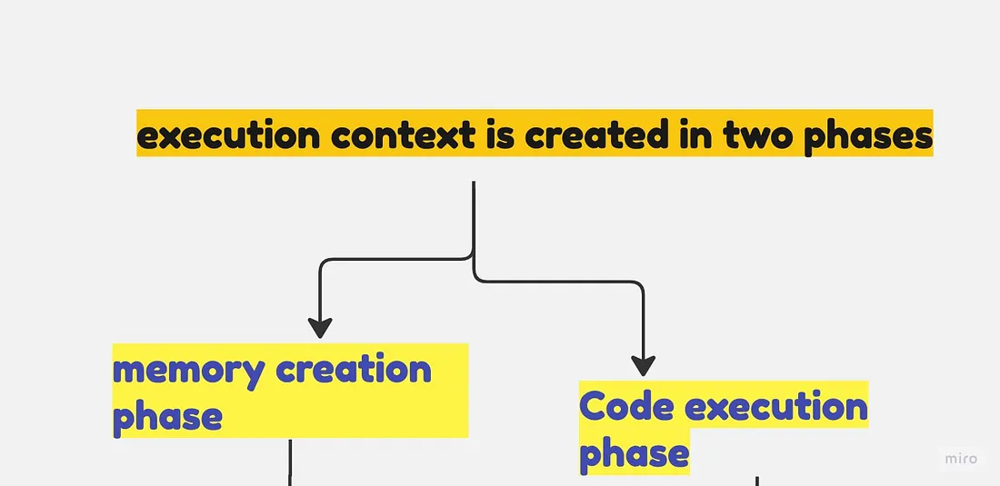

**In first phase of memory creation**, JavaScript will allocate memory to all the variables and functions.

So as soon as JS encounters this line 1, It **_allocates memory to n_**. So let us now allocate memory to n. How will it allocate? It will reserve a memory space here for n. Similarly, now JavaScript goes to line 2. It sees that there is a function, which is named square. So it will **_allocate memory to square_**.

In the first phase and in case of functions, it literally stores the whole code of the function inside this memory space

And now it will also **_allocate memory to square2 and square4_** and as there are another variables, it will again store undefined for them

so in the first phase, JS skims through the whole program

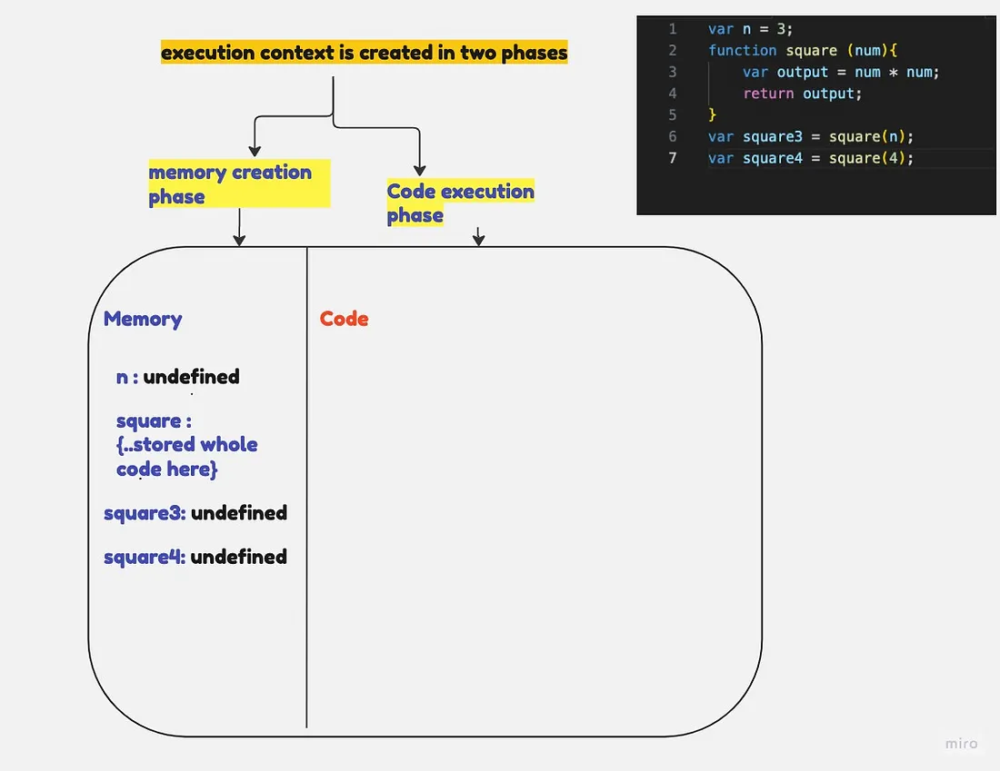

Let us see what happens in the phase two

### The second phase is the code execution phase

So let’s see how this code is executed after the memory allocation. So JavaScript, once again runs through this whole JS program line by line and it executes the code now. So this is the point when all these functions and every calculation in the program is done. Okay? So as soon as **_it encounters this first line, n=3, it actually places the ‘3’ inside the ’n’_**. So till now, the value of n was undefined, now it is 3.

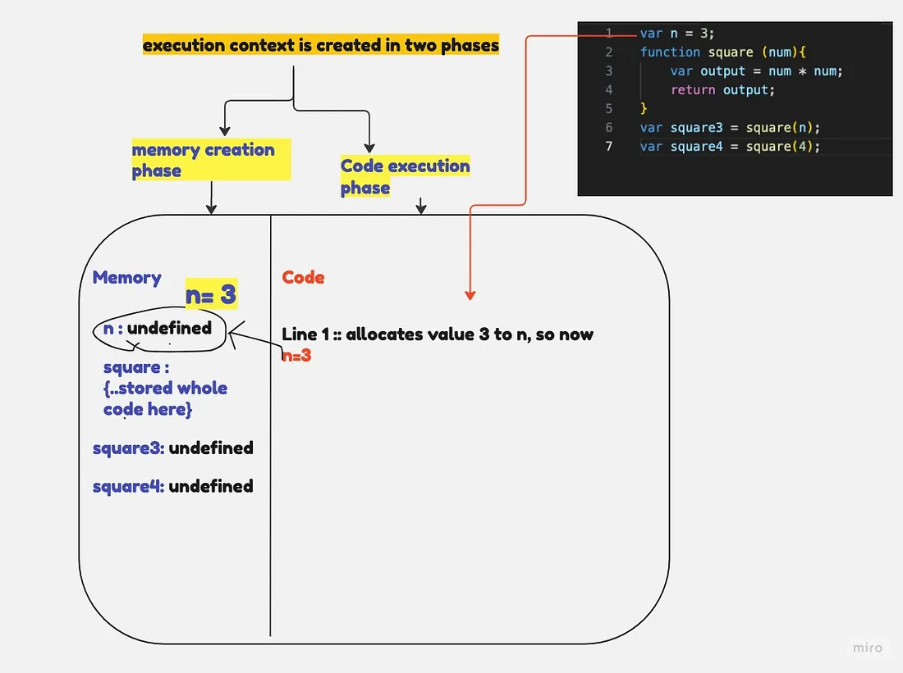

So line number two to five, there is nothing to execute literally. So it moves to line number 6

### Function Invocation and Execution Context Creation

Here, we invoke a function

```js
var square3 = square(n);
```

**What do you mean by a function invocation?** _Whenever you see a function name, with these round brackets, it means that the function is now being executed._

So functions over here are like a mini program, and whenever a new function is invoked, you know, a mini program is invoked, an altogether new execution context is created 😃

So now, we will again go through the creation of this execution context and there will again be two phases involved.

In the memory creation phase, So we will be concerned about this piece of code only. When we are executing this **square(n)**,

```js
function square(num) {
  var output = num * num;
  return output;
}
```

So now, let us see how the memory is allocated here in the first phase

In the phase one, first of all, don’t forget that the memory is allocated to variables and functions inside this function. And when I say variables and functions, it involves the parameters, like the **‘num’**, and the other variables and we don’t have a function so no need. so we will be allocating memory to _num_ and _output_.

Now comes the part of phase two. Okay? So, the phase two is the code execution phase. In this, we will be executing each line.

### What happens while executing return statement?🤔

This return keyword states that, now return the control of the program, to the place where this function was invoked.

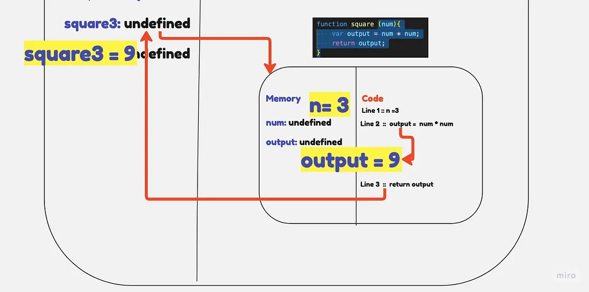

One more thing that happens when the whole function is executed, is that, this whole execution context, for that instance of that function, will be deleted. And the **control moves to line number 6**.

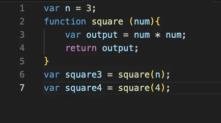

After this replacement, we will go to line number 7. So in line number 7 we are again invoking a function, right, and just the difference is, we are now passing in 4 over here as an argument directly. That’s it.

As soon as this function invocation happens👇

1. Again, a brand new execution context will be created

2. Again it will have this memory

3. Again it will have a code component, remember?

4. And now, it will again go through those two phases.

5. Firstly memory is allocated to num, okay?

6. num will store the value undefined. Remember?

7. And, one more thing happens is, we allocate memory to output, which is again, undefined.

8. Our first phase is done.

9. Now in the second phase, In the code execution phase, What will happen is, num will get this argument, from the invocation in line number 7,

10. num will get this value 4.

11. In the code execution, the undefined will be replaced by (in the code execution phase) 4.

12. It will execute `num*num`, which is `4*4`, 16 and this 16 will now replace this undefined value inside the output. Right?

13. The control moves to line number 4. After 3 is done.

14. So now, this return statement takes back the control to line number 7, where, the function was actually invoked.

15. Now the value 16 will replace undefined in the square4 variable. Okay?

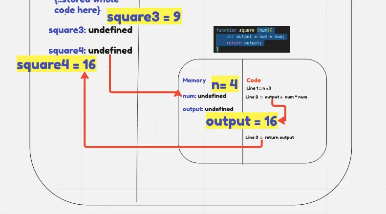

As soon as we are done with the function execution, this whole execution context is now deleted.

So JS is done with all it’s work.

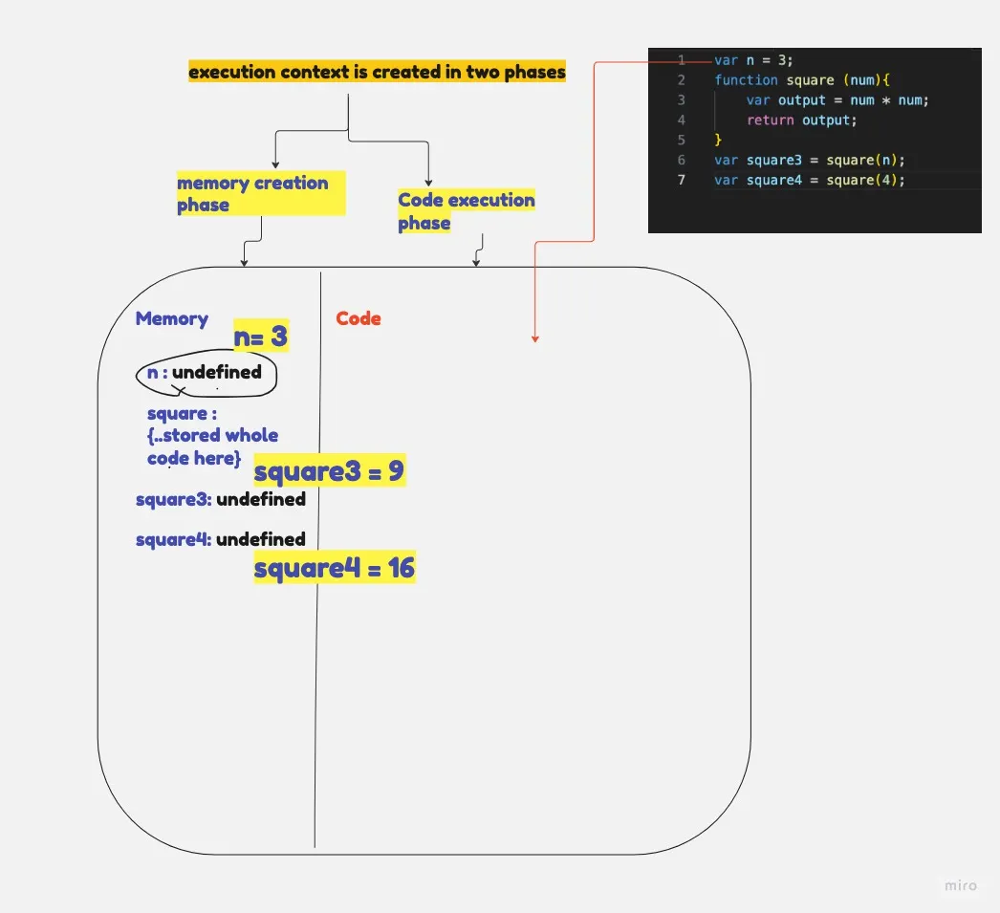

### But don’t you think that all this is too much to manage for the JS engine?🤔

Call Stack is answer for that.

### Introduction to Call Stack in JavaScript 📚

**Call Stack in JavaScript** It handles everything to manage this execution context creation, deletion, and the control.

_Note: To understand Call Stack , one need to understand Execution Context._

The call stack is like a stack. In the bottom of the stack we have our global execution context. That means, whenever any JS program is run, this call stack is populated with this Global execution context. This whole execution context is pushed inside this stack.


Remember this. Whenever a function is invoked, or a new execution context is created, as in case here, in line number 6, we created this execution context, So this execution context is put inside the stack. So let me just denote it by E1, which is the execution context 1.This is how it happens.

Once we are done with executing this function ( square3 ), we return the output, now this E1 is moved out.

E1 is popped out of the stack, and the control goes back to the global execution context, where it left.

So the control goes back to line number 6. Got it? This is how it works. This will again literally pop out of the stack


Now E1 will be popped off the stack and then we move on to line number 7, where the new function was invoked, and a new Execution context was created, and similarly this E2, will move up to the stack. This E2 was popped inside the stack. Once the whole function was executed, then E2 will also move out of stack, and the control goes back to Global Execution Context (GEC).

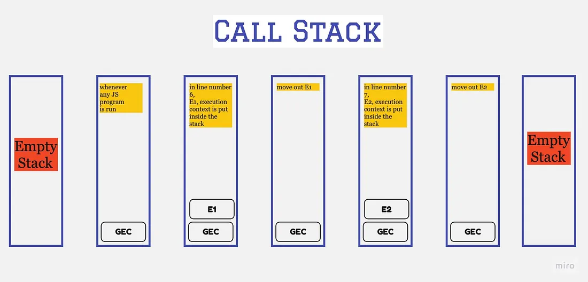

**So this call stack is only for managing these Execution contexts.**

_Whenever an Execution context is created, it is pushed into the stack and whenever an Execution context is deleted, it will move out of the stack.So that is how the whole control is being managed._

This whole Execution context creation deletion everything is managed by JavaScript After this whole thing is executed, the call stack gets empty. The GEC is also gone from this call stack

Now Another interesting thing, **Call stack is also known as, Execution context stack, Program stack, Control stack, Runtime stack, Machine stack.** So, Next time when someone asks you any of these terms, don’t get confused and answer like a pro 😎 .

### Ep. 3: Hoisting in JavaScript (variables & functions)

Hoisting is a phenomenon in javascript by which you can access variables and functions even before you have initialised those or you have put some value in it.

**Example**

```js
var x = 8;

function getName() {
  console.log("Hi Hoisting");
}

getName();
console.log(x);
```

**Output**

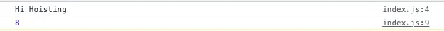

**Example 2:** Try to access getName and x even before we are initialising it.

```js
getName();
console.log(x);

var x = 8;

function getName() {
  console.log("Hi Hoisting");
}
```

**Output**

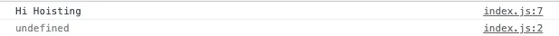

This means, _getName()_ somehow access the function and invoke the function. But _x is undefined_ 🤔.

**Example 3:** Remove var x = 8;

```js
getName();
console.log(x);

//var x = 8; // remove or comment this line

function getName() {
  console.log("Hi Hoisting");
}
```

**Output:**

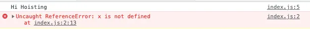

This says **x is not defined** . 🤔🤔

_Is undefined and not defined are same thing? Nope_ 👎 🚫

**Example 4:**

```js
function getName() {
  console.log("Hi Hoisting");
}
console.log(getName);
```

**Output:**


It just print the function.

**Example 5:** What if try to get function name before initialising it like did for x which gives undefined?

```js
console.log(getName);
var x = 8;
function getName() {
  console.log("Hi Hoisting");
}
```

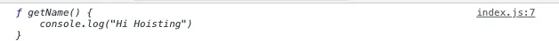

So

```js
getName();
console.log(x);
console.log(getName);

var x = 8;
function getName() {
  console.log("Hi Hoisting");
}
```

**Output:**

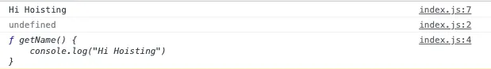

So, let’s dig down deep and see why it is behaving like this. Remember how Execution context works in previous Ep. 1 and Ep. 2.

So, **_even before this whole javascript code executes in javascript, memory gets allocated to each and every variable and function_**. Check below for reference. I put debugger here on first line of code, that means even first line of code is not executed yet and you can see variable and function already have memory allocated.

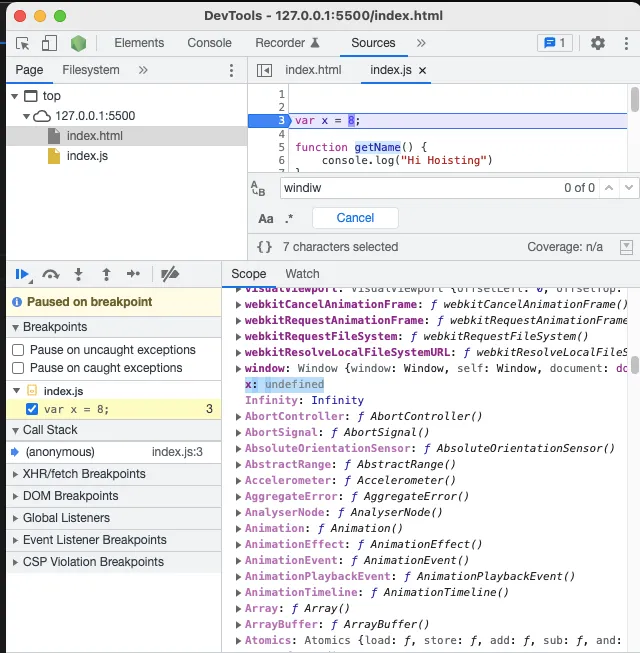

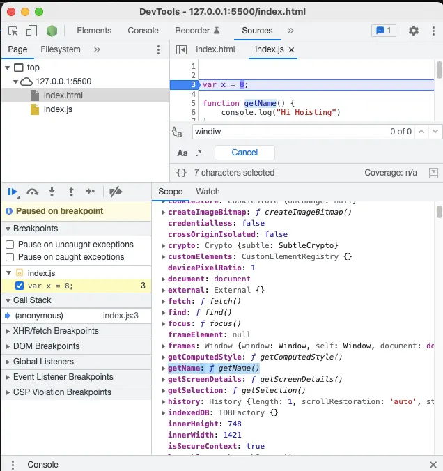

Even if you move console above and put debugger on first line then you can see memory is allocated .

```js
getName();
console.log(x);

console.log(getName);

var x = 8;

function getName() {
  console.log("Hi Hoisting");
}
```

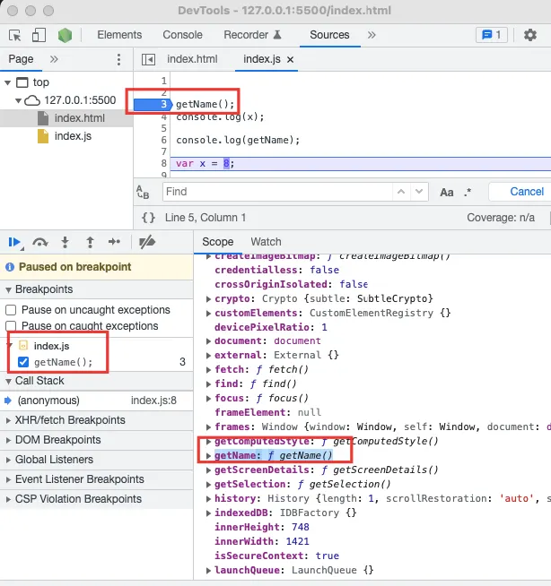

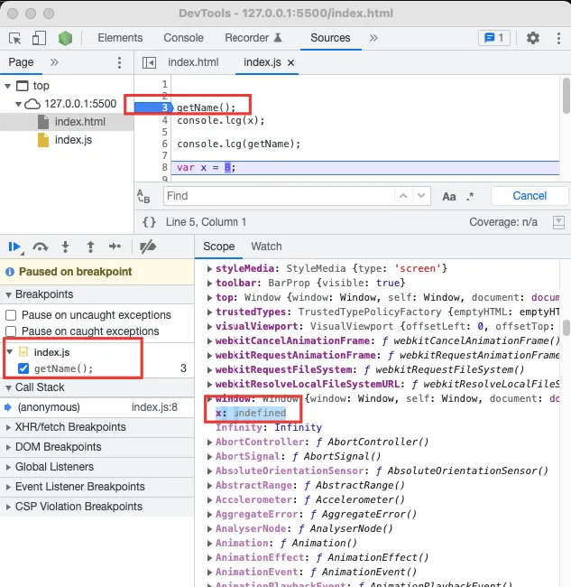

So, if you will move next line to line and check console then you ‘ll see output as :

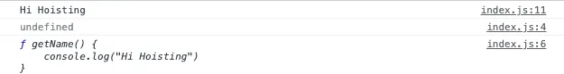

### Now, let’s come to undefined and not defined.

So, let’s remove **_var x = 8;_** then it means x is not in memory.

**_Memory is never allocated to x. As x is nowhere initialised in program._**

When code executes and check **_console.log(x);_** then it will give **_ReferenceError: x is not defined_**

```js
getName();
console.log(x);

console.log(getName);

function getName() {
  console.log("Hi Hoisting");
}
```

Now, let’s take an example of **_arrow function._**

```js
getName();
console.log(x);

console.log(getName);

var x = 8;

var getName = () => {
  console.log("Hi Hoisting");
};
```

**Output:**


**What happened?**

When you make _getName_ an **arrow function**, it started behaving like any other variable not as a function. And In memory allocation phase, just like any other variable , it allocates undefined.

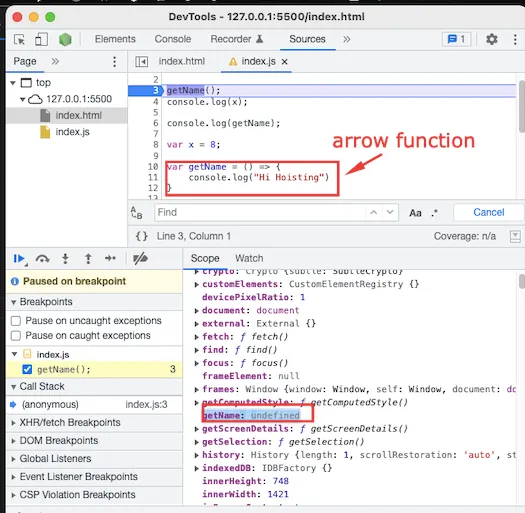

Even if you try below syntax:

```js
getName();
console.log(x);

console.log(getName);

var x = 8;

var getName = () => {
  console.log("Hi Hoisting");
};

var getName2 = function () {
  console.log("Hi Hoisting");
};

function getName3() {
  console.log("Hi Hoisting");
}
```

you can see, only in case of proper function, it will copy the whole code and other two act as variables and have _**undefined**_ value

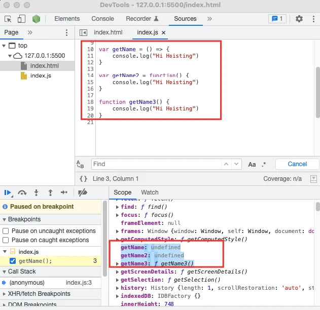

I hope this article provides a clear understands of how Hoisting works in JavaScript. Happy Coding.

### Ep. 4: How functions work in JS ❤ & Variable Environment

Let’s take **function a()** and **function b()** which have variable with name x but different values. From here, **_we’ll learn how function invocation work behind the scenes._**

Also, introduce something in global space. Let take x with different value at top of program.
Then invoke functions : a and b.

_From last articles, you must remember that these functions can be invoked before even initialising that because of hoisting._

```js
var x = 1;
a();
b();
console.log(x);

function a() {
  var x = 10;
  console.log(x);
}

function b() {
  var x = 100;
  console.log(x);
}
```

**Response:**

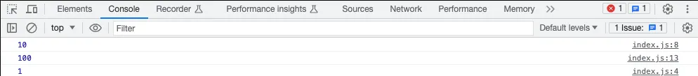

Let’s see how this program works behind the scene in javascript line by line. 🤔🤔

Everything we learn in this articles helps in understanding scope, closures

Steps:

When Javascript runs any program, **Global Execution Context(GEC)** is created. It will have two components : **Memory Component(Variable Environment) and Code Component.**

1. Memory will be allocated to all variables and functions present i.e **x, a() and b()**.

2. CallStack will be created and GEC will be pushed inside it.

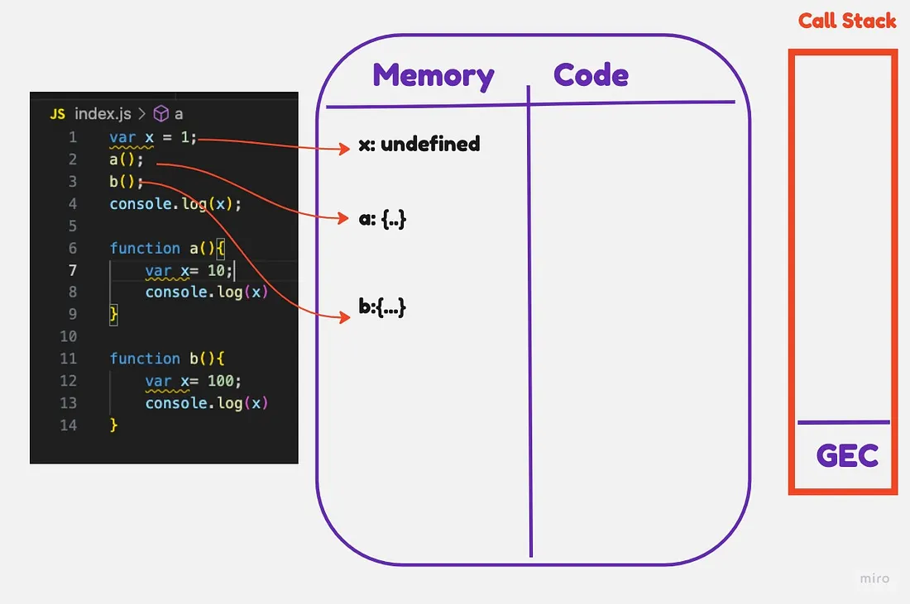

3. Now when code actually get executed that means

```html
var x = 1;
```

then **_1 will replace undefined_** in memory


4. When **function a()** is invoked, then a **_new execution context_** is created which is limited to this function only. It will follow same phase as above i.e two components: memory and code where x will be all together different variable.

```js
function a() {
  var x = 10;
  console.log(x);
}
```

5. As soon as this new execution context get created for a(), it get pushed into call stack.

6. Now control is at Line 7.

7. At line 7 , 10 will replace undefined for x in memory

8. At Line 8, **_console will print 10 not 1 as it will look into local memory space_**

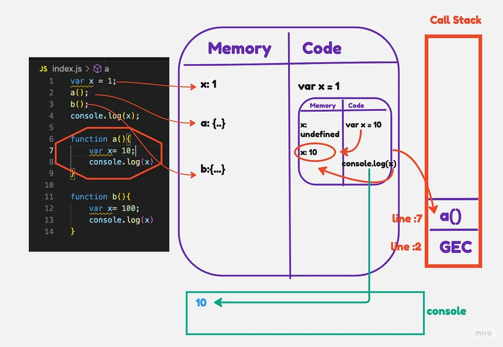

9. At line 9, We finish executing function a(), so now whole execution context for a will be deleted. **_a() will be popped out from call stack_**

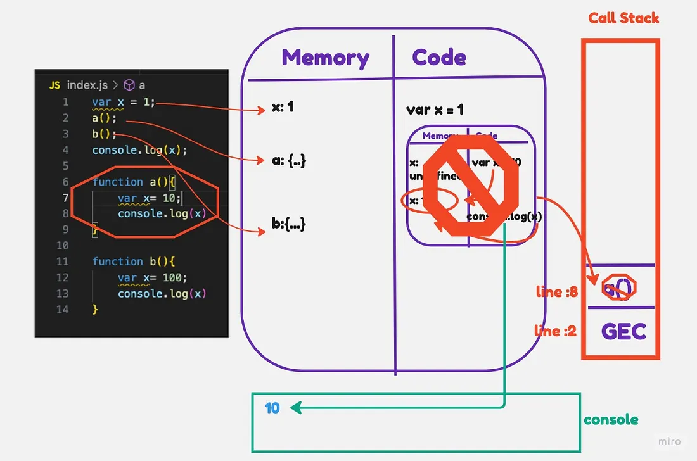

10. Now GEC is at line 2 again and control moves to line 3

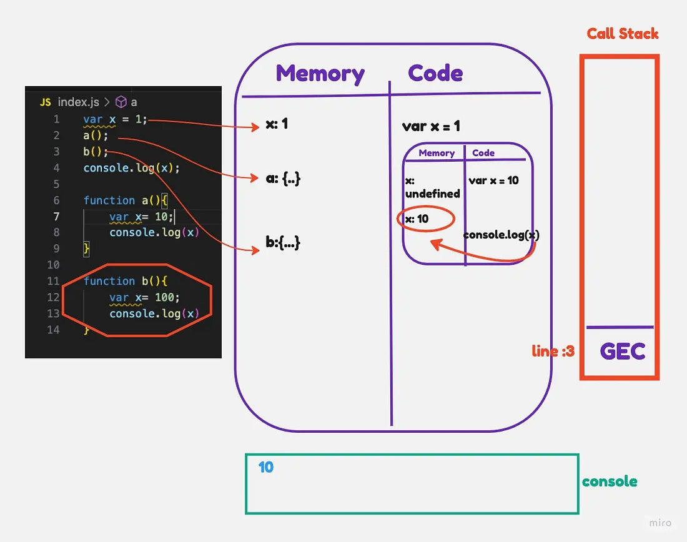

11. Again is a function b() is invoked and executes same as above, creating memory and code components. As soon as new execution context get created for b(), it get pushed into call stack.

Now control is at Line 12.

At line 12, 100 will replace undefined for x in memory.

At Line 12, **_console will print 100 not 1 as it will look into local memory space_**

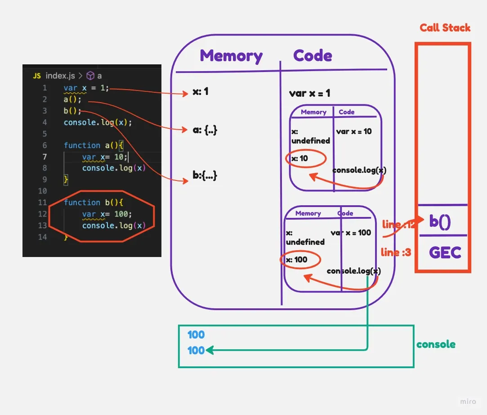

12. At line 12, We finish executing function b(), so now whole execution context for a will be deleted.

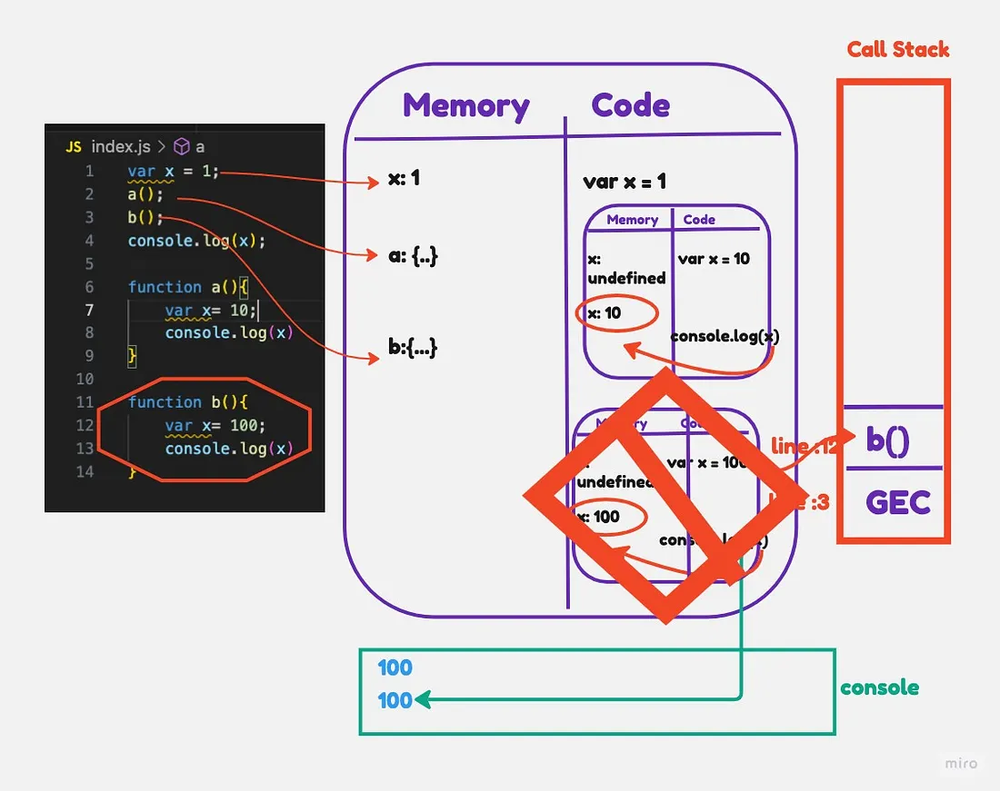

13. **_b() will be popped out from call stack_**

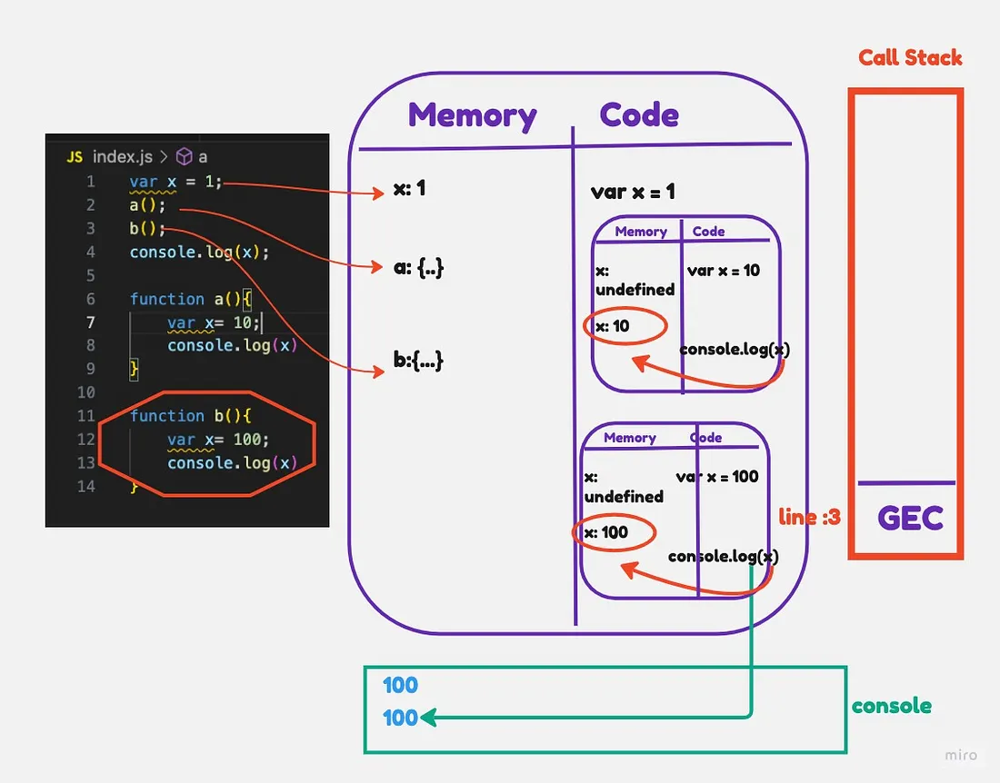

14. Now GEC is at line 3 again and control moves to line 4. It will look for x in local memory of this particular execution context. **_And it prints 1 in console_**.

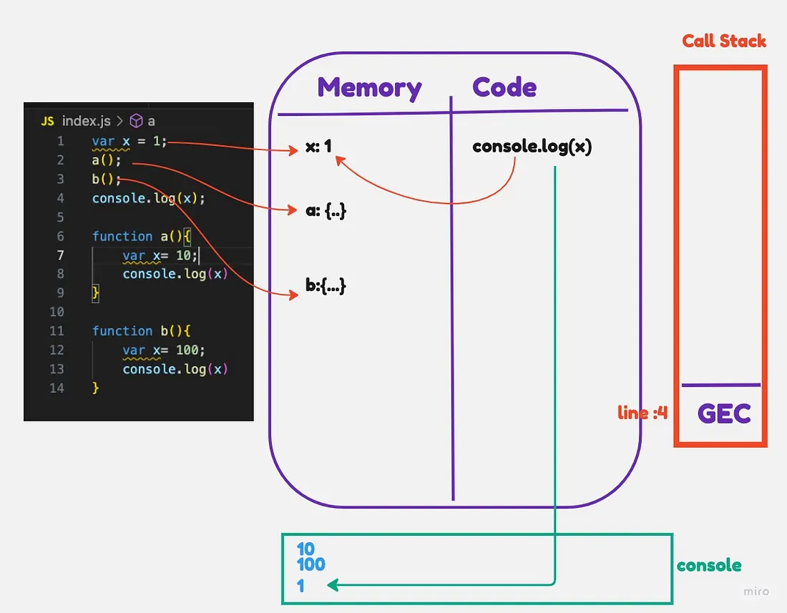

15. After finish executing line 4 in GEC. Now, JS engine moves to next line and see there is nothing left to execute.

16. GEC will be deleted and GEC will be popped out from call stack.

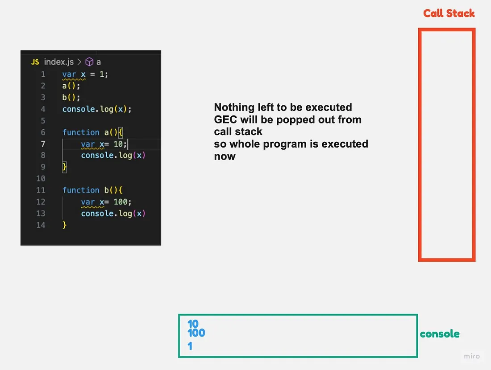

### This is how complete program get executed. 🎉

You can also check same in browser as well by adding breakpoints 🛑.

### Ep. 5: SHORTEST JS Program window & this keyword 🧐

Let’s just take an **empty JS file\*** where nothing to execute and see what happens behind the scenes.

1. Go to Source
2. Put debugger on and run program👩🏻‍💻
3. GEC will be created and JS engine still created GEC and set up memory space
4. There was nothing to setup as file was empty but it still did it’s job .🤷🏻‍♀️

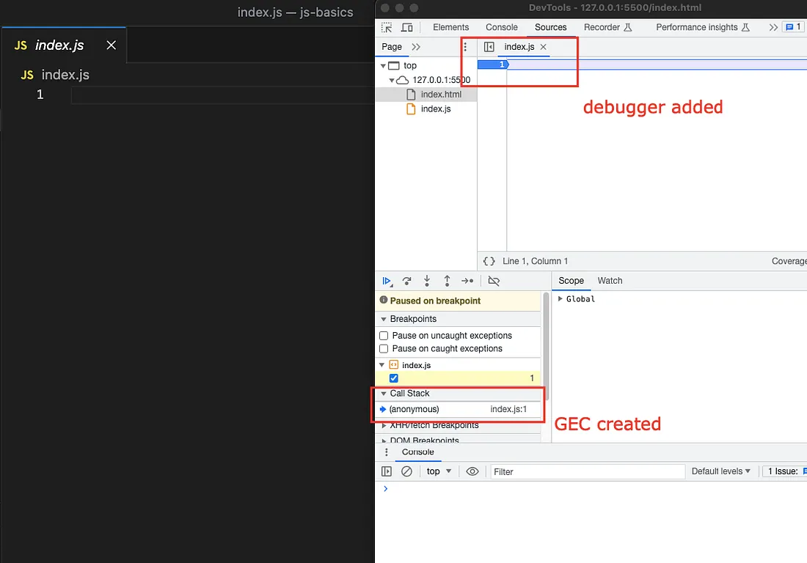

### Now comes new word “window” 🪟. What is that??

## When you go to console and type window, you’ll see something printed, a big object which consist functions and variable which are created by JS engine, in global space .

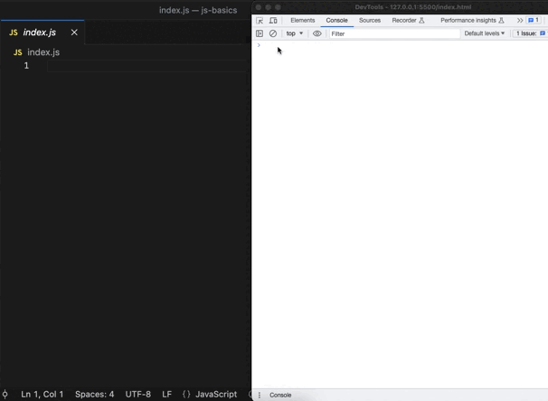

This means you can access all these functions and variables anywhere in JS program

Same as above JS engine creates **_this_** 👈🏻 keyword

Try typing **_“this”_** in console and you’ll see something will get printed.

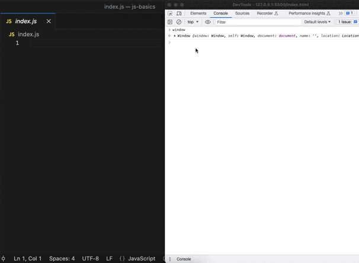

## Right now, “this” represents “window” in global space.👏🏼

### So, question here is what exactly is window? How to define that?

## window is a global object which is created along with GEC.

So, to **summaries** whenever a JS program runs:

1. GEC is created
2. global object is created i.e window
3. this variable is created and points to global object

#### Why it is called “window” ?

JS not just run on browsers, it runs on server and others. So, wherever JS is running there must be JS engine . Like in chrome, it’s V8, firefox and safari have their own engines. So, all these JS engines have responsibility to create global object. In case of browsers, it is known as “window”. It’ll be different for node or wherever JS is running but there will always be global object.

#### So, at global level in GEC this === window. 😃

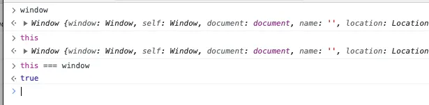

#### Now, you might have question: what is global space?🤔

Any code you write inside JS which is not inside a function is in global space.

Let see below example where we have variable **“y”** and **“function z()”**.


So, **“y” and function z()** is in global space. It will get attached to global object i.e window. But variable a inside **function z()** will not be in global object.

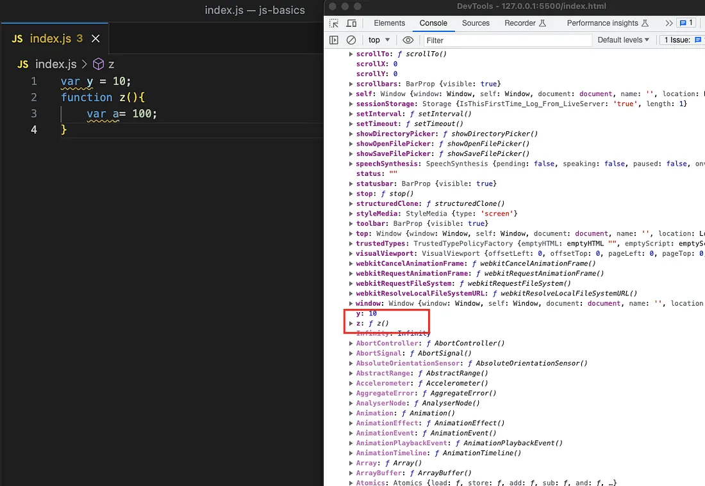

#### Now, how to access these?🧐

1. use **window.{variableName}**

2. directly use {**variableName**}

3. use **this.{variableName}**

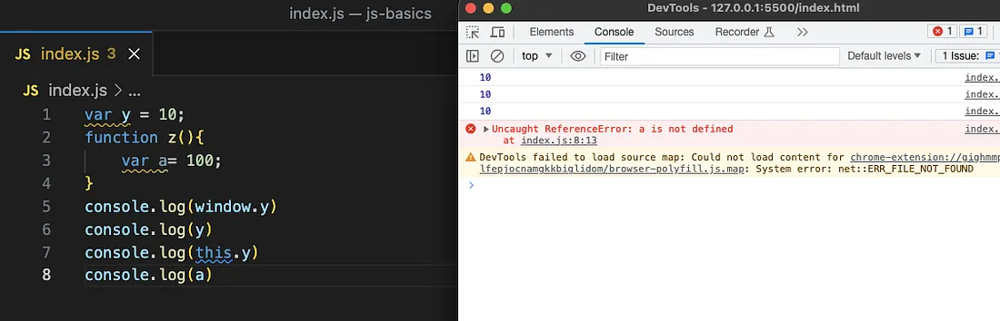

Note: Whenever we try to access any function or variable and we don’t put anything in front of it, it automatically assumes you are referring to global space.

so, all these referring to same place in memory space.

```js
(window.y === y) === this.y;
```

#### Summary

So now you can figure out the value of `this` by following these simple rules:

- By default, `this` refers to a global object, which is global in the case of NodeJS and a `window` object in the case of a browser

- When a method is called as a property of an object, then this refers to the parent object

Note: \* **empty JS file — Shortest JS program.**

### Ep. 6: undefined vs not defined in JS 🤨

**_undefined_** is a very special keyword in javascript and it is not there in other languages. It has a lot to do with how javascript code is executed.

_As we have studied in the previous articles also that javascript code is executed in a different way it creates a global execution context and allocates memory to all the variables and functions even before a single line of code is executed._

#### Code Example of undefined in JS

Suppose we created a variable a = 10, so even before this line of code is executed, javascript has tried to allocate memory to this even before this line of code is run.

Let us see with the help of debugger so i am putting the debugger right before this line is executed.
If we refresh the page this, line hasn’t been executed yet right but javascript has already allocated memory to this **“a”** .

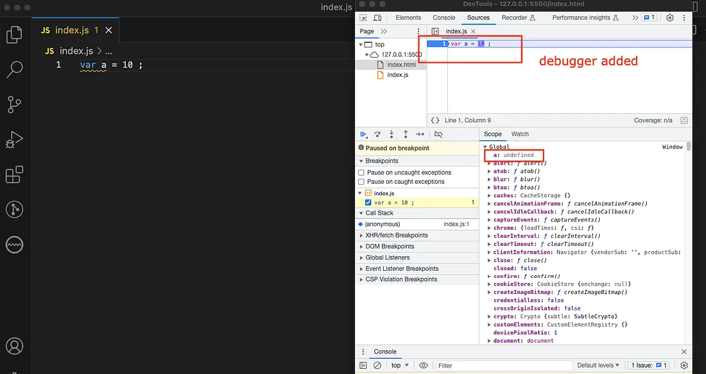

so we have already reserved memory for now. If we see here is the reserved memory so right now **_a is undefined_**.

#### Why this happened?

When it allocates memory to all the variables and functions, to the variables it tries to put a placeholder, it is like a placeholder which is placed in the memory. That special keyword is **_undefined_**

**_“undefined”_** _is very different than_ **_“not defined”._**

So suppose if i try to access something else like below to which we have not allocated memory.

```js
var a = 10;

console.log(x);
```

#### what will happen ?

“x” you won’t find anything that is known as **_“not defined ”_** 👈🏼

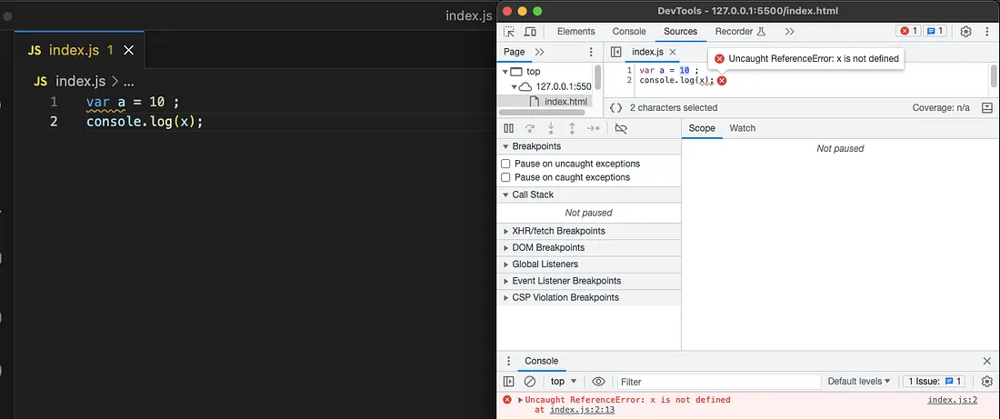

If you run below code, First it will give a = undefined

```js
console.log("a = ", a);
var a = 10;
console.log("a = ", a);
console.log("x = ", x);
```

But after second line has been executed, you will see that the **value of a has changed to 10** .

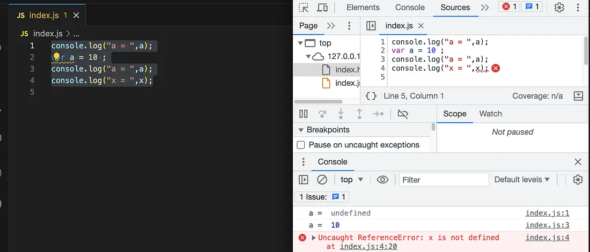

_So remember undefined is not equal to empty_

**_Some people 👥 think that undefined means empty_** _like it is not taking up any memory space._ 🤨 ❌

#### No, undefined is a special keyword it takes up its own memory but you can assume it to be like a placeholder which is kept for the time being until the variable is assigned some other value. 🤷🏻‍♀️

#### What if i never put any value inside “a” , like what if I just declared it? 🧐

I never put any value to it throughout our whole program. It have this value undefined that placeholder kept inside and to show you that it is something in javascript.

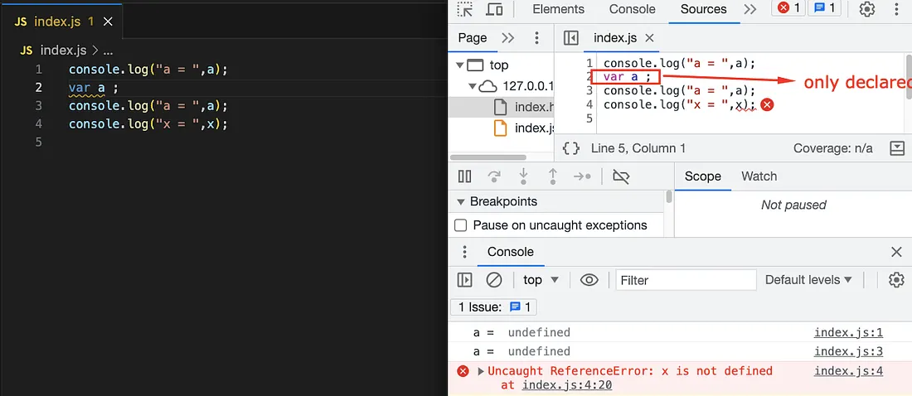

#### Mistake you should not make while using undefined.

**a = undefined** ❌ ❌

#### what does that mean?

undefined is a value, it is a keyword in javascript and it is totally possible to assign and define to any variable but it is kind of a mistake and it is a bad thing to do in javascript.

One should not do it because undefined is like a placeholder which is kept inside the variables and it states that in the whole code that variable was not assigned anything right so it is meant for a specific purpose so it is not generally a good way to put undefined like this

Though it is a totally okay to do this but it can lead to a lot of inconsistencies so it is not a good practice to do this.

**_Javascript is a loosely typed language. What does that mean?? 🫤_**

#### So loosely typed means that it does not attaches its variables to any specific data type.

Suppose if i created a and put in string in it so later on in the program i can also put numbers in it, i can also put boolean in it.


### It is like javascript is very flexible in this case, it is loosely typed that is known as loosely type language.

If it was strict type then just like other languages just like **C** or **C++** .

If you assign a variable that if it is a string a so it will only hold string, it won’t hold numbers or booleans or anything else but it is not the case in **javascript** you can put anything and everything inside this variable.

So if i do **var a** for the time being it can like just hold undefined

```js
var a;
console.log("Step 1,  a = ", a);
```


If i later on put **a = 10** here so it can hold numbers also

```js
var a;
console.log("Step 1,  a = ", a);
a = 10;
console.log("Step 2,  a = ", a);
```

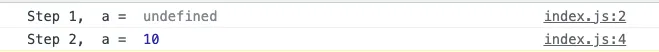

it can also hold a string again, so this is a perfectly valid javascript code

```js
var a;
console.log("Step 1,  a = ", a);
a = 10;
console.log("Step 2,  a = ", a);
a = "Hello World";
console.log("Step 3,  a = ", a);
```

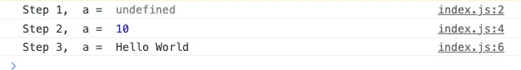

So until and unless any value is not specified there, it is a placeholder undefined, when you have put integer, string etc. It will print that.

**_JS is a loosely typed language a.k.a weakly typed language_**

### Ep. 7 The Scope Chain, Scope & Lexical Environment 🧐

In this article, we will cover:

1. What is Scope?

2. What is Lexical Environment?

3. What is Scope Chain?

Scope in JS is directly related to lexical Environment. Let’s take below example:

```js
function a() {
  console.log(b);
}
var b = 10;
a();
```

When JS engine reach line 2 and try to execute. JS engine will look for “b” in local memory space of function a. But it won’t be there because we never created “b” inside function a().

#### What will happen now? Will it print undefined or not defined or print value of variable?

Let’s run and see output


So, it printed value somehow.

#### Let’s make it more complicated. Add another function inside function and try to print “b” inside that. Invoke function also. What will happen now?

```js
function a() {
  c();
  function c() {
    console.log(b);
  }
}
var b = 10;
a();
```

Let’s run and see output again


So, it again printed value again.

#### Let’s take another example and move variable “b” inside the function but try to access it in global scope by printing it. What will happen now?

```js
function a() {
  var b = 10;
  c();
  function c() {}
}
a();
console.log(b);
```

Let’s run and see output again


Here goes **ERROR**. which says **not defined**.

Now, Scope comes into picture.

### Scope means where you can access a specific function or variable .

It mainly have two aspects:

1. What is scope of this variable “b” ? Where can i access this variable “b” ?

2. Is “b” inside the scope?? Like Is “b” inside the scope of function c?? Which means Can I access “b” inside function c??

#### What happen when program runs?

```js
function a() {
  var b = 10;
  c();
  function c() {}
}
a();
console.log(b);
```

1. When we run this program, GEC is created and pushed inside Call Stack.

2. When you run program, it will try to assign values to global variables and function. Example : It will assign value to function a().

3. Then it will invoke the function a(), which will result in creating execution context for a().

4. Now, function a() will reserve memory for variable b and function c().

5. So variable b= undefined and function c = function reference

6. Once, code starts executing b = 10.

7. At line 3, function c is invoking which results in new execution context and pushed to call stack.
   Press enter or click to view image in full size

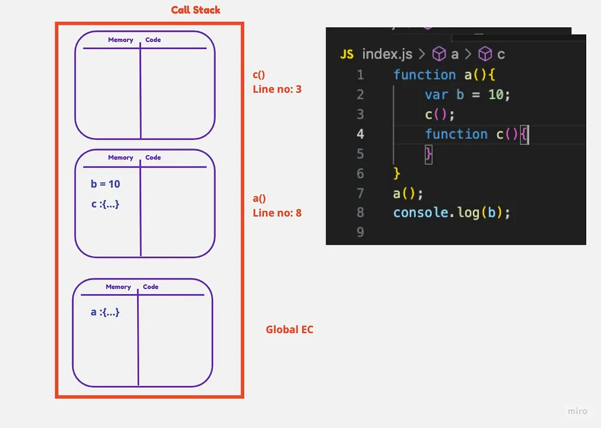

#### What is Lexical Env?

### Where ever an execution context is created, a lexical env is also created. So, Lexical env is local memory, along with lexical environment of it’s parent.

_Lexical means hierarchy or in sequence._

**In below example**, function c() is lexically sitting inside function a(). And function a() is lexically inside the global scope.

```js
function a() {
  var b = 10;
  c();
  function c() {}
}
a();
console.log(b);
```

So, Let’s assume **orange box inside memory which represents lexical env of it’s parent.**

1. In case of function c() execution context, it will represent lexical env of a() and a()’s parent i.e GEC.

2. In case of function a() execution context , it will represent lexical env of GEC.

3. In case of GEC, it represents outer env which is null.


#### What happens if you try to do console.log for b inside function c( ) ?? Will it print value of b or gives not defined?

```js
function a() {
  var b = 10;
  c();
  function c() {
    console.log(b);
  }
}

a();
console.log(b);
```

1. When JS engine encounter this line, it tries to find out this inside the local memory of function c().

2. It won’t find it because there is no variable b inside function c() memory.

3. Now, JS engine goes to orange reference which goes to lexical environment of it’s parent which is function a()’s memory.

4. Now, it find variable b inside function a()’s memory.

5. **It goes back and prints value of b as 10.**

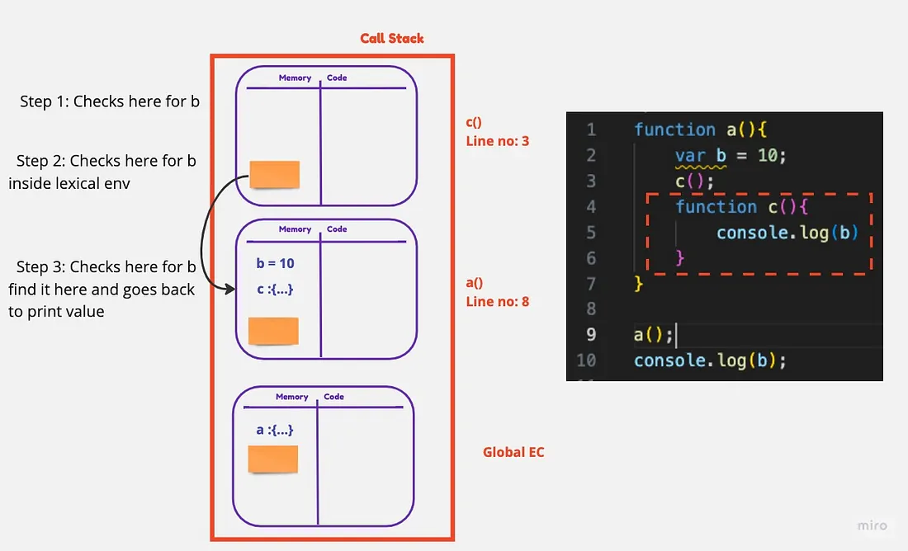

#### If variable b is moved outside function a(). What happens if you try to do console.log for b inside function c( ) ?? Will it print value ?

```js
function a() {
  c();
  function c() {
    console.log(b);
  }
}
var b = 10;
a();
console.log(b);
```

Answer is , **_YES_**. Check below for explanation ⬇️

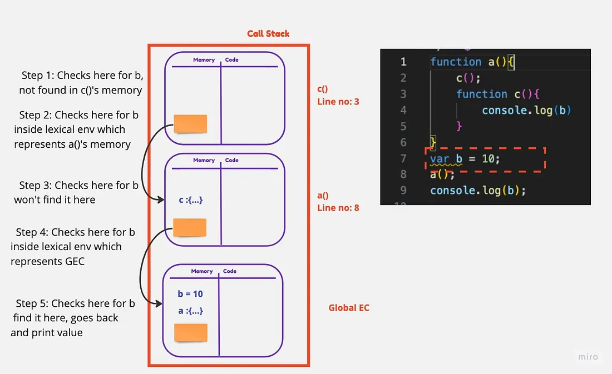

#### If variable b is removed. What happens if you try to do console.log for b inside function c( ) ?? Will it print value ?

```js
function a() {
  c();
  function c() {
    console.log(b);
  }
}
a();
```

Answer is , **_NO_**. Check below for explanation ⬇️


Output:

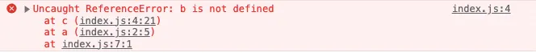

Here, we can say: **\*_“b is not in the scope”._**

So, this whole mechanism of searching b in local memory and if not found then into reference of the outer parent lexical env and so on is known as **_“SCOPE CHAIN”_**

#### Summary:

1. Lexical environment is created whenever an execution context is created. So, Lexical environment = Local memory + Reference to lexical env of parent.

2. Parent i.e Lexical Parent is where actually that function sits inside the code.

3. Chain of Lexical Env is known as Scope Chain. And it defines whether a variable or function is present inside the scope or not.

#### Let’s see same in browser as well:

1. Call stack with GEC, a()’s execution context and c()’s execution context⬇️

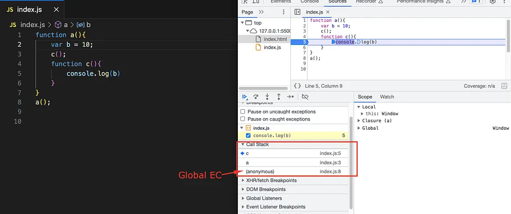

2. function a() have Local memory + lexical env of parent as “Global” ⬇️

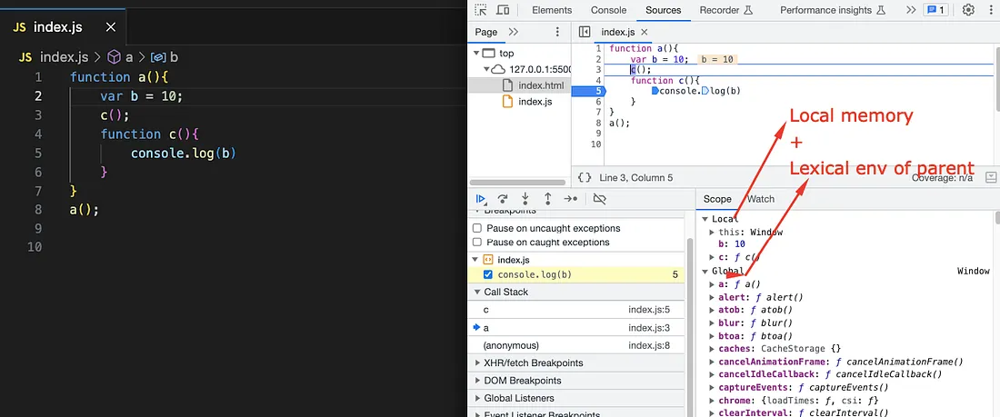

3. function c() have Local memory + lexical env of parent i.e a()’s memory + lexical env of it’s parent’s parent i.e a()’s parent which is GEC ⬇️

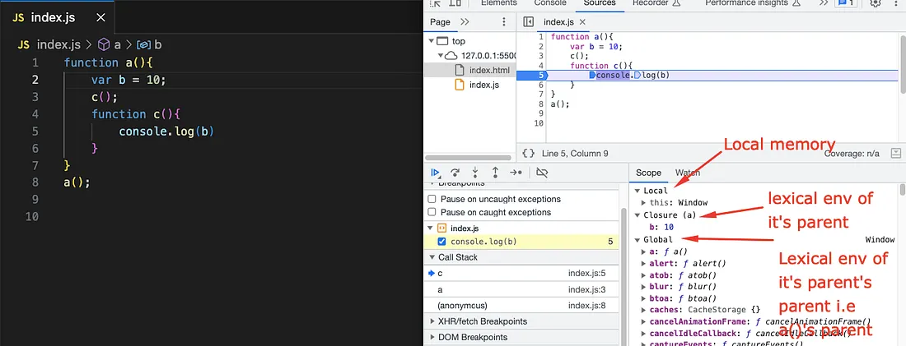

_Note: You can see “Closure” keyword in above screenshot. It’ll be covered in future articles._

### Ep. 8 let & const in JS Temporal Dead Zone 🧐

Prerequisite:
1.Hoisting in javaScript
2.“this” keyword in JS

#### In this article, we’ll cover : :

1. What is Temporal Dead Zone?
2. Are let and const declaration hoisted?
3. Difference between Syntax Error / Reference Error and Type Error?

#### Are let and const declaration hoisted?

Answer is : **YES** 👍🏼

But they are hoisted very differently then var declarations.
In interviews, you can say that these are in Temporal Dead Zone.

Let’s understand taking an example:

```js
let a = 10;
var b = 100;
```

In previous hoisting article, we learn that we can access variable “b” even before we have initialised it. Like below

```js
console.log(b);
let a = 10;
var b = 100;
```

**_Reason_**: Because in JS, memory has been allocated even before any line of code is executed. So, we can access variable “b” even before initialising or declaring.

Output :


#### Question: What If I try to access variable “a” in same way ? As it is hoisted , Will it give undefined too?

Answer is **NO** 👎🏼

```js
console.log(a);
let a = 10;
var b = 100;
```

Output:


SO, it is saying **_“Reference Error: Cannot access ‘a’ before initialisation”_** . i.e you can access “a” only after you assigned or initialised some value to “a”.

Let’s try below code:

```js
let a = 10;
console.log(a);
var b = 100;
```

Output:


Now, you can see we were able to access “a”. console prints value 10.

#### Question: How to know whether any variable is hoisted or not??

Let’s see that in browser, add a debugger:

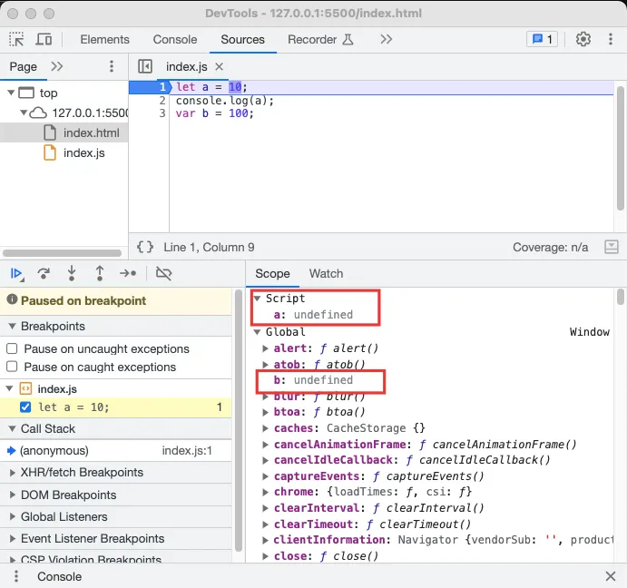

Now, If you see both variables “a” and “b” are in scope with value **undefined** but **“a” is under “script” where “b” is in Global memory space.**

To summarise: **“let”** and **“const”** type variables will be allocated memory but that is not in Global Space. They are hoisted but not stored in global space. And this memory is not accessible until you put some value into that.

#### Question: What is Temporal Dead Zone??

It is the time since when let variable was hoisted and till it is initialised some value.

So, _whenever you try to access any let or const variable in Temporal Dead Zone, it gives you_ **_Reference Error._**

```js
console.log(a);
let a = 10;
console.log(a);
var b = 100;
```

So, In above example, until Line 2 : let a = 10; . **_“a” is in Temporal Dead Zone and gives you Reference Error at Line 1._**
After Line 2, at Line 3: you can access variable a.

#### In previous article of “this” keyword in JS, we tried to access variables using “this” and “window” keywords. Let’s just try that too.

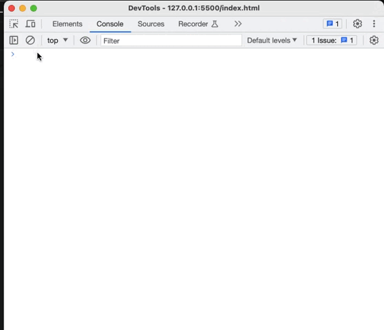

As you can see above, **_we are not able to access “a” using “window” and “this” keyword. It keeps giving “undefined”._**

Reason: “this” and “window” represents global space and memory allocated to “a” was different then global object. So, this shows, **_“let” is strict then “var”._**

#### Question: Can we re-declare “let” variable?

Answer is **NO** 👎🏼

```js
let a = 10;
let a = 100;
```

Output:

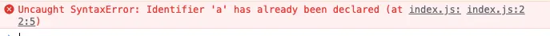

SO, it is saying **_“Syntax Error: Identifier ‘a’ has already been declared”_** .

Also, JS will not run any line of code if it sees redeclaration. It will not reach any line of code.

#### what If I try below ?

```js
let a = 10;
var a = 100;
```


Same again: **_“Syntax Error: Identifier ‘a’ has already been declared” . “let” variable can’t be declared again with same name again in same scope._**

#### Question: Can we re-declare “var” variable?

Answer is **YES** 👍🏼

```js
var a = 10;
var a = 100;
```

No error when you run code.

#### Question: Can we re-declare “const” variable?

Answer is **NO** 👎🏼

```js
var a = 10;
const b = 100;
const b = 1000;
```

Output:

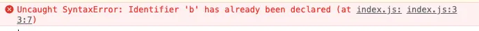

“const” variable can’t be declared again with same name in same scope.

#### What If I run below code?

```js
let a;
const b;
var c;

a = 10;
b = 100;
c = 1000;

```

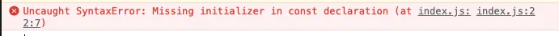

SO, it is saying **_“Syntax Error: Missing Initializer in const declaration.” This means “const” variable needs to be intialised and declared in same line._**

_“const needs to be initialised and declared in same line”_

#### What If I try to assign some value again to “const” variable?

```js
let a = 10;
const b = 100;

a = 20;
b = 200;
```


SO, it is saying **_“Type Error: Assignment to constant variable.” You can not assign value again to “const” type variable._**

Now, As we have three different ways to declare a variable using let, var and const.

#### Which one we should use?

1. const : whenever you put some value which is not going to change later, use const.

2. let: As let has Temporal dead zone and you won’t run into unexpected errors.

3. var: Try to put it aside and not use.

#### How to avoid Temporal Dead Zone errors?

Try to put all declaration and initialisation on top of scope. This will minimise unexpected errors when logic get called.

### Ep. 9 BLOCK SCOPE & Shadowing in JS

#### What is Block ?

1. Block is defined by curly braces i.e { .. }

2. Block is also know as **Compound Statement.**

#### Why Block is required in JS?

Block is used to combine multiple javascript statements into one group.

#### Why we need to group multiple statements at one place?

we group multiple statements in a block so that we can use it where JS expects one statement

Example: if statement only expecting one statement but we provided multiple statements using curly braces. This is a Block.

```js
if (true) {
  // Compound Statement
  var a = 10;
  console.log(a);
}
```

#### What is Block Scoped?

Block Scoped means what all variables and functions we can access inside block.

To understand in details, let’s take an example and run it:

```js
{
  var a = 10;
  let b = 20;
  const c = 30;
}
```

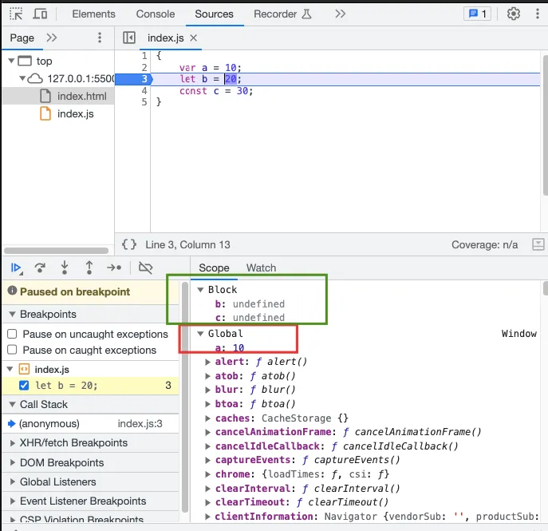

So, “b” and “c” are inside Block Scope which is separate space which is reserved for block only. But “a” is hoisted inside global object.
From here the statement comes in picture that:

`let` and `const` are block scoped.

Therefore, you can’t access `let` and `const` type variable outside the scope .

Therefore, you can’t access `let` and `const` type variable outside the scope .

```js
{
  var a = 10;
  let b = 20;
  const c = 30;
  console.log("Inside Block a= ", a);
  console.log("Inside Block b= ", b);
  console.log("Inside Block c= ", c);
}
console.log("Outside Block a= ", a);
console.log("Outside Block b= ", b);
console.log("Outside Block c= ", c);
```

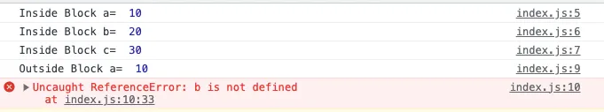

So, it is saying **_“Reference Error: b is not defined” . Because “b” is not in global scope._**

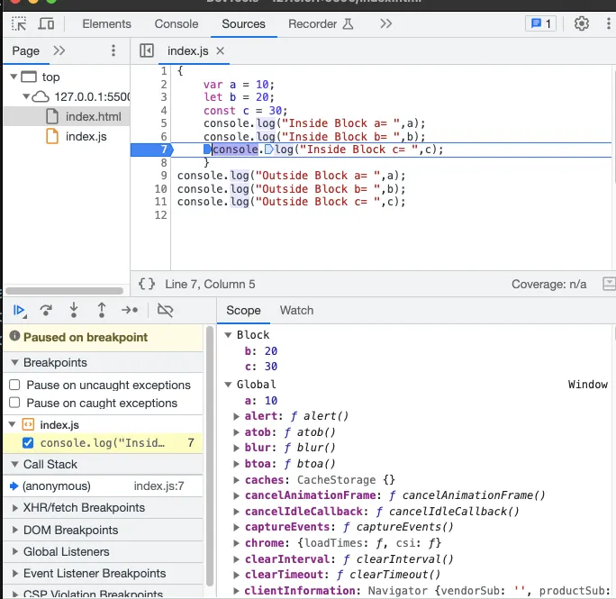

#### What is Shadowing in JS?

If we have same named variable outside the block, then block variable will shadowed outside block variable.

Example:

```js
var a = 12;
{
  var a = 10;
  let b = 20;
  const c = 30;
  console.log("Inside Block a= ", a);
  console.log("Inside Block b= ", b);
  console.log("Inside Block c= ", c);
}
```

#### What will log print for “a” now?

Output:

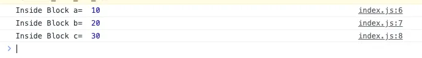

It prints 10. That means line 3 variable shadowed Line 1 variable.

#### \* What If I try to print var “a” outside block ? What should it print 10 or 12?

```js
var a = 12;
{
  var a = 10;
  let b = 20;
  const c = 30;
  console.log("Inside Block a= ", a);
  console.log("Inside Block b= ", b);
  console.log("Inside Block c= ", c);
}
console.log("Outside Block a= ", a);
```

Output:

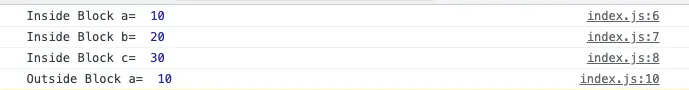

So , it prints 10 again. Line number 3 shadowed line 1 and also modified the value for variable. **_Because they both are pointing to same memory location._**

#### \* Now what happens with “let” type variable?

```js
let b = 12;
{
  var a = 10;
  let b = 20;
  const c = 30;
  console.log("Inside Block a= ", a);
  console.log("Inside Block b= ", b);
  console.log("Inside Block c= ", c);
}
console.log("Outside Block b= ", b);
```

Output:

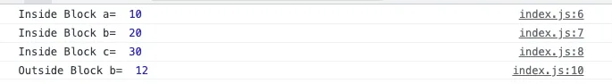

Now, Inside block variable “b” prints 20 but outside block , it prints 12.
Because scopes are different in case of let type variable. Try adding debugger and check scope of variables.


**_In above screenshot, you can see three scopes ::::_**

**_1. Global: memory reserved for var_**

**_2. Script: separate memory forletand const outside block scope_**

**_3. Block: separate memory for variables inside scope_**

#### \* Now what happens with “const” type variable?

```js
const c = 12;
{
  var a = 10;
  let b = 20;
  const c = 30;
  console.log("Inside Block a= ", a);
  console.log("Inside Block b= ", b);
  console.log("Inside Block c= ", c);
}
console.log("Outside Block c= ", c);
```

Output:

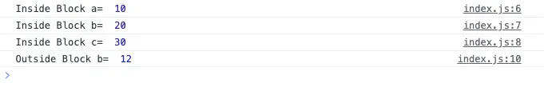

Now, Inside block variable “c” prints 30 but outside block , it prints 12.
Because scopes are different in case of const type variable. Try adding debugger and check scope of variables.

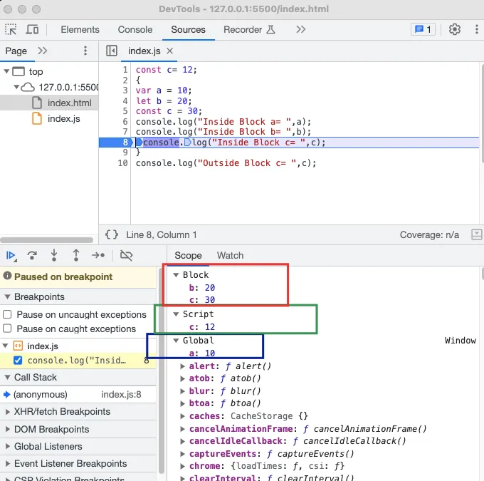

Again, in above screenshot, we can see 3 scopes.

#### Does Shadowing behaves same way in functions?

```js
const c = 12;

function a() {
  const c = 30;
  console.log("Inside Function c= ", c);
}

a();

console.log("Outside Function c= ", c);
```

Output:

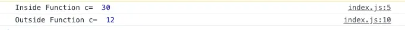

Now, Inside function variable “c” prints 30 but outside function, it prints 12.
Because scopes are different in case of `const` type variable. Try adding debugger and check scope of variables.

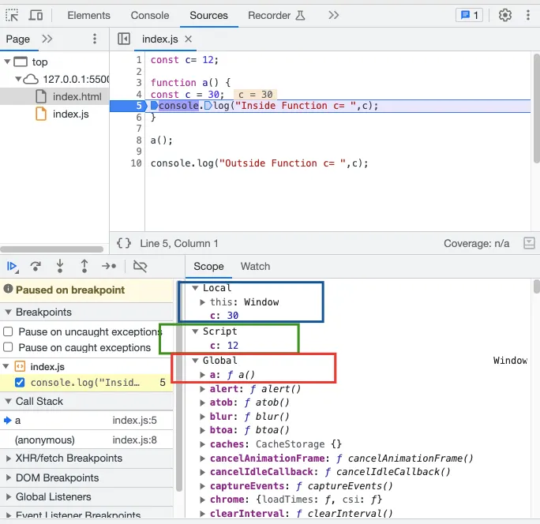

#### What is Illegal shadowing?

#### Case 1: If outside block variable is “let” and inside is “var” type? Will it still gives error?

```js
let a = 20;
{
  var a = 10;
}
```

Can we do this? What will be the output now?


So, this is known as Illegal Shadowing.

#### Case 2: But what If outside block variable is “var” and inside is “let” type? Will it still gives error?

```js
var a = 20;
{
  let a = 10;
}
console.log(a);
```

Answer is **NO** .It won’t give any error and work perfectly fine.

#### WHY?

Because if a variable is shadowing something, it should not cross the boundary of it’s scope.

In Case 1: `var` is not blocked scope. **_“var” is function scoped. So you can do it inside a function._**

```js
let a = 20;
function b() {
  var a = 10;
}
b();
```

Now, in this case, `var a` is not interfering with `let a` as both have different memory.

#### Now, Try below on your own, add debugger and see how scopes work:

Case 1:

```js
const a = 20;
{
  const a = 30;
  console.log("Inside Block 1, a = ", a);
  {
    const a = 40;
    console.log("Inside Block 2, a = ", a);
  }
}
console.log("Outside Block, a = ", a);
```

Case 2:

```js
const a = 20;
{
  const a = 30;
  console.log("Inside Block 1, a = ", a);
  {
    console.log("Inside Block 2, a = ", a);
  }
}
console.log("Outside Block, a = ", a);
```

**_These examples also cover Lexical Scope Chain pattern we covered in previous article._**

With this, we cover our basics for Block Scope, Function Scope and Shadowing.

### Ep10. Closures in JS 🤷🏻‍♀️

Let’s start with an example

```js
function x() {
  var a = 10;
  function y() {
    console.log(a);
  }
  y();
}
x();
```

Because of JS lexical scope concept, so when `y()` function is invoked and executed, it ‘ll try to find `a` inside local memory scope. If not found there, then it goes to **_Lexical Parent_** and search there.

#### What should be the output?


Let’s put debugger and check what is happening in background:

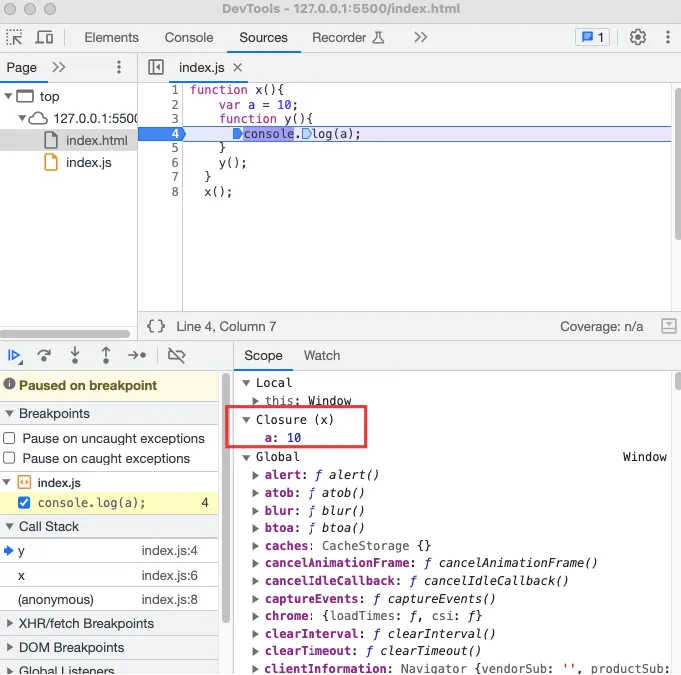

**_Closure_** _means that a function bind together with its lexical environment or you can say_ **“function along with it’s lexical scope”**

#### Why it says Closure (x) in above screenshot?

We hold program on to _`y()` at line `4` so inside `y()` , it forms closure with the variable `a` which was part of function `x()` lexical scope._

Or you can say, function _`y()` is bind to variable of function `x()` . So , it forms a closure and it has access to it’s parent lexical scope._

Let’s take another example:

```js
function x() {
  var a = 10;
  function y() {
    console.log(a);
  }
  return y;
}
var z = x();
console.log(z);
```

_Closures come into picture when you try to return these functions outside._

Output:

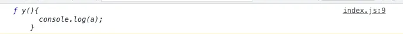

So, as you can see function `y()`is returned in to `variable z` now.

At Line 8, function `x()`is gone from memory space, completely vanish and no longer in call stack.

So, now `variable z` contains `function y()`.

#### Question: As function y( ) is returned and no longer reside inside function x( ). How will this behave in other lexical scope?

Let’s try calling function `z()`. See below:

```js
function x() {
  var a = 10;
  function y() {
    console.log(a);
  }
  return y;
}
var z = x();
console.log(z);
z(); // call function here
```

As function `y()` is trying print variable a but variable a is not in global scope and function `x()` is not in call stack anymore. **_What will happen to variable a? What will invoking function `z()` will print now?_**

Output:

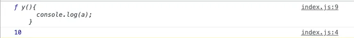

As you can see, **_it printed 10._**

Here comes **concept of closure**, When a function is returned from another function, they still maintains their Lexical Scope. They remember where they were actually present.

We can say when function `y()` was returned, not only function code was returned but closure was returned.

That closure enclosed function along with Lexical scope is returned.

#### Let’s take another example:

```js
function x() {
  var a = 10;
  function y() {
    console.log(a);
  }
  a = 100;
  return y;
}
var z = x();
console.log(z);
z();
```

What should be output now?

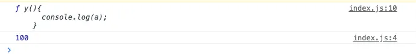

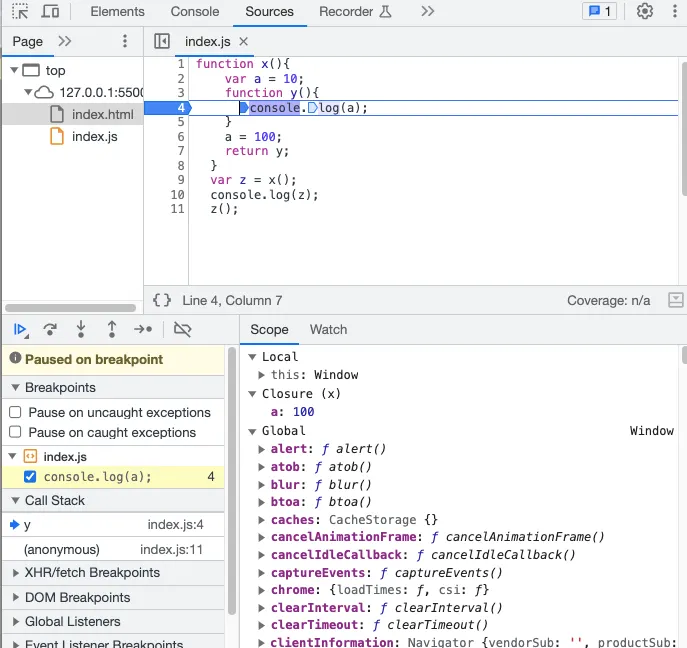

Because **_console.log(a) doesn’t refers 10. It is reference to the variable not the value. So, reference to variable persist._**

So, now variable a’s reference points to 100 . That means 100 is still in memory preserved because of closure. When function `x()` was gone , it is not garbage collected, because it has to be used later. That’s why 100 printed not 10.

#### Let’s take another example again :

```js
function z() {
  var b = 20;
  function x() {
    var a = 10;
    function y() {
      console.log(a, b);
    }
    y(); // call function here
  }
  x(); // call function here
}

z(); // call outer function here
```

Run it and add debugger in browser:


As you can see in above, there are two closures : Closure (x) and Closure (z).

Closure (x) => for parent
Closure (z) => For parent’s parent

So, if `y()` is being returned anywhere then value of `variable a` and `variable b` are not garbage collected.

_So, Because of Closures, as these functions remember things even when they are not in their lexical scope, this makes JS language very powerful._

**Few Common usage of Closures are :**

1. Module Design Patterns

2. Currying

3. Function Like once

4. memoize

5. maintaining state in async world

6. setTimeouts

7. Iterators

8. Data Hiding and Encapsulation

#### Disadvantages of Closures:

1. There could be over consumption of memory because every time a closure is formed, it consumes a lot of memory.

2. Those closed over variables are not Garbage Collected, so it means it is accumulating a lot of memory

3. If not handled properly, it can lead to memory leaks.
