# Nmjs-1

### Ep. 1: How JavaScript Works & Execution Context 🤷🏻‍♀️

1. Do you know how JavaScript works and how the code is executed?
2. Is JavaScript synchronous or asynchronous?

3. Is JavaScript single threaded or is it multi threaded?

Don’t worry we’ll cover everything

### Execution Context in JS 🤔

**_"Everything in JavaScript happens inside the Execution Context"_**


Let’s just say this **_execution context_** to be a big box or a container 🎁 in which whole JavaScript code is executed. It has two components in it.

**The first component** is also known as the **_memory component_** 📝. So this is the place where all the variables and functions are stored as key-value pairs Key value, if suppose we have a variable ‘a’ which is equivalent to 10 and similarly functions are stored over here in this memory component. This memory component is also known as **Variable environment**

**The second component** of this execution context is the **_code component_** 📋. This is the place where code is executed one line at a time. It is also known as **Thread of execution**


### Is JavaScript synchronous or asynchronous?🧐

JavaScript is a **_synchronous single-threaded_** language.

**single threaded**, means JavaScript can only execute one command at a time and **synchronous**, means in a specific order.

So that means that it can only go to the next line once the current line has been finished executing.

JavaScript is not possible without this beautiful execution context.

So, in the next part I’ll walk you through a real JS program. We will see how this whole beautiful execution context is created, how this memory section is created, how this code is executed inside this code component.

### Ep. 2 : How JavaScript Code is executed? ❤ & Call Stack 🤷🏻‍♀️

Do you know? When you run a JavaScript program, there are a lot of things happening behind the scenes inside the JavaScript engine. we’ll be covering everything right now.

Remember in the last article , we discussed that everything in JavaScript happens inside an **Execution Context**.

### So what happens when you run a JavaScript program?

_An execution context is created._

**Code Example for Execution Context Creation**

```js
var n = 3;
function square(num) {
  var output = num * num;
  return output;
}
var square3 = square(n);
var square4 = square(4);
```

So we have this variable ’n’ which is 3 and there is a function **_square_** which returns the square of a number which is being passed inside this function and there are two other variables, **_square3 & square4_**, which are just invoking this already created function.

So now let us see how this whole JavaScript code is run behind the scenes.

### Global Execution Context Creation 🤔


**In first phase of memory creation**, JavaScript will allocate memory to all the variables and functions.

So as soon as JS encounters this line 1, It **_allocates memory to n_**. So let us now allocate memory to n. How will it allocate? It will reserve a memory space here for n. Similarly, now JavaScript goes to line 2. It sees that there is a function, which is named square. So it will **_allocate memory to square_**.

In the first phase and in case of functions, it literally stores the whole code of the function inside this memory space

And now it will also **_allocate memory to square2 and square4_** and as there are another variables, it will again store undefined for them

so in the first phase, JS skims through the whole program


Let us see what happens in the phase two

### The second phase is the code execution phase

So let’s see how this code is executed after the memory allocation. So JavaScript, once again runs through this whole JS program line by line and it executes the code now. So this is the point when all these functions and every calculation in the program is done. Okay? So as soon as **_it encounters this first line, n=3, it actually places the ‘3’ inside the ’n’_**. So till now, the value of n was undefined, now it is 3.


So line number two to five, there is nothing to execute literally. So it moves to line number 6

### Function Invocation and Execution Context Creation

Here, we invoke a function

```js
var square3 = square(n);
```

**What do you mean by a function invocation?** _Whenever you see a function name, with these round brackets, it means that the function is now being executed._

So functions over here are like a mini program, and whenever a new function is invoked, you know, a mini program is invoked, an altogether new execution context is created 😃

So now, we will again go through the creation of this execution context and there will again be two phases involved.

In the memory creation phase, So we will be concerned about this piece of code only. When we are executing this **square(n)**,

```js
function square(num) {
  var output = num * num;
  return output;
}
```

So now, let us see how the memory is allocated here in the first phase

In the phase one, first of all, don’t forget that the memory is allocated to variables and functions inside this function. And when I say variables and functions, it involves the parameters, like the **‘num’**, and the other variables and we don’t have a function so no need. so we will be allocating memory to _num_ and _output_.

Now comes the part of phase two. Okay? So, the phase two is the code execution phase. In this, we will be executing each line.

### What happens while executing return statement?🤔

This return keyword states that, now return the control of the program, to the place where this function was invoked.


One more thing that happens when the whole function is executed, is that, this whole execution context, for that instance of that function, will be deleted. And the **control moves to line number 6**.


After this replacement, we will go to line number 7. So in line number 7 we are again invoking a function, right, and just the difference is, we are now passing in 4 over here as an argument directly. That’s it.

As soon as this function invocation happens👇

1. Again, a brand new execution context will be created

2. Again it will have this memory

3. Again it will have a code component, remember?

4. And now, it will again go through those two phases.

5. Firstly memory is allocated to num, okay?

6. num will store the value undefined. Remember?

7. And, one more thing happens is, we allocate memory to output, which is again, undefined.

8. Our first phase is done.

9. Now in the second phase, In the code execution phase, What will happen is, num will get this argument, from the invocation in line number 7,

10. num will get this value 4.

11. In the code execution, the undefined will be replaced by (in the code execution phase) 4.

12. It will execute `num*num`, which is `4*4`, 16 and this 16 will now replace this undefined value inside the output. Right?

13. The control moves to line number 4. After 3 is done.

14. So now, this return statement takes back the control to line number 7, where, the function was actually invoked.

15. Now the value 16 will replace undefined in the square4 variable. Okay?


As soon as we are done with the function execution, this whole execution context is now deleted.

So JS is done with all it’s work.


### But don’t you think that all this is too much to manage for the JS engine?🤔

Call Stack is answer for that.

### Introduction to Call Stack in JavaScript 📚

**Call Stack in JavaScript** It handles everything to manage this execution context creation, deletion, and the control.

_Note: To understand Call Stack , one need to understand Execution Context._

The call stack is like a stack. In the bottom of the stack we have our global execution context. That means, whenever any JS program is run, this call stack is populated with this Global execution context. This whole execution context is pushed inside this stack.


Remember this. Whenever a function is invoked, or a new execution context is created, as in case here, in line number 6, we created this execution context, So this execution context is put inside the stack. So let me just denote it by E1, which is the execution context 1.This is how it happens.

Once we are done with executing this function ( square3 ), we return the output, now this E1 is moved out.

E1 is popped out of the stack, and the control goes back to the global execution context, where it left.

So the control goes back to line number 6. Got it? This is how it works. This will again literally pop out of the stack


Now E1 will be popped off the stack and then we move on to line number 7, where the new function was invoked, and a new Execution context was created, and similarly this E2, will move up to the stack. This E2 was popped inside the stack. Once the whole function was executed, then E2 will also move out of stack, and the control goes back to Global Execution Context (GEC).


**So this call stack is only for managing these Execution contexts.**

_Whenever an Execution context is created, it is pushed into the stack and whenever an Execution context is deleted, it will move out of the stack.So that is how the whole control is being managed._

This whole Execution context creation deletion everything is managed by JavaScript After this whole thing is executed, the call stack gets empty. The GEC is also gone from this call stack

Now Another interesting thing, **Call stack is also known as, Execution context stack, Program stack, Control stack, Runtime stack, Machine stack.** So, Next time when someone asks you any of these terms, don’t get confused and answer like a pro 😎 .

### Ep. 3: Hoisting in JavaScript (variables & functions)

Hoisting is a phenomenon in javascript by which you can access variables and functions even before you have initialised those or you have put some value in it.

**Example**

```js
var x = 8;

function getName() {
  console.log("Hi Hoisting");
}

getName();
console.log(x);
```

**Output**


**Example 2:** Try to access getName and x even before we are initialising it.

```js
getName();
console.log(x);

var x = 8;

function getName() {
  console.log("Hi Hoisting");
}
```

**Output**


This means, _getName()_ somehow access the function and invoke the function. But _x is undefined_ 🤔.

**Example 3:** Remove var x = 8;

```js
getName();
console.log(x);

//var x = 8; // remove or comment this line

function getName() {
  console.log("Hi Hoisting");
}
```

**Output:**


This says **x is not defined** . 🤔🤔

_Is undefined and not defined are same thing? Nope_ 👎 🚫

**Example 4:**

```js
function getName() {
  console.log("Hi Hoisting");
}
console.log(getName);
```

**Output:**


It just print the function.

**Example 5:** What if try to get function name before initialising it like did for x which gives undefined?

```js
console.log(getName);
var x = 8;
function getName() {
  console.log("Hi Hoisting");
}
```


So

```js
getName();
console.log(x);
console.log(getName);

var x = 8;
function getName() {
  console.log("Hi Hoisting");
}
```

**Output:**


So, let’s dig down deep and see why it is behaving like this. Remember how Execution context works in previous Ep. 1 and Ep. 2.

So, **_even before this whole javascript code executes in javascript, memory gets allocated to each and every variable and function_**. Check below for reference. I put debugger here on first line of code, that means even first line of code is not executed yet and you can see variable and function already have memory allocated.


Even if you move console above and put debugger on first line then you can see memory is allocated .

```js
getName();
console.log(x);

console.log(getName);

var x = 8;

function getName() {
  console.log("Hi Hoisting");
}
```


So, if you will move next line to line and check console then you ‘ll see output as :


### Now, let’s come to undefined and not defined.

So, let’s remove **_var x = 8;_** then it means x is not in memory.

**_Memory is never allocated to x. As x is nowhere initialised in program._**

When code executes and check **_console.log(x);_** then it will give **_ReferenceError: x is not defined_**

```js
getName();
console.log(x);

console.log(getName);

function getName() {
  console.log("Hi Hoisting");
}
```

Now, let’s take an example of **_arrow function._**

```js
getName();
console.log(x);

console.log(getName);

var x = 8;

var getName = () => {
  console.log("Hi Hoisting");
};
```

**Output:**


**What happened?**

When you make _getName_ an **arrow function**, it started behaving like any other variable not as a function. And In memory allocation phase, just like any other variable , it allocates undefined.


Even if you try below syntax:

```js
getName();
console.log(x);

console.log(getName);

var x = 8;

var getName = () => {
  console.log("Hi Hoisting");
};

var getName2 = function () {
  console.log("Hi Hoisting");
};

function getName3() {
  console.log("Hi Hoisting");
}
```

you can see, only in case of proper function, it will copy the whole code and other two act as variables and have _**undefined**_ value


I hope this article provides a clear understands of how Hoisting works in JavaScript. Happy Coding.

### Ep. 4: How functions work in JS ❤ & Variable Environment

Let’s take **function a()** and **function b()** which have variable with name x but different values. From here, **_we’ll learn how function invocation work behind the scenes._**

Also, introduce something in global space. Let take x with different value at top of program.
Then invoke functions : a and b.

_From last articles, you must remember that these functions can be invoked before even initialising that because of hoisting._

```js
var x = 1;
a();
b();
console.log(x);

function a() {
  var x = 10;
  console.log(x);
}

function b() {
  var x = 100;
  console.log(x);
}
```

**Response:**


Let’s see how this program works behind the scene in javascript line by line. 🤔🤔

Everything we learn in this articles helps in understanding scope, closures

Steps:

When Javascript runs any program, **Global Execution Context(GEC)** is created. It will have two components : **Memory Component(Variable Environment) and Code Component.**

1. Memory will be allocated to all variables and functions present i.e **x, a() and b()**.

2. CallStack will be created and GEC will be pushed inside it.


3. Now when code actually get executed that means

```html
var x = 1;
```

then **_1 will replace undefined_** in memory


4. When **function a()** is invoked, then a **_new execution context_** is created which is limited to this function only. It will follow same phase as above i.e two components: memory and code where x will be all together different variable.

```js
function a() {
  var x = 10;
  console.log(x);
}
```

5. As soon as this new execution context get created for a(), it get pushed into call stack.

6. Now control is at Line 7.

7. At line 7 , 10 will replace undefined for x in memory

8. At Line 8, **_console will print 10 not 1 as it will look into local memory space_**


9. At line 9, We finish executing function a(), so now whole execution context for a will be deleted. **_a() will be popped out from call stack_**


10. Now GEC is at line 2 again and control moves to line 3


11. Again is a function b() is invoked and executes same as above, creating memory and code components. As soon as new execution context get created for b(), it get pushed into call stack.

Now control is at Line 12.

At line 12, 100 will replace undefined for x in memory.

At Line 12, **_console will print 100 not 1 as it will look into local memory space_**


12. At line 12, We finish executing function b(), so now whole execution context for a will be deleted.


13. **_b() will be popped out from call stack_**


14. Now GEC is at line 3 again and control moves to line 4. It will look for x in local memory of this particular execution context. **_And it prints 1 in console_**.


15. After finish executing line 4 in GEC. Now, JS engine moves to next line and see there is nothing left to execute.

16. GEC will be deleted and GEC will be popped out from call stack.


### This is how complete program get executed. 🎉

You can also check same in browser as well by adding breakpoints 🛑.

### Ep. 5: SHORTEST JS Program window & this keyword 🧐

Let’s just take an **empty JS file\*** where nothing to execute and see what happens behind the scenes.

1. Go to Source
2. Put debugger on and run program👩🏻‍💻
3. GEC will be created and JS engine still created GEC and set up memory space
4. There was nothing to setup as file was empty but it still did it’s job .🤷🏻‍♀️


### Now comes new word “window” 🪟. What is that??

## When you go to console and type window, you’ll see something printed, a big object which consist functions and variable which are created by JS engine, in global space .


This means you can access all these functions and variables anywhere in JS program

Same as above JS engine creates **_this_** 👈🏻 keyword

Try typing **_“this”_** in console and you’ll see something will get printed.


## Right now, “this” represents “window” in global space.👏🏼

### So, question here is what exactly is window? How to define that?

## window is a global object which is created along with GEC.

So, to **summaries** whenever a JS program runs:

1. GEC is created
2. global object is created i.e window
3. this variable is created and points to global object

#### Why it is called “window” ?

JS not just run on browsers, it runs on server and others. So, wherever JS is running there must be JS engine . Like in chrome, it’s V8, firefox and safari have their own engines. So, all these JS engines have responsibility to create global object. In case of browsers, it is known as “window”. It’ll be different for node or wherever JS is running but there will always be global object.

#### So, at global level in GEC this === window. 😃


#### Now, you might have question: what is global space?🤔

Any code you write inside JS which is not inside a function is in global space.

Let see below example where we have variable **“y”** and **“function z()”**.


So, **“y” and function z()** is in global space. It will get attached to global object i.e window. But variable a inside **function z()** will not be in global object.


#### Now, how to access these?🧐

1. use **window.{variableName}**

2. directly use {**variableName**}

3. use **this.{variableName}**


Note: Whenever we try to access any function or variable and we don’t put anything in front of it, it automatically assumes you are referring to global space.

so, all these referring to same place in memory space.

```js
(window.y === y) === this.y;
```

#### Summary

So now you can figure out the value of `this` by following these simple rules:

- By default, `this` refers to a global object, which is global in the case of NodeJS and a `window` object in the case of a browser

- When a method is called as a property of an object, then this refers to the parent object

Note: \* **empty JS file — Shortest JS program.**

### Ep. 6: undefined vs not defined in JS 🤨

**_undefined_** is a very special keyword in javascript and it is not there in other languages. It has a lot to do with how javascript code is executed.

_As we have studied in the previous articles also that javascript code is executed in a different way it creates a global execution context and allocates memory to all the variables and functions even before a single line of code is executed._

#### Code Example of undefined in JS

Suppose we created a variable a = 10, so even before this line of code is executed, javascript has tried to allocate memory to this even before this line of code is run.

Let us see with the help of debugger so i am putting the debugger right before this line is executed.
If we refresh the page this, line hasn’t been executed yet right but javascript has already allocated memory to this **“a”** .


so we have already reserved memory for now. If we see here is the reserved memory so right now **_a is undefined_**.

#### Why this happened?

When it allocates memory to all the variables and functions, to the variables it tries to put a placeholder, it is like a placeholder which is placed in the memory. That special keyword is **_undefined_**

**_“undefined”_** _is very different than_ **_“not defined”._**

So suppose if i try to access something else like below to which we have not allocated memory.

```js
var a = 10;

console.log(x);
```

#### what will happen ?

“x” you won’t find anything that is known as **_“not defined ”_** 👈🏼


If you run below code, First it will give a = undefined

```js
console.log("a = ", a);
var a = 10;
console.log("a = ", a);
console.log("x = ", x);
```

But after second line has been executed, you will see that the **value of a has changed to 10** .


_So remember undefined is not equal to empty_

**_Some people 👥 think that undefined means empty_** _like it is not taking up any memory space._ 🤨 ❌

#### No, undefined is a special keyword it takes up its own memory but you can assume it to be like a placeholder which is kept for the time being until the variable is assigned some other value. 🤷🏻‍♀️

#### What if i never put any value inside “a” , like what if I just declared it? 🧐

I never put any value to it throughout our whole program. It have this value undefined that placeholder kept inside and to show you that it is something in javascript.


#### Mistake you should not make while using undefined.

**a = undefined** ❌ ❌

#### what does that mean?

undefined is a value, it is a keyword in javascript and it is totally possible to assign and define to any variable but it is kind of a mistake and it is a bad thing to do in javascript.

One should not do it because undefined is like a placeholder which is kept inside the variables and it states that in the whole code that variable was not assigned anything right so it is meant for a specific purpose so it is not generally a good way to put undefined like this

Though it is a totally okay to do this but it can lead to a lot of inconsistencies so it is not a good practice to do this.

**_Javascript is a loosely typed language. What does that mean?? 🫤_**

#### So loosely typed means that it does not attaches its variables to any specific data type.

Suppose if i created a and put in string in it so later on in the program i can also put numbers in it, i can also put boolean in it.


### It is like javascript is very flexible in this case, it is loosely typed that is known as loosely type language.

If it was strict type then just like other languages just like **C** or **C++** .

If you assign a variable that if it is a string a so it will only hold string, it won’t hold numbers or booleans or anything else but it is not the case in **javascript** you can put anything and everything inside this variable.

So if i do **var a** for the time being it can like just hold undefined

```js
var a;
console.log("Step 1,  a = ", a);
```


If i later on put **a = 10** here so it can hold numbers also

```js
var a;
console.log("Step 1,  a = ", a);
a = 10;
console.log("Step 2,  a = ", a);
```


it can also hold a string again, so this is a perfectly valid javascript code

```js
var a;
console.log("Step 1,  a = ", a);
a = 10;
console.log("Step 2,  a = ", a);
a = "Hello World";
console.log("Step 3,  a = ", a);
```


So until and unless any value is not specified there, it is a placeholder undefined, when you have put integer, string etc. It will print that.

**_JS is a loosely typed language a.k.a weakly typed language_**

### Ep. 7 The Scope Chain, Scope & Lexical Environment 🧐

In this article, we will cover:

1. What is Scope?

2. What is Lexical Environment?

3. What is Scope Chain?

Scope in JS is directly related to lexical Environment. Let’s take below example:

```js
function a() {
  console.log(b);
}
var b = 10;
a();
```

When JS engine reach line 2 and try to execute. JS engine will look for “b” in local memory space of function a. But it won’t be there because we never created “b” inside function a().

#### What will happen now? Will it print undefined or not defined or print value of variable?

Let’s run and see output


So, it printed value somehow.

#### Let’s make it more complicated. Add another function inside function and try to print “b” inside that. Invoke function also. What will happen now?

```js
function a() {
  c();
  function c() {
    console.log(b);
  }
}
var b = 10;
a();
```

Let’s run and see output again


So, it again printed value again.

#### Let’s take another example and move variable “b” inside the function but try to access it in global scope by printing it. What will happen now?

```js
function a() {
  var b = 10;
  c();
  function c() {}
}
a();
console.log(b);
```

Let’s run and see output again


Here goes **ERROR**. which says **not defined**.

Now, Scope comes into picture.

### Scope means where you can access a specific function or variable .

It mainly have two aspects:

1. What is scope of this variable “b” ? Where can i access this variable “b” ?

2. Is “b” inside the scope?? Like Is “b” inside the scope of function c?? Which means Can I access “b” inside function c??

#### What happen when program runs?

```js
function a() {
  var b = 10;
  c();
  function c() {}
}
a();
console.log(b);
```

1. When we run this program, GEC is created and pushed inside Call Stack.

2. When you run program, it will try to assign values to global variables and function. Example : It will assign value to function a().

3. Then it will invoke the function a(), which will result in creating execution context for a().

4. Now, function a() will reserve memory for variable b and function c().

5. So variable b= undefined and function c = function reference

6. Once, code starts executing b = 10.

7. At line 3, function c is invoking which results in new execution context and pushed to call stack.
   Press enter or click to view image in full size


#### What is Lexical Env?

### Where ever an execution context is created, a lexical env is also created. So, Lexical env is local memory, along with lexical environment of it’s parent.

_Lexical means hierarchy or in sequence._

**In below example**, function c() is lexically sitting inside function a(). And function a() is lexically inside the global scope.

```js
function a() {
  var b = 10;
  c();
  function c() {}
}
a();
console.log(b);
```

So, Let’s assume **orange box inside memory which represents lexical env of it’s parent.**

1. In case of function c() execution context, it will represent lexical env of a() and a()’s parent i.e GEC.

2. In case of function a() execution context , it will represent lexical env of GEC.

3. In case of GEC, it represents outer env which is null.


#### What happens if you try to do console.log for b inside function c( ) ?? Will it print value of b or gives not defined?

```js
function a() {
  var b = 10;
  c();
  function c() {
    console.log(b);
  }
}

a();
console.log(b);
```

1. When JS engine encounter this line, it tries to find out this inside the local memory of function c().

2. It won’t find it because there is no variable b inside function c() memory.

3. Now, JS engine goes to orange reference which goes to lexical environment of it’s parent which is function a()’s memory.

4. Now, it find variable b inside function a()’s memory.

5. **It goes back and prints value of b as 10.**


#### If variable b is moved outside function a(). What happens if you try to do console.log for b inside function c( ) ?? Will it print value ?

```js
function a() {
  c();
  function c() {
    console.log(b);
  }
}
var b = 10;
a();
console.log(b);
```

Answer is , **_YES_**. Check below for explanation ⬇️


#### If variable b is removed. What happens if you try to do console.log for b inside function c( ) ?? Will it print value ?

```js
function a() {
  c();
  function c() {
    console.log(b);
  }
}
a();
```

Answer is , **_NO_**. Check below for explanation ⬇️


Output:


Here, we can say: **\*_“b is not in the scope”._**

So, this whole mechanism of searching b in local memory and if not found then into reference of the outer parent lexical env and so on is known as **_“SCOPE CHAIN”_**

#### Summary:

1. Lexical environment is created whenever an execution context is created. So, Lexical environment = Local memory + Reference to lexical env of parent.

2. Parent i.e Lexical Parent is where actually that function sits inside the code.

3. Chain of Lexical Env is known as Scope Chain. And it defines whether a variable or function is present inside the scope or not.

#### Let’s see same in browser as well:

1. Call stack with GEC, a()’s execution context and c()’s execution context⬇️


2. function a() have Local memory + lexical env of parent as “Global” ⬇️


3. function c() have Local memory + lexical env of parent i.e a()’s memory + lexical env of it’s parent’s parent i.e a()’s parent which is GEC ⬇️


_Note: You can see “Closure” keyword in above screenshot. It’ll be covered in future articles._

### Ep. 8 let & const in JS Temporal Dead Zone 🧐

Prerequisite:
1.Hoisting in javaScript
2.“this” keyword in JS

#### In this article, we’ll cover : :

1. What is Temporal Dead Zone?
2. Are let and const declaration hoisted?
3. Difference between Syntax Error / Reference Error and Type Error?

#### Are let and const declaration hoisted?

Answer is : **YES** 👍🏼

But they are hoisted very differently then var declarations.
In interviews, you can say that these are in Temporal Dead Zone.

Let’s understand taking an example:

```js
let a = 10;
var b = 100;
```

In previous hoisting article, we learn that we can access variable “b” even before we have initialised it. Like below

```js
console.log(b);
let a = 10;
var b = 100;
```

**_Reason_**: Because in JS, memory has been allocated even before any line of code is executed. So, we can access variable “b” even before initialising or declaring.

Output :


#### Question: What If I try to access variable “a” in same way ? As it is hoisted , Will it give undefined too?

Answer is **NO** 👎🏼

```js
console.log(a);
let a = 10;
var b = 100;
```

Output:


SO, it is saying **_“Reference Error: Cannot access ‘a’ before initialisation”_** . i.e you can access “a” only after you assigned or initialised some value to “a”.

Let’s try below code:

```js
let a = 10;
console.log(a);
var b = 100;
```

Output:


Now, you can see we were able to access “a”. console prints value 10.

#### Question: How to know whether any variable is hoisted or not??

Let’s see that in browser, add a debugger:


Now, If you see both variables “a” and “b” are in scope with value **undefined** but **“a” is under “script” where “b” is in Global memory space.**

To summarise: **“let”** and **“const”** type variables will be allocated memory but that is not in Global Space. They are hoisted but not stored in global space. And this memory is not accessible until you put some value into that.

#### Question: What is Temporal Dead Zone??

It is the time since when let variable was hoisted and till it is initialised some value.

So, _whenever you try to access any let or const variable in Temporal Dead Zone, it gives you_ **_Reference Error._**

```js
console.log(a);
let a = 10;
console.log(a);
var b = 100;
```

So, In above example, until Line 2 : let a = 10; . **_“a” is in Temporal Dead Zone and gives you Reference Error at Line 1._**
After Line 2, at Line 3: you can access variable a.

#### In previous article of “this” keyword in JS, we tried to access variables using “this” and “window” keywords. Let’s just try that too.


As you can see above, **_we are not able to access “a” using “window” and “this” keyword. It keeps giving “undefined”._**

Reason: “this” and “window” represents global space and memory allocated to “a” was different then global object. So, this shows, **_“let” is strict then “var”._**

#### Question: Can we re-declare “let” variable?

Answer is **NO** 👎🏼

```js
let a = 10;
let a = 100;
```

Output:


SO, it is saying **_“Syntax Error: Identifier ‘a’ has already been declared”_** .

Also, JS will not run any line of code if it sees redeclaration. It will not reach any line of code.

#### what If I try below ?

```js
let a = 10;
var a = 100;
```


Same again: **_“Syntax Error: Identifier ‘a’ has already been declared” . “let” variable can’t be declared again with same name again in same scope._**

#### Question: Can we re-declare “var” variable?

Answer is **YES** 👍🏼

```js
var a = 10;
var a = 100;
```

No error when you run code.

#### Question: Can we re-declare “const” variable?

Answer is **NO** 👎🏼

```js
var a = 10;
const b = 100;
const b = 1000;
```

Output:


“const” variable can’t be declared again with same name in same scope.

#### What If I run below code?

```js
let a;
const b;
var c;

a = 10;
b = 100;
c = 1000;

```


SO, it is saying **_“Syntax Error: Missing Initializer in const declaration.” This means “const” variable needs to be intialised and declared in same line._**

_“const needs to be initialised and declared in same line”_

#### What If I try to assign some value again to “const” variable?

```js
let a = 10;
const b = 100;

a = 20;
b = 200;
```


SO, it is saying **_“Type Error: Assignment to constant variable.” You can not assign value again to “const” type variable._**

Now, As we have three different ways to declare a variable using let, var and const.

#### Which one we should use?

1. const : whenever you put some value which is not going to change later, use const.

2. let: As let has Temporal dead zone and you won’t run into unexpected errors.

3. var: Try to put it aside and not use.

#### How to avoid Temporal Dead Zone errors?

Try to put all declaration and initialisation on top of scope. This will minimise unexpected errors when logic get called.

### Ep. 9 BLOCK SCOPE & Shadowing in JS

#### What is Block ?

1. Block is defined by curly braces i.e { .. }

2. Block is also know as **Compound Statement.**

#### Why Block is required in JS?

Block is used to combine multiple javascript statements into one group.

#### Why we need to group multiple statements at one place?

we group multiple statements in a block so that we can use it where JS expects one statement

Example: if statement only expecting one statement but we provided multiple statements using curly braces. This is a Block.

```js
if (true) {
  // Compound Statement
  var a = 10;
  console.log(a);
}
```

#### What is Block Scoped?

Block Scoped means what all variables and functions we can access inside block.

To understand in details, let’s take an example and run it:

```js
{
  var a = 10;
  let b = 20;
  const c = 30;
}
```


So, “b” and “c” are inside Block Scope which is separate space which is reserved for block only. But “a” is hoisted inside global object.
From here the statement comes in picture that:

`let` and `const` are block scoped.

Therefore, you can’t access `let` and `const` type variable outside the scope .

Therefore, you can’t access `let` and `const` type variable outside the scope .

```js
{
  var a = 10;
  let b = 20;
  const c = 30;
  console.log("Inside Block a= ", a);
  console.log("Inside Block b= ", b);
  console.log("Inside Block c= ", c);
}
console.log("Outside Block a= ", a);
console.log("Outside Block b= ", b);
console.log("Outside Block c= ", c);
```


So, it is saying **_“Reference Error: b is not defined” . Because “b” is not in global scope._**


#### What is Shadowing in JS?

If we have same named variable outside the block, then block variable will shadowed outside block variable.

Example:

```js
var a = 12;
{
  var a = 10;
  let b = 20;
  const c = 30;
  console.log("Inside Block a= ", a);
  console.log("Inside Block b= ", b);
  console.log("Inside Block c= ", c);
}
```

#### What will log print for “a” now?

Output:


It prints 10. That means line 3 variable shadowed Line 1 variable.

#### \* What If I try to print var “a” outside block ? What should it print 10 or 12?

```js
var a = 12;
{
  var a = 10;
  let b = 20;
  const c = 30;
  console.log("Inside Block a= ", a);
  console.log("Inside Block b= ", b);
  console.log("Inside Block c= ", c);
}
console.log("Outside Block a= ", a);
```

Output:


So , it prints 10 again. Line number 3 shadowed line 1 and also modified the value for variable. **_Because they both are pointing to same memory location._**

#### \* Now what happens with “let” type variable?

```js
let b = 12;
{
  var a = 10;
  let b = 20;
  const c = 30;
  console.log("Inside Block a= ", a);
  console.log("Inside Block b= ", b);
  console.log("Inside Block c= ", c);
}
console.log("Outside Block b= ", b);
```

Output:


Now, Inside block variable “b” prints 20 but outside block , it prints 12.
Because scopes are different in case of let type variable. Try adding debugger and check scope of variables.


**_In above screenshot, you can see three scopes ::::_**

**_1. Global: memory reserved for var_**

**_2. Script: separate memory forletand const outside block scope_**

**_3. Block: separate memory for variables inside scope_**

#### \* Now what happens with “const” type variable?

```js
const c = 12;
{
  var a = 10;
  let b = 20;
  const c = 30;
  console.log("Inside Block a= ", a);
  console.log("Inside Block b= ", b);
  console.log("Inside Block c= ", c);
}
console.log("Outside Block c= ", c);
```

Output:


Now, Inside block variable “c” prints 30 but outside block , it prints 12.
Because scopes are different in case of const type variable. Try adding debugger and check scope of variables.


Again, in above screenshot, we can see 3 scopes.

#### Does Shadowing behaves same way in functions?

```js
const c = 12;

function a() {
  const c = 30;
  console.log("Inside Function c= ", c);
}

a();

console.log("Outside Function c= ", c);
```

Output:


Now, Inside function variable “c” prints 30 but outside function, it prints 12.
Because scopes are different in case of `const` type variable. Try adding debugger and check scope of variables.


#### What is Illegal shadowing?

#### Case 1: If outside block variable is “let” and inside is “var” type? Will it still gives error?

```js
let a = 20;
{
  var a = 10;
}
```

Can we do this? What will be the output now?


So, this is known as Illegal Shadowing.

#### Case 2: But what If outside block variable is “var” and inside is “let” type? Will it still gives error?

```js
var a = 20;
{
  let a = 10;
}
console.log(a);
```

Answer is **NO** .It won’t give any error and work perfectly fine.

#### WHY?

Because if a variable is shadowing something, it should not cross the boundary of it’s scope.

In Case 1: `var` is not blocked scope. **_“var” is function scoped. So you can do it inside a function._**

```js
let a = 20;
function b() {
  var a = 10;
}
b();
```

Now, in this case, `var a` is not interfering with `let a` as both have different memory.

#### Now, Try below on your own, add debugger and see how scopes work:

Case 1:

```js
const a = 20;
{
  const a = 30;
  console.log("Inside Block 1, a = ", a);
  {
    const a = 40;
    console.log("Inside Block 2, a = ", a);
  }
}
console.log("Outside Block, a = ", a);
```

Case 2:

```js
const a = 20;
{
  const a = 30;
  console.log("Inside Block 1, a = ", a);
  {
    console.log("Inside Block 2, a = ", a);
  }
}
console.log("Outside Block, a = ", a);
```

**_These examples also cover Lexical Scope Chain pattern we covered in previous article._**

With this, we cover our basics for Block Scope, Function Scope and Shadowing.

### Ep10. Closures in JS 🤷🏻‍♀️

Let’s start with an example

```js
function x() {
  var a = 10;
  function y() {
    console.log(a);
  }
  y();
}
x();
```

Because of JS lexical scope concept, so when `y()` function is invoked and executed, it ‘ll try to find `a` inside local memory scope. If not found there, then it goes to **_Lexical Parent_** and search there.

#### What should be the output?


Let’s put debugger and check what is happening in background:


**_Closure_** _means that a function bind together with its lexical environment or you can say_ **“function along with it’s lexical scope”**

#### Why it says Closure (x) in above screenshot?

We hold program on to _`y()` at line `4` so inside `y()` , it forms closure with the variable `a` which was part of function `x()` lexical scope._

Or you can say, function _`y()` is bind to variable of function `x()` . So , it forms a closure and it has access to it’s parent lexical scope._

Let’s take another example:

```js
function x() {
  var a = 10;
  function y() {
    console.log(a);
  }
  return y;
}
var z = x();
console.log(z);
```

_Closures come into picture when you try to return these functions outside._

Output:


So, as you can see function `y()`is returned in to `variable z` now.

At Line 8, function `x()`is gone from memory space, completely vanish and no longer in call stack.

So, now `variable z` contains `function y()`.

#### Question: As function y( ) is returned and no longer reside inside function x( ). How will this behave in other lexical scope?

Let’s try calling function `z()`. See below:

```js
function x() {
  var a = 10;
  function y() {
    console.log(a);
  }
  return y;
}
var z = x();
console.log(z);
z(); // call function here
```

As function `y()` is trying print variable a but variable a is not in global scope and function `x()` is not in call stack anymore. **_What will happen to variable a? What will invoking function `z()` will print now?_**

Output:


As you can see, **_it printed 10._**

Here comes **concept of closure**, When a function is returned from another function, they still maintains their Lexical Scope. They remember where they were actually present.

We can say when function `y()` was returned, not only function code was returned but closure was returned.

That closure enclosed function along with Lexical scope is returned.

#### Let’s take another example:

```js
function x() {
  var a = 10;
  function y() {
    console.log(a);
  }
  a = 100;
  return y;
}
var z = x();
console.log(z);
z();
```

What should be output now?


Because **_console.log(a) doesn’t refers 10. It is reference to the variable not the value. So, reference to variable persist._**

So, now variable a’s reference points to 100 . That means 100 is still in memory preserved because of closure. When function `x()` was gone , it is not garbage collected, because it has to be used later. That’s why 100 printed not 10.

#### Let’s take another example again :

```js
function z() {
  var b = 20;
  function x() {
    var a = 10;
    function y() {
      console.log(a, b);
    }
    y(); // call function here
  }
  x(); // call function here
}

z(); // call outer function here
```

Run it and add debugger in browser:


As you can see in above, there are two closures : Closure (x) and Closure (z).

Closure (x) => for parent
Closure (z) => For parent’s parent

So, if `y()` is being returned anywhere then value of `variable a` and `variable b` are not garbage collected.

_So, Because of Closures, as these functions remember things even when they are not in their lexical scope, this makes JS language very powerful._

**Few Common usage of Closures are :**

1. Module Design Patterns

2. Currying

3. Function Like once

4. memoize

5. maintaining state in async world

6. setTimeouts

7. Iterators

8. Data Hiding and Encapsulation

#### Disadvantages of Closures:

1. There could be over consumption of memory because every time a closure is formed, it consumes a lot of memory.

2. Those closed over variables are not Garbage Collected, so it means it is accumulating a lot of memory

3. If not handled properly, it can lead to memory leaks.

### Ep. 11 setTimeout + Closures Interview Question 🤓

**_Basic Definition_** : _The `setTimeout()` function is commonly used if you wish to run your function a specified number of milliseconds from when the `setTimeout()` method was called. The general syntax of the method is:_

`setTimeout(expression, timeout);`

_where `expression` is the JavaScript code to run after `timeout` milliseconds have elapsed._

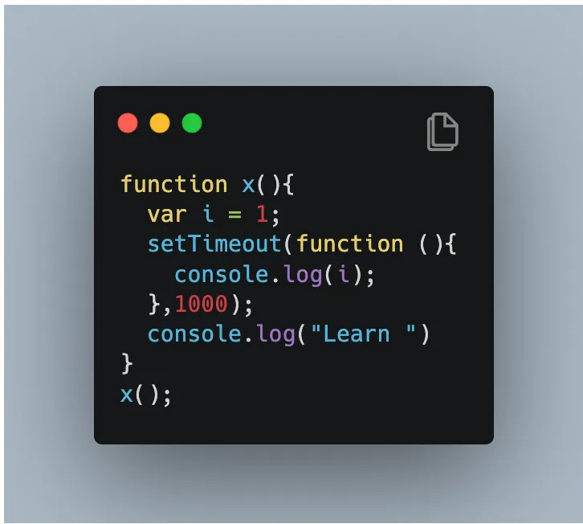

#### If we run this program, What do you expect to see in console?

Output:

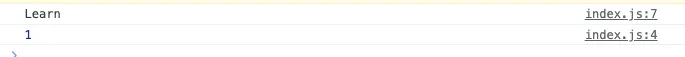

It’ll print value of `i` i.e 1 after 1 sec.

Similarly if you try doing below, it’ll print after 3 sec.

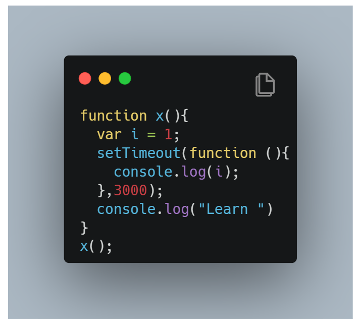

You might be thinking that `setTimeout()` will wait for 3 sec first to print `i` and then print **“Learn”**. But **NO**, it will print **“Learn”** first then wait for 3 sec and print value of `i` .

#### What `setTimeout()` actually does?

- At Line 3, function () forms a Closure. This function remember reference to `i`.

- `setTimeout()` is taking that callback function and stores it into some place and attaches timer to it. And JS proceeds and goes to next line.

- Once that timer expires, it takes that function, put it back in call stack and runs it.

Let’s take an example of complicated problem.

#### Print in console 1, 2, 3, 4, 5 … 10, after each and every second. Means 1 after 1 sec, 2 after 2 sec, 3 after 3 sec and so on. How would you do it?

First solution comes to mind is using for loop and move `setTimeout()` inside it. Like below, right ?

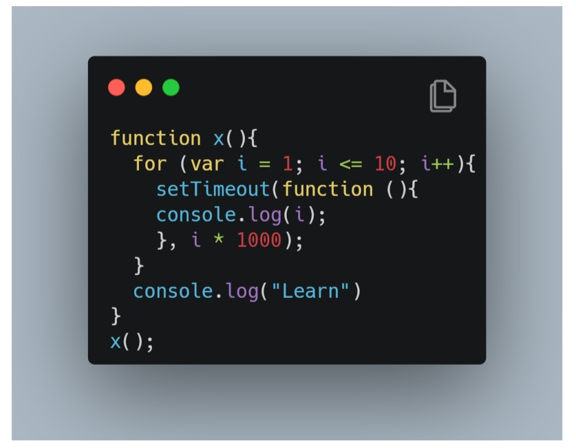

Let’s check output:

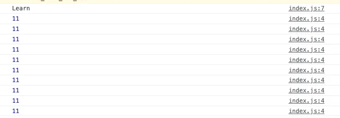

#### This is not what we expected. Why’s that? What happened?🧐

**Two reasons:**

1. We learn **Closures** how it is a function along with it’s lexical environment. So, even when function is taken out from it’s original scope, still it will remember it’s original scope. It’ll have access to those variables of it’s lexical scope.

So, When **`setTimeout()`**
takes this function and stores it somewhere and attaches a timeout, it remember the reference to `i`.

So, when loop runs the first time, it mix a copy of function, attaches timer and remember the reference of `i` .

Similarly, all 10 copies of functions, remember the reference of `i` , not the value. And **all are pointing to same reference of `i`** .

#### Why the hell they are pointing to same reference of `i` ? 😳

Because the environment for all these functions are same. All these copies of `setTimeout()’s` **callback functions** refers to `i` in same memory space. 🤷🏻‍♀️

2. **JS doesn’t wait for anything.** So, it will run the loop again and again 🔄.
   So, `setTimeout()`will store all 10 functions and JS will move on. It won’t wait for timers to expire. It’ll print **“Learn”** and when the timer expires, it is too late.

Now, value of `i` changed because the loop was constantly running. when this callback function runs, by that time, the value of `var i = 11` in memory location.

#### That’s why it prints 11 every time🤷🏻‍♀️. Because all of these copies of callback functions are referring to same spot in memory🤦🏻‍♀️. Which now have run 10 times and it’s value became 11 because of increment in for loop🙄.

#### Now, how we can fix this? 💡💡

use _`let` instead of `var` because `let` has block scope. So for each and every loop iteration, i will be new variable every time. New copy of `i` will be in memory every time._

_When setTimeout() runs , callback function will have new copy of `i` with it._

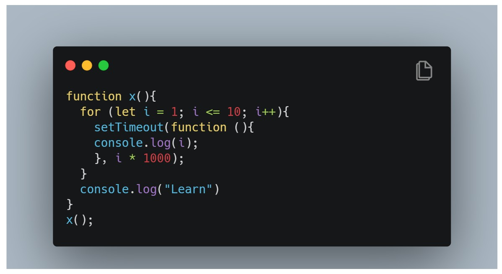

Let’s run and see output:

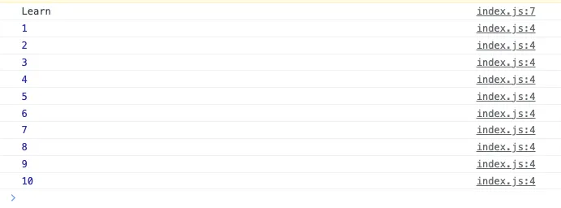

It worked 🎉🎉

#### Let’s just revise again, what actually happened because of `let`:

1. When loop started with `i = 1` , function formed a closure with new variable itself.

2. After `i++` , when function formed closure again, it does have new variable with value 2 and saves it.

3. And so on. This way it forms it makes 10 copies of `variable i` and forms closure with each and every function.

#### So, Next time someone asks you what will be the difference in output of below two cases and why? You know the answer 😎

#### Case 1:

```js
function x() {
  for (var i = 1; i <= 10; i++) {
    // using var here
    setTimeout(function () {
      console.log(i);
    }, i * 1000);
  }
  console.log("Learn");
}
x();
```

#### Case 2:

```js
function x() {
  for (let i = 1; i <= 10; i++) {
    // using let here
    setTimeout(function () {
      console.log(i);
    }, i * 1000);
  }
  console.log("Learn");
}
x();
```

**Answer:** _`let` is Block Scoped and it’s creates a new copy every time until loop is executed._

#### And Twist again 🤭 : What If you have to only use var and prints 1,2,3,..10 every second? What to do?

Think a bit , what could be the solution?

#### Trick is , we have to make a new copy of variable i every time.

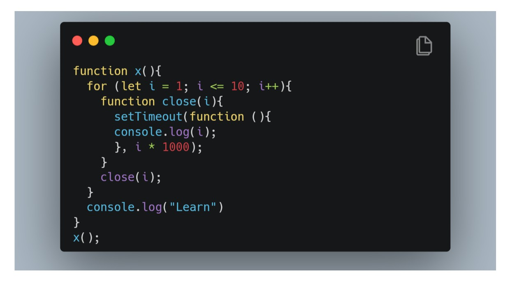

So, we will create a new function **`close()`** and wrap `setTimeout()` inside that. And pass `i` every time in calling.

#### Why it will work? 😬

Because every time you call **`close()`** function with `i` , it creates a new copy of `i` for `setTimeout()` 😎.

And that’s it. We covered how `setTimeout()` works and connected to closures. 👏🏼

### Ep. 12 CRAZY JS INTERVIEW ft. Closures 🤯

#### Question 1: What are closures In JS?

A function along with a reference to its outer environment like together forms a closure.

#### Question 2. How you’ll explain more about it?

- Each and every function in JS have access to it’s outer lexical environment that means it has access to variables and functions which are in environment of it’s parent.

- Even If this function is executed in some other scope instead of original scope, it will still remember it’s outer lexical environment where it was originally present in the code.

#### Question 3. What about an example to explain all this?

```js
function outer() {
  var a = 10;
  function inner() {
    console.log(a);
  }
  return inner;
}

outer()();
```

So, in above example, We have nested function `inner()`inside function `outer()` . `inner()` function have access to `variable a` which is present in it’s outer environment.

Also, when you return `inner()` function and invoke `outer() `function, it will still console value of `variable a` . So, it remembered it’s outer lexical env even when called in other scope.

So, `inner()` function = **Closure** 💡

#### Question 4. What is `outer()()` ? Why there are two parenthesis?

_Two parenthesis are used to call inner function._

Example :

- `outer()` will return below output:

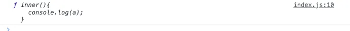

- `outer()()` will return below output:


Also, This can be done in other way as well

```js
function outer() {
  var a = 10;
  function inner() {
    console.log(a);
  }
  return inner;
}

var close = outer(); // this will give you outer function
close(); // this will give you inner function and equivalent
```

#### Question 5. What if `var` declaration is moved to Line 5, just before return statement. What will happen? Will it still be a Closure?

```js
function outer() {
  function inner() {
    console.log(a);
  }
  var a = 10;
  return inner;
}

var close = outer(); // this will give you outer function
close(); // this will give you inner function and equivalent
```

Answer is **YES, it will still be. Closure**. It doesn’t matter what the sequence is, means where the statement is. For closure, all matter is function has access to it’s lexical environment. Also, output will be same.

#### Question 6. What if `var` is replaced by `let` in Line 5. What will happen?

```js
function outer() {
  function inner() {
    console.log(a);
  }
  let a = 10; // let instead of var
  return inner;
}

var close = outer(); // this will give you outer function
close(); // this will give you inner function and equivalent
```

Answer is **It won’t affect anything**. It ‘ll still be a closure and output will be same.

#### Question 7. What if `outer()` have a parameter? What happens then?

```js
function outer(b) {
  function inner() {
    console.log(a, b); // try printing b here
  }
  let a = 10; // let instead of var
  return inner;
}

// Passing argument here
var close = outer("Hi Closures"); // this will give you outer function
close(); // this will give you inner function and equivalent
```

Answer is **It won’t affect anything.** It ‘ll still be a closure and we can try printing value of `b` as well in console.

Reason: `b` is also the part of outer environment

Output will be:

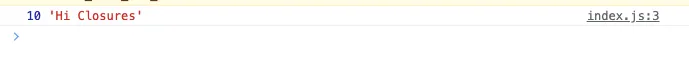

#### Question 8. What if `outer()` function is nested into another function? Will `inner()` function have access to `outer()` function’s environment as well?

```js
function outest() {
  var c = 12;
  function outer(b) {
    function inner() {
      console.log(a, b, c); // try printing b and c  here
    }
    let a = 10; // let instead of var
    return inner;
  }
  return outer;
}

// Passing argument here
var close = outest()("Hi Closures"); // this will give you outer function
close(); // this will give you inner function and equivalent
```

Answer is **YES, `inner()` function have access to `outer()` function’s environment as well.**

Try printing `variable c` inside `inner()` function.

Output will be :

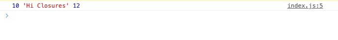

#### Question 9. What if we have global variable with conflicted name?

```js
function outest() {
  var c = 12;
  function outer(b) {
    function inner() {
      console.log(a, b, c); // try printing b and c  here
    }
    let a = 10; // let instead of var
    return inner;
  }
  return outer;
}

let a = 100;
// Passing argument here
var close = outest()("Hi Closures"); // this will give you outer function
close(); // this will give you inner function and equivalent
```

`inner()` function has a closure with `variable a` on **Line 7** i.e `let a = 10` .So the `inner()` function has reference for `variable a` is at Line 7.
`let a = 100;` at **Line 13** is in different scope. So, it will print output with value 10.

But **if we comment Line 7**, _then it will go to outer environments looking for a and prints 100_. Check below:

```js
function outest() {
  var c = 12;
  function outer(b) {
    function inner() {
      console.log(a, b, c); // try printing b and c  here
    }
    //let a =10; // let instead of var
    return inner;
  }
  return outer;
}

let a = 100;
// Passing argument here
var close = outest()("Hi Closures"); // this will give you outer function
close(); // this will give you inner function and equivalent
```

Also, **if we comment Line 13**, _then it will print “ReferenceError: a is not defined”_. Check below:

```js
function outest() {
  var c = 12;
  function outer(b) {
    function inner() {
      console.log(a, b, c); // try printing b and c  here
    }
    //let a =10; // let instead of var
    return inner;
  }
  return outer;
}

// let a =100;
// Passing argument here
var close = outest()("Hi Closures"); // this will give you outer function
close(); // this will give you inner function and equivalent
```

#### Question 10. What are the advantages of Closure?

1. Module Design Patterns

2. Currying

3. Function Like once

4. memoize

5. maintaining state in async world

6. setTimeouts

7. Iterators

8. Data Hiding and Encapsulation

#### Question 11. What are disadvantages of Closure?

1. There could be over consumption of memory because every time a closure is formed, it consumes a lot of memory.

2. Those closed over variables are not Garbage Collected, so it means it is accumulating a lot of memory

3. If not handled properly, it can lead to memory leaks.

### Question 11. What is Garbage Collector?

Garbage Collector is a program in browser or in JS engine, which free up unutilised memory.
In languages like c, c++, it is upto developers how we allocate and deallocate memory but in high level programming language like JS, most work is done by JS engine.
So, whenever there are some unused variables, Garbage collector takes those out of memory

#### Question 11. How Closures and Garbage Collector related to each other?

```js
function a() {
  var x = 10;
  return function b() {
    console.log(x);
  };
}
var y = a();
```

In above example, `function b()` is closure. So, ideally after executing `function a()` , all it’s memory including `variable x` should be garbage collected. It wasn’t needed anymore. But because `function b()` is closure and `variable x` is being referred and assigning value `variable y`, so it won’t free up as later on , we might call `y()` .

This way more closures means keeping a lot of memory accumulating.

Although, some modern browsers like chrome and JS engines like V8, they have smart garbage collection mechanism, in which it somehow identify unreachable variables and collects these garbage variables.

#### Question 13. What is Smartly garbaged variable, examples?

```js
function a() {
  var x = 10,
    z = 20;
  return function b() {
    console.log(x);
  };
}
var y = a();
```

In above example, `variable z` is not being used . So when `function b()` is returned ,`variable z` will be smartly garbaged but `variable x` is not. So, `variable z` won’t be in memory.

With this, we covers basic questions with explanation.

Thanks for reading the article ❤️

#### Closure JS Interview exercise

```js
function outerFunction() {
  var outerVariable = "Hi, ";
  function innerFunction(name) {
    console.log(outerVariable + name); // What is logged?
  }
  return innerFunction;
}

var inner = outerFunction();
inner("Closure");
```

```js
function outer() {
  var x = 10;
  function inner() {
    console.log(x); // What is logged?
  }
  return inner;
}
var innerFunc = outer();
innerFunc();
```

```js
function outer() {
  var x = 10;
  function inner() {
    console.log(x); // What is logged?
  }
  var x = 20;
  return inner;
}
var innerFunc = outer();
innerFunc();
```

```js
function outer() {
  var x = 10;
  function inner() {
    var y = 12;
    console.log(x + y); // What is logged?
  }
  return inner;
}
var innerFunc = outer();
innerFunc();
```

```js
var a = 1;
function b() {
  a = 10;
  return;
  function a() {}
}
b();
console.log(a); // What is logged?
```

```js
function test() {
  console.log(a); // What is logged?
  console.log(foo()); // What is logged?

  var a = 1;
  function foo() {
    return 2;
  }
}

test();
```

```js
var a = 1;

function someFunction(number) {
  function otherFunction(input) {
    return a;
  }

  a = 5;

  return otherFunction;
}

var firstResult = someFunction(19); // What is firstResult?
var result = firstResult(12); // What is result?
```

```js
var fullname = "Daisy Doe";
var obj = {
  fullname: "Vera Singh",
  prop: {
    fullname: "Amar Akbar Anthony",
    getFullname: function () {
      return this.fullname;
    },
  },
};

console.log(obj.prop.getFullname());

var test = obj.prop.getFullname;

console.log(test()); // What is logged?
```

### Ep. 13 FIRST CLASS FUNCTIONS ft. Anonymous Functions

A function without a name is anonymous function.A function without a name is **anonymous function**.

Now, Other related questions are::

What are **first class functions** in javascript?

What is **difference between function statement and function expression?**

**Let move on, we’ll be covering all below topics:**

1. Function Statement
2. Function Expression
3. Function Declaration
4. Anonymous Function
5. Named Function Expression
6. Difference between Parameters and Arguments ?
7. First Class Functions

First of all, let’s see **What is Function Statement?**

_If you write a function keyword and give it a name like below then it is a function statement._

```js
function a() {}
```

Let’s just say **function “a”** have nothing more then console like below:

```js
function a() {
  console.log("Hello, I am calling a");
}
```

So, this way of creating a function is called **Function Statement** 🤷🏻‍♀️.

Now, you can assign a function to a variable 😮 also :

```js
var b = function () {
  console.log("Hello, b called");
};
```

Above, We **assigned a function to variable “b”**. Now function acts like a value. Now this is known as **Function Expression** 🤷🏻‍♀️.

_So, Function Statement and Function Expressions, both are ways to create functions which we are doing from many years._

Now, **What the difference between Function Statement and Function Expression?**

**Answer is:** Hoisting.. 🧐

Now, **the question is how??**

So, when we try to call both functions on top of file and check output then what happens?

```js
a();
b();

//Function Statement
function a() {
  console.log("Hello, a called");
}

//Function Expression
var b = function () {
  console.log("Hello, b called");
};
```

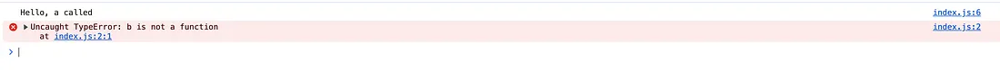

**Output : “b”** throws an error

**Uncaught TypeError: “b” is not a function 😳🤨**

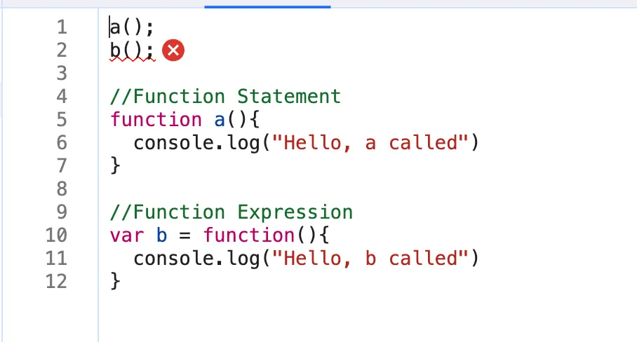

As you already know from hoisting in previous articles. **Function “a”** will create a memory in memory creation phase and function is assigned to a. But in case of **Function expression**, “b” will be treated like any another variable. So, “b” is assigned undefined initially until code hits the line 9. So, when JS engine executes line by line and reaches line no. 9 then only function will be assigned to variable “b” until then it is undefined.

#### So, that’s the major difference between Function Statement and Function Expression.

**What is Function Declaration?**🧐

It is same as Function Statement

**What are Anonymous Function?**🧐

A function without a name is Anonymous Function. These functions doesn’t have their own identity. This means if I do below then it will give you syntax error

```js
// Anonymous Function
function () {

}

```

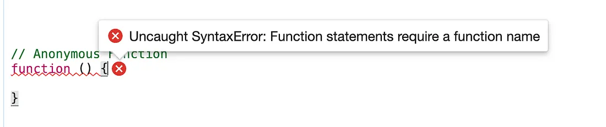

**_Why is the error?_**

_Because Anonymous Function looks exactly like a function statement but doesn’t have a name. As per ECMA Script specification, A function statement should always have a name._

Now the question is **what’s even the use of Anonymous Functions?**🤔

These functions are used in a place where functions are used as values. This means that you can use those to assign as values to some variables, like we did in Function expression.

**_What is Named Function Expressions?_**

_A named function expression is like a function expression but instead of anonymous function, we use a function with a name._

```js
//Named Function Expression
var b = function xyz() {
  console.log("Hello, b called");
};
```

So, if interviewer asks you **“How can you have the name of function itself and then put it into an expression”?**

**Answer is:** _Named function expression. Function “xyz” have name to itself and then assigned it to variable “b” and this makes named function expression._

#### Next question: Can you call function “xyz”? What will happen then?

```js
//Named Function Expression
var b = function xyz() {
  console.log("Hello, b called");
};

b(); // output here?
xyz(); // output here?
```

**Output :**

#### Uncaught ReferenceError: “xyz” is not defined 🧐 😮

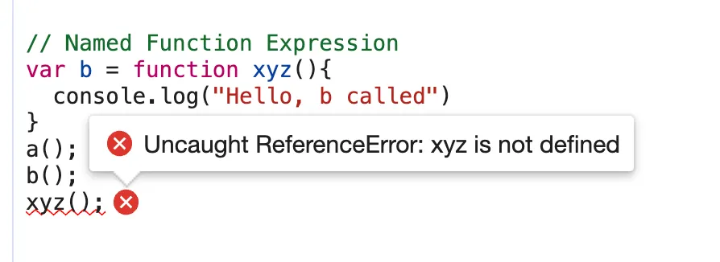

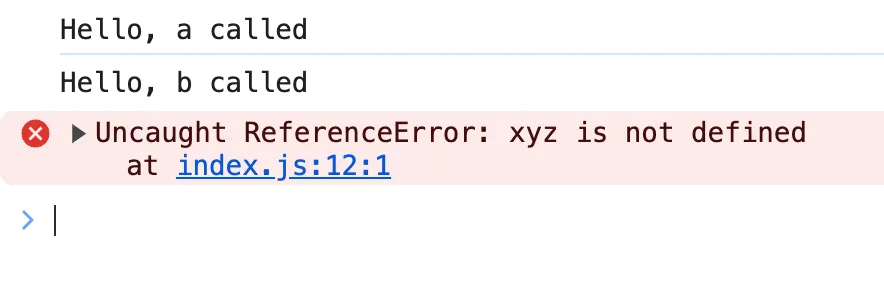

#### So, What’s the reason? Why “xyz” is not defined?

_Because function “xyz” is used as value and not in global scope. But it is created in local scope._

_So, if you try to access it inside the function then you can do that._ See below:

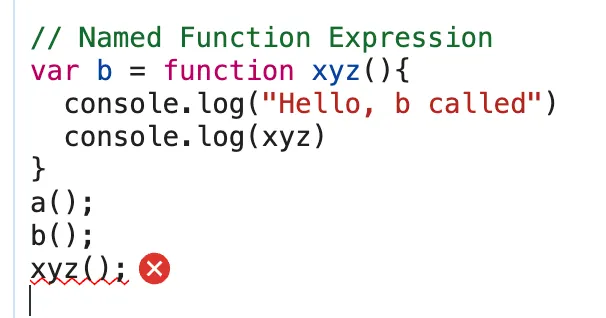

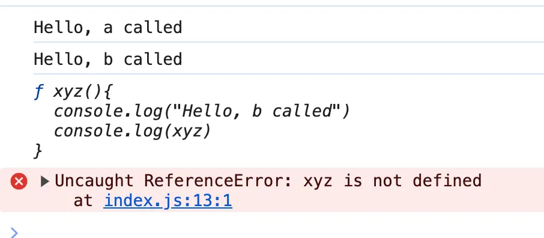

#### What is difference between Parameters and Arguments?

The local variable in function scope is called **parameters.**

See below example: You can not access param1, param2 outside the function

```js
var b = function (param1, param2) {
  console.log("Hello, b called");
};
```

The values which we pass inside a function are called **arguments.**

```js
var b = function (param1, param2) {
  console.log("Hello, b called");
};

b(1, 2); // 1 and 2 are arguments
```

#### What are First Class functions?

The ability to use functions as values which means

1. can be passed as an arguments into another functions

2. and can be returned from the functions
   is known as First class Functions.

**Example 1:** When you can pass function inside another function as an arguments.

```js
var b = function (param1) {
  console.log("Param 1 =", param1);
};

b(function () {});
```

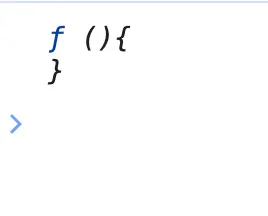

You can also do this using Named function like below:

```js
// First Class function
var b = function (param1) {
  console.log("Param 1 =", param1); // cheking here if accessible
};

// Named function
function xyz() {}

b(xyz); // passing named function as xyz
```


**Example 2:** Another thing that we can do is return a function from a function. See below:

```js
var b = function (param1) {
  console.log("Param 1 =", param1);
  return function () {};
};

function xyz() {}

console.log("Return value of b = ", b(xyz));
```

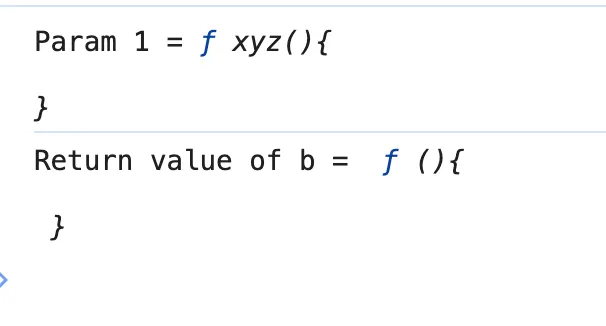

This programming concept of First class function is exist in other languages also.

### Ep. 14 Callback Functions in JS ft. Event Listeners

### Callback Functions

- Functions are first class citizens ie. take a function A and pass it to another function B. Here, A is a callback function. So basically I am giving access to function B to call function A. This callback function gives us the access to whole **Asynchronous** world in **Synchronous** world.

```js
setTimeout(function () {
  console.log("Timer");
}, 1000); // first argument is callback function and second is timer.
```

- JS is a synchronous and single threaded language. But due to callbacks, we can do async things in JS.

- ```js
  setTimeout(function () {
    console.log("timer");
  }, 5000);
  function x(y) {
    console.log("x");
    y();
  }
  x(function y() {
    console.log("y");
  });
  // x y timer
  ```

  - In the call stack, first x and y are present. After code execution, they go away and stack is empty. Then after 5 seconds (from beginning) anonymous suddenly appear up in stack ie. setTimeout
  - All 3 functions are executed through call stack. If any operation blocks the call stack, its called blocking the main thread.
  - Say if x() takes 30 sec to run, then JS has to wait for it to finish as it has only 1 call stack/1 main thread. Never block main thread.
  - Always use **async** for functions that take time eg. setTimeout

- ```js
  // Another Example of callback
  function printStr(str, cb) {
    setTimeout(() => {
      console.log(str);
      cb();
    }, Math.floor(Math.random() * 100) + 1);
  }
  function printAll() {
    printStr("A", () => {
      printStr("B", () => {
        printStr("C", () => {});
      });
    });
  }
  printAll(); // A B C // in order
  ```

### Event Listener

- We will create a button in html and attach event to it.

  ```js
  // index.html
  <button id="clickMe">Click Me!</button>;

  // in index.js
  document.getElementById("clickMe").addEventListener("click", function xyz() {
    //when event click occurs, this callback function (xyz) is called into callstack
    console.log("Button clicked");
  });
  ```

- Lets implement a increment counter button.
  - Using global variable (not good as anyone can change it)
    ```js
    let count = 0;
    document
      .getElementById("clickMe")
      .addEventListener("click", function xyz() {
        console.log("Button clicked", ++count);
      });
    ```
  - Use closures for data abstraction
    `js
function attachEventList() {
  //creating new function for closure
  let count = 0;
  document
    .getElementById("clickMe")
    .addEventListener("click", function xyz() {
      console.log("Button clicked", ++count); //now callback function forms closure with outer scope(count)
    });
}
attachEventList();
`
    

### Garbage Collection and removeEventListeners

- Event listeners are heavy as they form closures. So even when call stack is empty, EventListener won't free up memory allocated to count as it doesn't know when it may need count again. So we remove event listeners when we don't need them (garbage collected) onClick, onHover, onScroll all in a page can slow it down heavily.

### Ep. 15 Asynchronous JavaScript & EVENT LOOP from scratch

> Note: Call stack will execeute any execeution context which enters it. Time, tide and JS waits for none. TLDR; Call stack has no timer.

- Browser has JS Engine which has Call Stack which has Global execution context, local execution context etc.

  - But browser has many other superpowers - Local storage space, Timer, place to enter URL, Bluetooth access, Geolocation access and so on.
  - Now JS needs some way to connect the callstack with all these superpowers. This is done using Web APIs.

    

### WebAPIs

None of the below are part of Javascript! These are extra superpowers that browser has. Browser gives access to JS callstack to use these powers.


- setTimeout(), DOM APIs, fetch(), localstorage, console (yes, even console.log is not JS!!), location and so many more.

  - setTimeout() : Timer function
  - DOM APIs : eg.Document.xxxx ; Used to access HTML DOM tree. (Document Object Manipulation)
  - fetch() : Used to make connection with external servers eg. Netflix servers etc.

- We get all these inside call stack through global object ie. window

  - Use window keyword like : window.setTimeout(), window.localstorage, window.console.log() to log something inside console.
  - As window is global obj, and all the above functions are present in global object, we don't explicity write window but it is implied.

- Let's undertand the below code image and its explaination:

  

  - ```js
    console.log("start");
    setTimeout(function cb() {
      console.log("timer");
    }, 5000);
    console.log("end");
    // start end timer
    ```
  - First a GEC is created and put inside call stack.
  - console.log("Start"); // this calls the console web api (through window) which in turn actually modifies values in console.
  - setTimeout(function cb() { //this calls the setTimeout web api which gives access to timer feature. It stores the callback cb() and starts timer. console.log("Callback");}, 5000);
  - console.log("End"); // calls console api and logs in console window. After this GEC pops from call stack.
  - While all this is happening, the timer is constantly ticking. After it becomes 0, the callback cb() has to run.
  - Now we need this cb to go into call stack. Only then will it be executed. For this we need **event loop** and **Callback queue**

### Event Loops and Callback Queue

Q: How after 5 secs timer is console?

- cb() cannot simply directly go to callstack to be execeuted. It goes through the callback queue when timer expires.
- Event loop keep checking the callback queue, and see if it has any element to puts it into call stack. It is like a gate keeper.
- Once cb() is in callback queue, eventloop pushes it to callstack to run. Console API is used and log printed


Q: Another example to understand Eventloop & Callback Queue.

See the below Image and code and try to understand the reason:


Explaination?

- ```js
  console.log("Start");
  document.getElementById("btn").addEventListener("click", function cb() {
    // cb() registered inside webapi environment and event(click) attached to it. i.e. REGISTERING CALLBACK AND ATTACHING EVENT TO IT.
    console.log("Callback");
  });
  console.log("End"); // calls console api and logs in console window. After this GEC get removed from call stack.
  // In above code, even after console prints "Start" and "End" and pops GEC out, the eventListener stays in webapi env(with hope that user may click it some day) until explicitly removed, or the browser is closed.
  ```

- Eventloop has just one job to keep checking callback queue and if found something push it to call stack and delete from callback queue.

Q: Need of callback queue?

**Ans**: Suppose user clciks button x6 times. So 6 cb() are put inside callback queue. Event loop sees if call stack is empty/has space and whether callback queue is not empty(6 elements here). Elements of callback queue popped off, put in callstack, executed and then popped off from call stack.

<br>

### Behaviour of fetch (**Microtask Queue?**)

Let's observe the code below and try to understand

```js
console.log("Start"); // this calls the console web api (through window) which in turn actually modifies values in console.
setTimeout(function cbT() {
  console.log("CB Timeout");
}, 5000);
fetch("https://api.netflix.com").then(function cbF() {
    console.log("CB Netflix");
}); // take 2 seconds to bring response
// millions lines of code
console.log("End");

Code Explaination:
* Same steps for everything before fetch() in above code.
* fetch registers cbF into webapi environment along with existing cbT.
* cbT is waiting for 5000ms to end so that it can be put inside callback queue. cbF is waiting for data to be returned from Netflix servers gonna take 2 seconds.
* After this millions of lines of code is running, by the time millions line of code will execute, 5 seconds has finished and now the timer has expired and response from Netflix server is ready.
* Data back from cbF ready to be executed gets stored into something called a Microtask Queue.
* Also after expiration of timer, cbT is ready to execute in Callback Queue.
* Microtask Queue is exactly same as Callback Queue, but it has higher priority. Functions in Microtask Queue are executed earlier than Callback Queue.
* In console, first Start and End are printed in console. First cbF goes in callstack and "CB Netflix" is printed. cbF popped from callstack. Next cbT is removed from callback Queue, put in Call Stack, "CB Timeout" is printed, and cbT removed from callstack.
* See below Image for more understanding
```


Microtask Priority Visualization


#### What enters the Microtask Queue ?

- All the callback functions that come through promises go in microtask Queue.
- **Mutation Observer** : Keeps on checking whether there is mutation in DOM tree or not, and if there, then it execeutes some callback function.
- Callback functions that come through promises and mutation observer go inside **Microtask Queue**.
- All the rest goes inside **Callback Queue aka. Task Queue**.
- If the task in microtask Queue keeps creating new tasks in the queue, element in callback queue never gets chance to be run. This is called **starvation**

### Some Important Questions

1. **When does the event loop actually start ? -** Event loop, as the name suggests, is a single-thread, loop that is _almost infinite_. It's always running and doing its job.

2. **Are only asynchronous web api callbacks are registered in web api environment? -** YES, the synchronous callback functions like what we pass inside map, filter and reduce aren't registered in the Web API environment. It's just those async callback functions which go through all this.

3. **Does the web API environment stores only the callback function and pushes the same callback to queue/microtask queue? -** Yes, the callback functions are stored, and a reference is scheduled in the queues. Moreover, in the case of event listeners(for example click handlers), the original callbacks stay in the web API environment forever, that's why it's adviced to explicitly remove the listeners when not in use so that the garbage collector does its job.

4. **How does it matter if we delay for setTimeout would be 0ms. Then callback will move to queue without any wait ? -** No, there are trust issues with setTimeout() 😅. The callback function needs to wait until the Call Stack is empty. So the 0 ms callback might have to wait for 100ms also if the stack is busy.

<br>

### Observation of Eventloop, Callback Queue & Microtask Queue [**GiF**]


### Ep. 16 : JS Engine Exposed, Google's V8 Architecture

- JS runs literally everywhere from smart watch to robots to browsers because of Javascript Runtime Environment (JRE).

- JRE is like a big container which has everything which are required to run Javascript code.

- JRE consists of a JS Engine (❤️ of JRE), set of APIs to connect with outside environment, event loop, Callback queue, Microtask queue etc.

- Browser can execute javascript code because it has the Javascript Runtime Environment.

- ECMAScript is a governing body of JS. It has set of rules which are followed by all JS engines like Chakra(Internet Explorer), V8 Engine (Edge) Spidermonkey(Firefox)(first javascript engine created by JS creator himself), v8(Chrome)

- Javascript Engine is not a machine. Its software written in low level languages (eg. C++) that takes in hi-level code in JS and spits out low level machine code.

- Code inside Javascript Engine passes through 3 steps : **Parsing**, **Compilation** and **Execution**

  1. **Parsing** - Code is broken down into tokens. In "let a = 7" -> let, a, =, 7 are all tokens. Also we have a syntax parser that takes code and converts it into an AST (Abstract Syntax Tree) which is a JSON with all key values like type, start, end, body etc (looks like package.json but for a line of code in JS. Kinda unimportant)(Check out astexplorer.net -> converts line of code into AST).
  2. **Compilation** - JS has something called Just-in-time(JIT) Compilation - uses both interpreter & compiler. Also compilation and execution both go hand in hand. The AST from previous step goes to interpreter which converts hi-level code to byte code and moves to execeution. While interpreting, compiler also works hand in hand to compile and form optimized code during runtime. **Does JavaScript really Compiles?** The answer is a loud **YES**. JS used to be only interpreter in old times, but now has both to compile and interpreter code and this make JS a JIT compiled language, its like best of both world.

  3. **Execution** - Needs 2 components ie. Memory heap(place where all memory is stored) and Call Stack(same call stack from prev episodes). There is also a garbage collector. It uses an algo called **Mark and Sweep**.

     

     

- Companies use different JS engines and each try to make theirs the best.

  - v8 of Google has Interpreter called Ignition, a compiler called Turbo Fan and garbage collector called Orinoco
  - v8 architecture:

    

### Ep. 17 : Trust issues with setTimeout()

- setTimeout with timer of 5 secs sometimes does not exactly guarantees that the callback function will execute exactly after 5s.

- Let's observe the below code and it's explaination

  ```js
  console.log("Start");
  setTimeout(function cb() {
    console.log("Callback");
  }, 5000);
  console.log("End");
  // Millions of lines of code to execute

  // o/p: Over here setTimeout exactly doesn't guarantee that the callback function will be called exactly after 5s. Maybe 6,7 or even 10! It all depends on callstack. Why?
  ```

  Reason?

  - First GEC is created and pushed in callstack.
  - Start is printed in console
  - When setTimeout is seen, callback function is registered into webapi's env. And timer is attached to it and started. callback waits for its turn to be execeuted once timer expires. But JS waits for none. Goes to next line.
  - End is printed in console.
  - After "End", we have 1 million lines of code that takes 10 sec(say) to finish execution. So GEC won't pop out of stack. It runs all the code for 10 sec.
  - But in the background, the timer runs for 5s. While callstack runs the 1M line of code, this timer has already expired and callback fun has been pushed to Callback queue and waiting to pushed to callstack to get executed.
  - Event loop keeps checking if callstack is empty or not. But here GEC is still in stack so cb can't be popped from callback Queue and pushed to CallStack. **Though setTimeout is only for 5s, it waits for 10s until callstack is empty before it can execute** (When GEC popped after 10sec, callstack() is pushed into call stack and immediately executed (Whatever is pushed to callstack is executed instantly).
  - This is called as the **[Concurrency model](https://developer.mozilla.org/en-US/docs/Web/JavaScript/EventLoop)** of JS. This is the logic behind setTimeout's trust issues.

- The First rule of JavaScript: Do not **block the main thread** (as JS is a single threaded(only 1 callstack) language).

- In below example, we are blocking the main thread. Observe Questiona and Output.

  

- setTimeout guarantees that it will take at least the given timer to execute the code.

- JS is a synchronous single threaded language. With just 1 thread it runs all pieces of code. It becomes kind of an interpreter language, and runs code very fast inside browser (no need to wait for code to be compiled) (JIT - Just in time compilation). And there are still ways to do async operations as well.

- What if **timeout = 0sec**?
  ```js
  console.log("Start");
  setTimeout(function cb() {
    console.log("Callback");
  }, 0);
  console.log("End");
  // Even though timer = 0s, the cb() has to go through the queue. Registers calback in webapi's env , moves to callback queue, and execute once callstack is empty.
  // O/p - Start End Callback
  // This method of putting timer = 0, can be used to defer a less imp function by a little so the more important function(here printing "End") can take place
  ```
